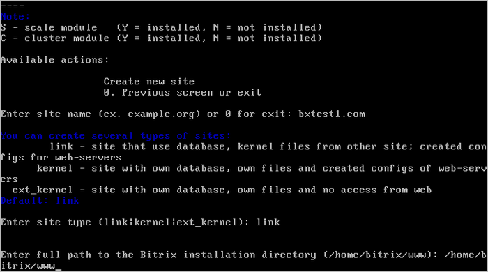
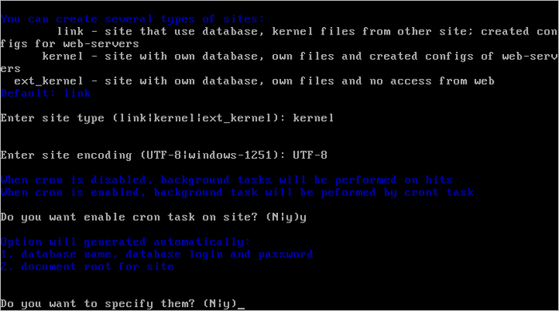

# 1. Создание сайта (1. Create site)

**Навигация**
- [← Оглавление курса](index.md)
- [← Предыдущий: 9367 — 3. Добавить хосты для мониторинга (3. Add new host(s) on monitoring)](lesson_9367.md)
- [Следующий: 9353 — 2. Удалить сайт (2. Delete site) →](lesson_9353.md)

Официальная страница урока: https://dev.1c-bitrix.ru/learning/course/index.php?COURSE_ID=37&LESSON_ID=8849

**Внимание!** После создания дополнительного сайта необходимо обязательно удалить созданный при установке дефолтный сайт, если он не используется.

Мастер создания дополнительных сайтов, позволяет развернуть на одной виртуальной машине несколько сайтов, как на независимых установках «1С-Битрикс», так и в рамках многосайтовости.

**Внимание!** В **BitrixVM\BitrixEnv** версии **7.х** root пароль к MySQL **не может быть пустым**, он задается для BitrixEnv на этапе установки, а для BitrixVM автоматически при первом старте. Изменить root пароль к MySQL можно в меню 3. Configure MySQL service for the pool &gt; 2. Change password for mysql user root . Если root пароль к MySQL будет пустым, то при добавлении нового сайта будет выдана ошибка.

Для добавления дополнительного сайта необходимо:

- Предварительно настроить DNS-записи в управлении доменами или в случае локальной установки указать доменное имя в `/etc/hosts` на виртуальной машине, а также на всех компьютерах, с которых будет осуществляться доступ к данному сайту.
- Далее из административного меню запустить мастер 6. Configure pool sites &gt; 1 Create site:
  
  
  и указать:

  1. **Enter site name** - доменное имя дополнительного сайта без www;
    **Внимание!** Если у вас домен в национальной кодировке (например, кириллический домен), то в данное поле нужно вводить имя домена в [Punycode-формате](https://ru.wikipedia.org/wiki/Punycode), воспользовавшись любым Unicode-Punycode конвертером.
  2. **Enter site type** - тип установки ядра «1С-Битрикс»:

    - **kernel** - в случае создания дополнительного сайта в рамках отдельной установки - отдельное ядро продукта «1С-Битрикс» в новой директории сайта.
    - **ext_kernel** - отдельное ядро продукта «1С-Битрикс» в новой директории сайта для создания линков на это ядро в рамках многосайтовости, ядро будет недоступно напрямую, а только через дополнительные сайты (работает в паре с сайтами типа **link**).
    - **link** - в случае создания дополнительного сайта в рамках многосайтовости - общее ядро и данные в общей базе с уже установленным продуктом «1С-Битрикс» (работает в паре с ядром **ext_kernel**).
  3. **Enter full path to the Bitrix installation directory** - указать путь до ядра продукта *«1С-Битрикс»*, на которые будут сделаны симлинки (для ядра типа **link**).
  4. **Enter site encoding** - указать кодировку будущего сайта: `UTF-8` или `windows 1251` (для ядра типа **kernel** и **ext_kernel**).
  5. **Do you want to enable cron task on site** - включить ли выполнение заданий на cron для будущего сайта (для ядра типа **kernel** и **ext_kernel**).
  6. **Do you want to specify them** - по умолчанию название, логин и пароль базы данных и root-директория сайта создаются автоматически (в файлах dbconn.php и .settings.php (с версии 20.900.0 - только в **.settings.php**)), но с помощью данной опции можно указать свои, выбрав ответ `y` (для ядра типа **kernel** и **ext_kernel**).
- В процессе работы мастера будет создана директория на сервере: `/home/bitrix/ext_www/{название_хоста}`, в которой будут:

  - символические ссылки на директорию ядра, которую выбрали ранее (если был выбран вариант **link**).
  - директории и скрипт **BitrixSetup** для установки или восстановления продукта (если был выбран вариант **kernel**).
  - директории и скрипт **BitrixSetup** для восстановления продукта (если был выбран вариант **ext_kernel**).
- После завершения задачи по добавлению сайта он будет готов к использованию.
  **Примечание**: Количество дополнительных сайтов ограничивается лишь лицензией «1С-Битрикс» данной установки.

**Внимание!** Если был выбран вариант ядра **ext_kernel** и установлено ядро в `/home/bitrix/ext_www/{название_хоста}`, то в списке сайтов виртуальной машины данное ядро не появится до тех пор, пока не будет создан хотя бы один сайт (link) на это ядро.

**Внимание!** Задачи могут выполняться довольно длительное время (до 2-3 часов и более) в зависимости от сложности задачи, объема данных, используемых в этих задачах, мощности и загруженности сервера. Проверить текущие выполняемые задачи можно с помощью меню 10. Background pool tasks &gt; 1. View running tasks. Если по каким-либо причинам нужно посмотреть лог-файлы выполнения задач, то они находятся в директории `/opt/webdir/temp`.
