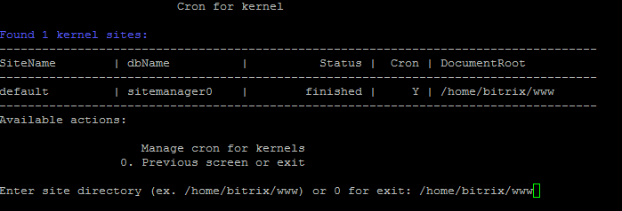
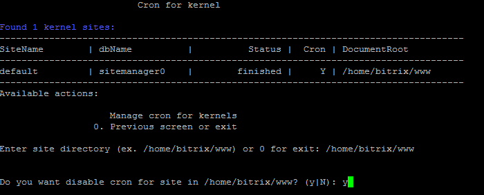
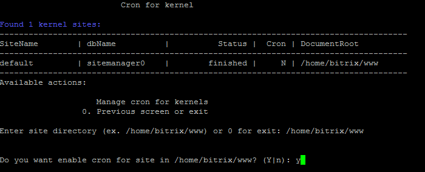

# 3. Настройка задач cron (3. Change cron tasks on site)

**Навигация**
- [← Оглавление курса](index.md)
- [← Предыдущий: 9353 — 2. Удалить сайт (2. Delete site)](lesson_9353.md)
- [Следующий: 12265 — Настройки для почтовых сервисов →](lesson_12265.md)

Официальная страница урока: https://dev.1c-bitrix.ru/learning/course/index.php?COURSE_ID=37&LESSON_ID=8851

По умолчанию в виртуальной машине **cron** уже включен. Если по каким-либо причинам нужно отключить эту службу, то для этого необходимо:

- Перейти в главном меню в 6. Configure pool sites &gt; 3. Change cron tasks on site и ввести директорию сайта, для которого нужно отключить службу **cron**:
  
- Согласиться на отключение и дождаться пока задача будет закончена:
  

Аналогичным способом осуществляется и включение службы:

**Внимание!** Информацию о том, как настроить в продуктах *«1С-Битрикс»* обработку всех агентов на **cron**, можно прочитать [здесь](lesson_8897.md).
