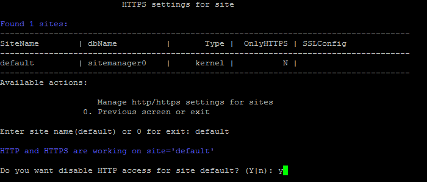

# 5. Настройка https на сайте (5. Change https settings on site)

**Навигация**
- [← Оглавление курса](index.md)
- [← Предыдущий: 12265 — Настройки для почтовых сервисов](lesson_12265.md)
- [Следующий: 8857 — 6. Настройка резервного копирования сайта (6. Change backup settings on site) →](lesson_8857.md)

Официальная страница урока: https://dev.1c-bitrix.ru/learning/course/index.php?COURSE_ID=37&LESSON_ID=8855

### Доступ по HTTPS

По умолчанию в виртуальной машине включена поддержка доступа к сайтам через протоколы HTTP и HTTPS.

Если необходимо оставить доступ к сайту только по защищенному протоколу HTTPS, то для этого нужно:

- Перейти в главном меню в 6. Configure pool sites &gt; 5. Change https settings on site и ввести имя хоста, для которого нужно настроить протокол доступа:
  
- Согласиться на отключение HTTP доступа и дождаться пока задача будет закончена:
  
  **Внимание!** Для доступа к сайту только по протоколу HTTPS необходим [SSL-сертификат](https://ru.wikipedia.org/wiki/SSL) от доверенного центра сертификации, иначе браузеры будут выдавать ошибку, что сертификат безопасности сайта не является доверенным.

### Доступ по HTTP

Аналогичным способом осуществляется возврат доступа к сайту по протоколу HTTP:

**Внимание!** Задачи могут выполняться довольно длительное время (до 2-3 часов и более) в зависимости от сложности задачи, объема данных, используемых в этих задачах, мощности и загруженности сервера. Проверить текущие выполняемые задачи можно с помощью меню 10. Background pool tasks &gt; 1. View running tasks. Если по каким-либо причинам нужно посмотреть лог-файлы выполнения задач, то они находятся в директории `/opt/webdir/temp`.
