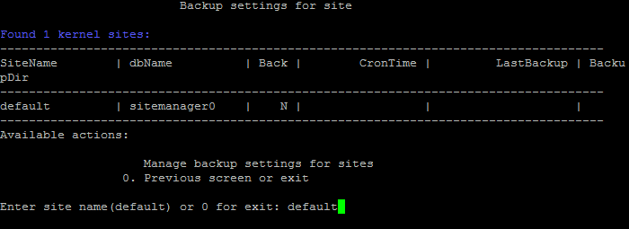
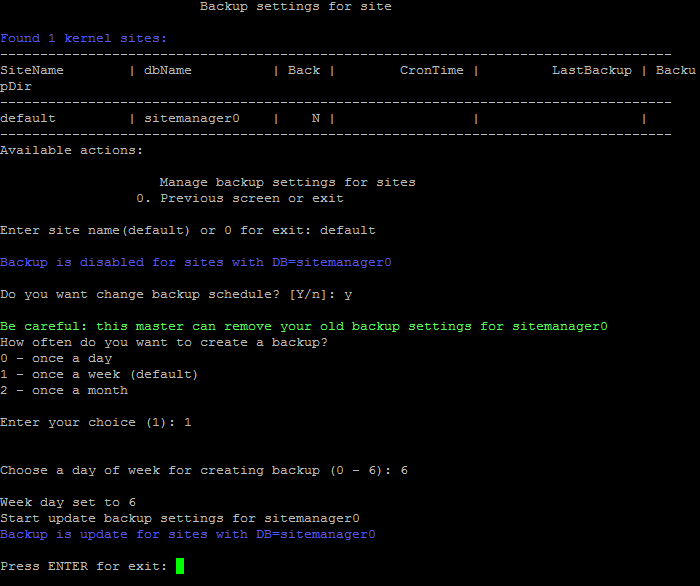

# 6. Настройка резервного копирования сайта (6. Change backup settings on site)

**Навигация**
- [← Оглавление курса](index.md)
- [← Предыдущий: 8855 — 5. Настройка https на сайте (5. Change https settings on site)](lesson_8855.md)
- [Следующий: 8859 — 7. Настройка NTLM-авторизации на всех сайтах (7. Configure NTLM auth for all sites) →](lesson_8859.md)

Официальная страница урока: https://dev.1c-bitrix.ru/learning/course/index.php?COURSE_ID=37&LESSON_ID=8857

### Копирование по расписанию


При разворачивании проектов на базе *BitrixVM/BitrixEnv*, часто встает задача создания резервной копии проекта по расписанию.


В *BitrixVM/BitrixEnv* есть функционал автоматического резервного копирования сайта и базы данных. Бекап будет создан по расписанию в виде архива **.tar.gz** и записан в директории `/home/bitrix/backup/archive/`.


У данного способа есть как преимущества, так и недостатки в сравнении с встроенным в продукты «1С-Битрикс» механизмом создания резервной копии:


- **К преимуществам** относятся более высокая скорость создания резервной копии и независимость от работоспособности проекта.
- **Из недостатков** стоит отметить то, что при использование данного способа нельзя сделать резервную копию файлов, расположенных в облачных хранилищах.


### Создание расписания


Для создания расписания автоматического резервного копирования средствами *BitrixVM/BitrixEnv* необходимо:


- В меню виртуальной машины выбрать пункт 6. Configure pool sites &gt; 6. Change backup settings on site.
- Выбрать из списка имя хоста и согласиться на изменение настроек расписания автоматического резервного копирования:
  
- Выбрать периодичность и час запуска автоматического резервного копирования:
  
  Если необходимо выполнить более точную настройку бэкапов, можно воспользоваться утилитой командной строки:
  ```
  /opt/webdir/bin/bx-sites -a backup -d dbcp --enable --minute=10 --hour=18 --day=any --month=any --weekday=any
  ```
  **Примечание**: Как настроить правильное время в *BitrixVM/BitrixEnv* см. [здесь](lesson_8829.md).
- На этом работа мастера настройки завершена, и в Cron (`/etc/crontab`) добавляется задача резервного копирования проекта.
  Бэкап делается для ядра (сайта типа **kernel** и **ext_kernel**) и всех его **link**, если такие существуют.
  Для этого создается задание в crontab-файле. Например:
  ```
  10 22 * * * bitrix /opt/webdir/bin/bx_backup.sh sitemanager /home/bitrix/backup/archive
  ```
  В качестве первой опции указывается **имя БД**, второй опцией указывается **каталог**, в котором будет создан архив.
  В итоге скрипт создаст архив следующего вида:  **www_backup__DD.MM.YYYY_&lt;random_string&gt;.tar.gz** (например - www_backup_dbcp_21.10.2014_1RJKXbMv.tar.gz).
  Внутри архива должны присутствовать следующие файлы:

  1. дамп БД `/home/bitrix/mysql_dump__DD.MM.YYYY_.sql`
  2. данные сайта ядра
  3. данные сайтов  типа ссылок с полным путем


### Управление бэкапами через bx-sites


- `-a|--action` - действие по управлению сайтами, в данном случае это backup
- `-d|--database` - название БД (в бэкапе будут содержаться данные для всех сайтов, которые используют эту БД)
- `--enable|--disable` - включение или отключение бэкапа для сайтов
- `--minute` - параметры записи в crontab файле (минуты)
- `--hour` - параметры записи в crontab файле (часы)
- `--day` - параметры записи в crontab файле (день)
- `--month` - параметры записи в crontab файле (месяц)
- `--weekday` - параметры записи в crontab файле (день недели)


В случае успешного выполнения утилита вернет новые опции для сайта:


```

/opt/webdir/bin/bx-sites -a backup -d sitemanager0 --enable --minute=10 --hour=23 --day=1 --month=any --weekday=any -o json | python -mjson.tool
...
            "BackupCronFile": "/etc/crontab",
            "BackupDay": "1",
            "BackupFolder": "/home/bitrix/backup/archive",
            "BackupHour": "23",
            "BackupMinute": "10",
            "BackupMonth": "*",
            "BackupTask": "enable",
            "BackupVersion": "v5",
            "BackupWeekDay": "*",
...
```


### Списки исключений


Ряд файлов/каталогов необходимо исключить из резервной копии. Список таких исключений можно найти в файле **/opt/webdir/bin/ex.txt**.


По умолчанию, в нем находятся следующие подкаталоги:


```

bitrix/cache
bitrix/managed_cache
bitrix/stack_cache
bitrix/local_cache
bitrix/backup
bitrix/tmp
upload/tmp
upload/resize_cache
```


### Содержимое бэкапа/ восстановление


Как уже сказано выше, в бэкап включается:


- сам каталог сайта ядра (**kernel** или **ext_kernel**);
- файл dump БД (`/home/bitrix/mysql_dump_<db>.sql`);
- каталоги сайтов (**link**), которые используют ядро.


Например команда:

```
/opt/webdir/bin/bx_backup.sh sitemanager /home/bitrix/backup/archive
```


создает в директории **/home/bitrix/backup/archive/** архив **www_backup_&lt;DBName&gt;_DD.MM.YYYY_&lt;random_string&gt;.tar.gz**, например **www_backup_sitemanager_09.03.2023_zJ34ogIj.tar.gz**:


Для восстановления нужно распаковать бэкап в `DocumentRoot` ядра. В примере рассмотрим директорию для сайта по умолчанию **/home/bitrix/www**:


```
tar -xvzf /home/bitrix/backup/archive/www_backup_sitemanager_09.03.2023_zJ34ogIj.tar.gz -C /home/bitrix/www/
```


После чего нужно восстановить БД:


```
mysql sitemanager < /home/bitrix/www/home/bitrix/mysql_dump_sitemanager_09.03.2023_zJ34ogIj_after_connect.sql
```


Аналогичной командой нужно восстановить другой файл с бекапом базы данных сайта:


```
mysql sitemanager < /home/bitrix/www/home/bitrix/mysql_dump_sitemanager_09.03.2023_zJ34ogIj.sql
```


Затем восстановите данные дополнительных сайтов типа **link**, если они есть:


```

rsync -av /home/bitrix/www/home/bitrix/ext_www/<site_name> /home/bitrix/ext_www/
```


Далее удалите дамп базы данных и бэкапы дополнительных сайтов в целях безопасности.


```
rm -fr /home/bitrix/www/home/bitrix/*
```


#### Восстановление на другой сервер Если копия восстанавливается на другом сервере, то сначала нужно создать восстанавливаемые сайты в меню VMBitrix. Также пароль от БД в архиве не подойдет к БД нового сервера, так как пароли генерируются случайным образом после установки новой виртуальной машины. То есть после восстановления нужно сменить пароль пользователя базы данных. Эти данные можно взять в секции connections файла /bitrix/.settings.php после распаковки архива бэкапа (для сайта по умолчанию пользователь базы данных – bitrix0). Сменить пароль можно SQL запросом в консоли mysql: SET PASSWORD FOR 'bitrix0'@'localhost' = PASSWORD('new_pass'); Затем восстановить дампы базы данных и бэкапы дополнительных сайтов. Аналогичные действия нужно провести, если в качестве DocumentRoot для сайтов использовалась директория /home/bitrix/ext_www. Примечание: Не забывайте следить за свободным местом на диске и периодически удалять старые резервные копии.
