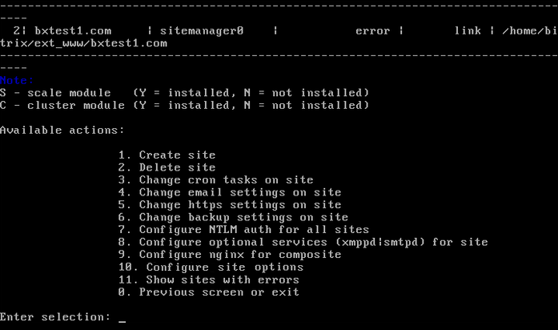
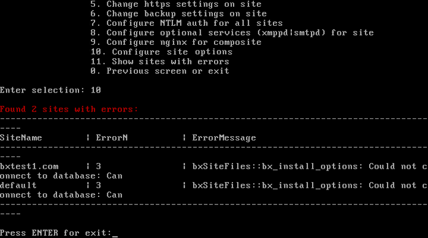

# 11. Сайты с ошибками (11. Show sites with errors)

**Навигация**
- [← Оглавление курса](index.md)
- [← Предыдущий: 9357 — 1. Настроить параметр proxy_ignore_client_abort (1. Configure proxy_ignore_client_abort for site)](lesson_9357.md)
- [Следующий: 9347 — 1. Создать инстанс sphinx на сервере (1. Create sphinx instance on server) →](lesson_9347.md)

Официальная страница урока: https://dev.1c-bitrix.ru/learning/course/index.php?COURSE_ID=37&LESSON_ID=8869

Если по каким-либо причинам на сайтах появились серьезные ошибки: отсутствие модулей на сайте или нет подключения к БД (не получается подключиться с данными настроек сайта), то в меню виртуальной машины появляется пункт меню 6. Manage sites in the pool &gt; 11. Show sites with errors:

Выбрав этот пункт меню, отобразится список сайтов с кратким описанием ошибки (в данном примере - нет соединения с базой данных mysql):

**Примечание**: Пункт меню 6. Configure pool sites &gt; 11. Show sites with errors является скрытым и появляется только тогда, когда есть ошибки на сайтах под управлением виртуальной машиной *BitrixVM* или linux-окружением *BitrixEnv*. Как только ошибки будут исправлены, данный пункт снова скроется.
