# Увеличение размера существующего жесткого диска BitrixVM

**Навигация**
- [← Оглавление курса](index.md)
- [← Предыдущий: 8885 — Добавление дополнительного жесткого диска BitrixVM](lesson_8885.md)
- [Следующий: 9383 — Увеличение размера LVM-раздела BitrixEnv →](lesson_9383.md)

Официальная страница урока: https://dev.1c-bitrix.ru/learning/course/index.php?COURSE_ID=37&LESSON_ID=8887

**Внимание!**

1. Для операций, описанных в данной главе, необходимы знания администрирования *nix-систем. Перед началом проведения данных операций рекомендуется сделать полный бекап *«Виртуальной машины»*.
2. Приведённые настройки выходят за рамки меню Виртуальной машины. Это означает, что информация - ознакомительная и применять её следует с чётким пониманием того что вы делаете и с собственной ответственностью за совершаемые действия. В нашей техподдержке рассматриваются только вопросы по работе пунктов меню ВМ.


Вторым способом увеличения дискового пространства в *BitrixVM* является увеличение размера уже существующего жесткого диска виртуальной машины.


1. Сначала измените размер системного диска на требуемый, например до 100Гб:
  ## Изменить размер системного диска в VMWare
  В списке виртуальных машин **VMWare Player** выберите виртуальную машину *BitrixVM* и нажмите **Edit virtual machine settings**:
  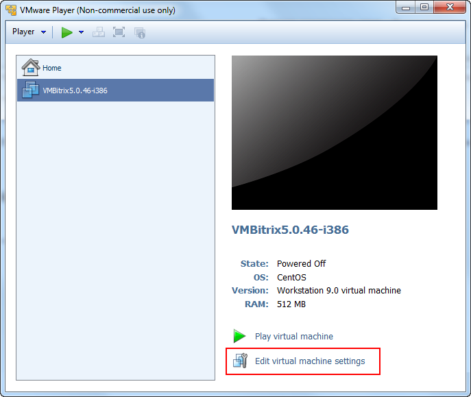
  В окне устройств выберите **Hard Disk**, размер которого нужно увеличить, и активируйте в меню **Utilities** пункт **Expand**:
  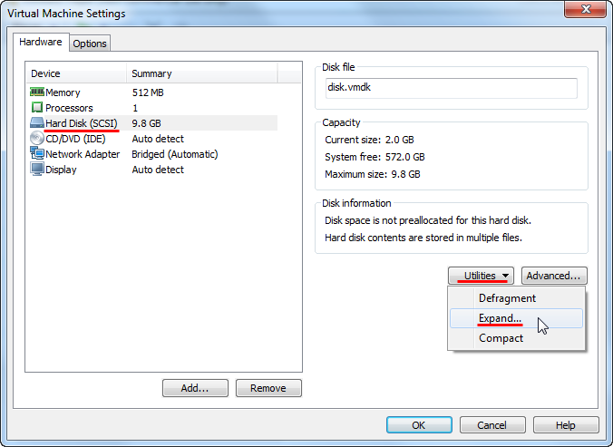
  В открывшемся окне **Expand Disk Capacity** в поле **Maximum disk size (GB)** укажите необходимый объем виртуального диска в гигабайтах (в данном примере - 100Гб):
  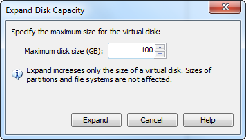
  ## Изменить размер системного диска в VirtualBox
  В меню VirtualBox **File** выберите **Virtual Media Manager**:
  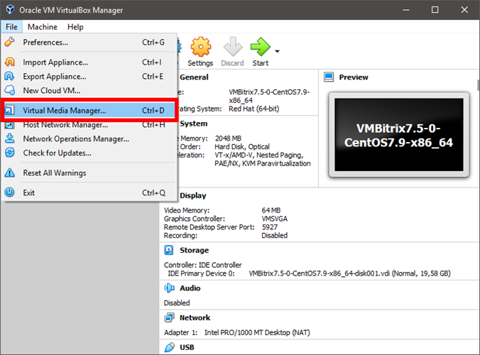
  Далее выберите ваш виртуальный диск, нажмите на кнопку **Properties** и укажите необходимый объем диска:
  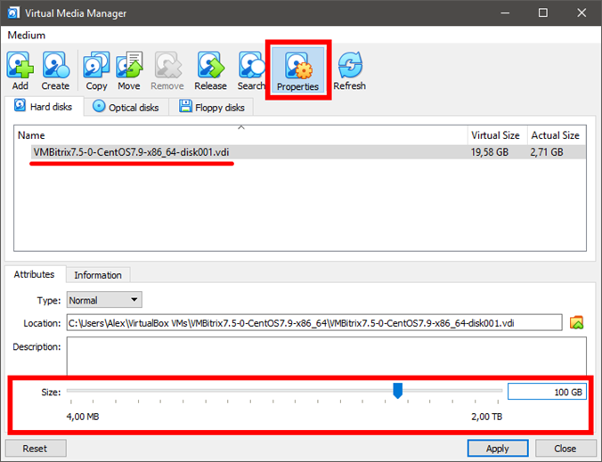
2. Далее необходимо запустить виртуальную машину *BitrixVM*, авторизоваться под **root** и перейти в режим командной строки (консоль), выбрав пункт меню **0. Exit** в виртуальной машине.
3. Смотрим диск и присвоенное ему буквенное обозначение консольной командой:
  ```
  fdisk -c -u -l
  ```
  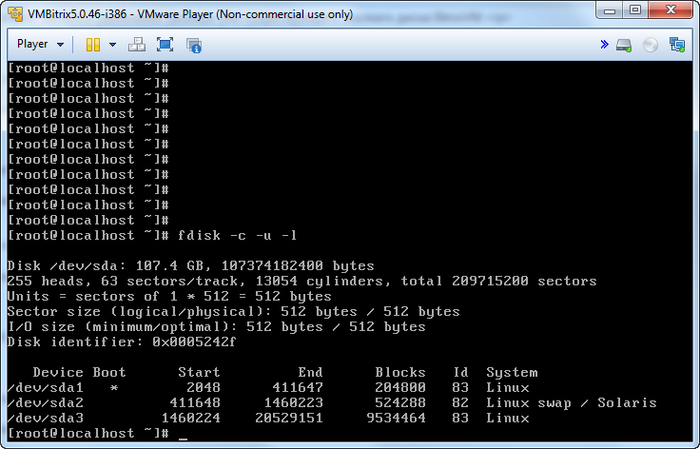
  где для диска `/dev/sda`:

  - **sda1** - загрузочный сектор диска;
  - **sda2** - файл подкачки (swap);
  - **sda3** - раздел, в котором установлена операционная система и который как раз и нужно увеличить.
4. Запускаем утилиту **fdisk** для работы с диском `/dev/sda`:
  ```
  fdisk -c -u /dev/sda
  ```
5. Командой **d** удаляем раздел **sda3**, выбрав `Partition number (1-4): 3`:
  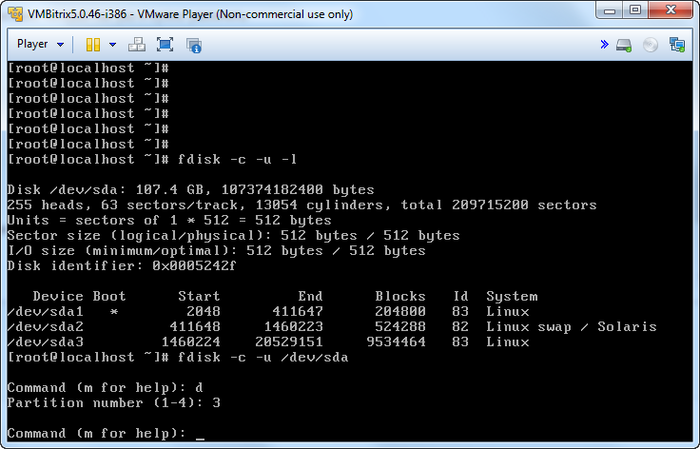
  **Внимание!** Данные с диска при этом никуда не удаляются, в данном случае удаляется лишь запись о разделе из таблицы разделов диска.
6. Далее командой **n** создаем новый раздел:
  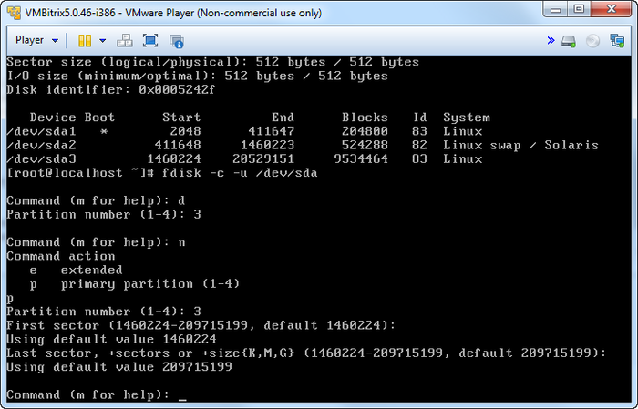

  - основной (primary partition) - команда **p** и `Partition number (1-4): 3`;
  - первый и последний сектора при этом выбираем по умолчанию - таким образом, будет создан раздел, используя все свободное пространство на диске.
7. Для сохранения обновленной таблицы разделов и выхода из fdisk введите команду **w**:
  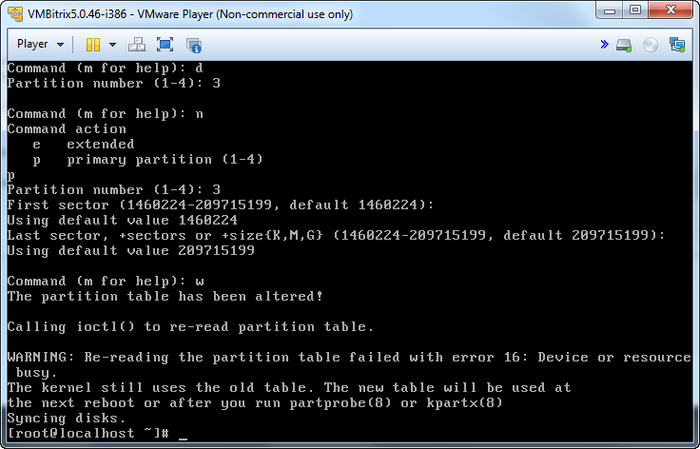
8. Чтобы система подгрузила новую таблицу разделов, необходима перезагрузка виртуальной машины:
  ```
  reboot
  ```
9. После перезагрузки с помощью утилиты **resize2fs** увеличиваем размер файловой системы раздела `/dev/sda3`:
  ```
  resize2fs /dev/sda3
  ```
  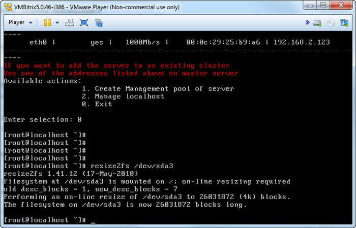


Проверить, что раздел увеличен можно с помощью команды **df**:


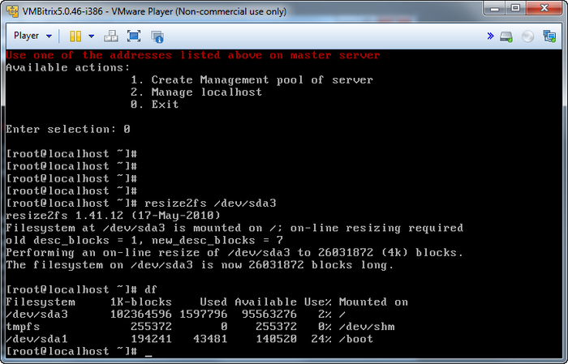


Изменение размера дисков в других средах виртуализации проходит аналогично.
