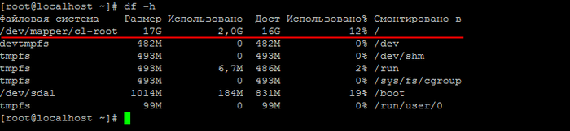
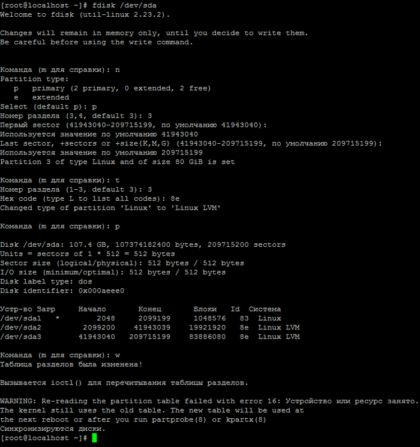
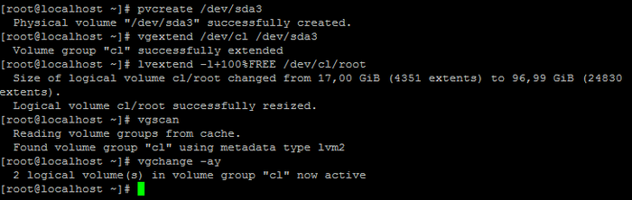
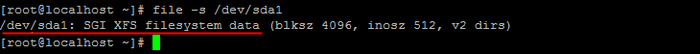
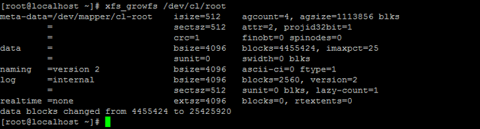
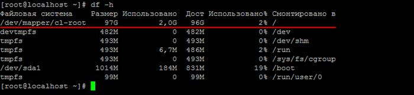

# Увеличение размера LVM-раздела BitrixVM

**Навигация**
- [← Оглавление курса](index.md)
- [← Предыдущий: 6928 — Увеличение размера существующего жесткого диска BitrixVM](lesson_6928.md)
- [Следующий: 9101 — Добавление ssl-сертификатов в BitrixVM →](lesson_9101.md)

Официальная страница урока: https://dev.1c-bitrix.ru/learning/course/index.php?COURSE_ID=37&LESSON_ID=8909

**Внимание!** Для операций, описанных в данном уроке, необходимы знания администрирования *nix-систем. Перед началом проведения данных операций рекомендуется сделать полный бекап *«Виртуальной машины»*.


**Внимание!** По умолчанию в CentOS 7 устанавливается менеджер логических томов **LVM2** при автоматической разбивке диска на этапе установки системы (в случае установки BitrixEnv c помощью скрипта bitrix_env.sh на готовый CentOS 7). В таком случае изменение размера LVM-раздела будет отличаться от предыдущих способов.


Пусть размер системного диска был увеличен с 20 ГБ до 100Гб, как было [сделано ранее](lesson_6928.md) в VMWare Player.


Тогда действия по изменению размера LVM-раздела будут такими:


1. Смотрим, что в системе на данный момент есть из устройств/разделов командой:
  ```
  fdisk -l
  ```
  
2. Убеждаемся, что место в системе автоматически не увеличилось при помощи команды:
  ```
  df -h
  ```
  
  Здесь мы также видим и запоминаем имя группы томов и имя тома (у вас они будут другие):

  - **cl** - имя группы томов;
  - **root** - имя тома.
3. Создаем новый раздел **sda3** - тип раздела: **Linux LVM** (код типа **8e**) на неразмеченной области. Для этого начинаем работу с устройством **sda** c помощью команды:
  ```
  fdisk /dev/sda
  ```
4. Далее командой **n** создаем новый раздел:

  - основной (primary partition) - команда **p** и `Partition number (1-3, default 3): 3` (так как у нас было 2 логических раздела sda1 и sda2 - п.1);
  - первый и последний сектора при этом выбираем по умолчанию - таким образом, будет создан раздел, используя все свободное пространство на диске;
  - укажем тип раздела - команда **t** и `Partition number (1-3, default 3): 3`;
  - вводим код типа раздела, соответствующий Linux LVM - `8e`;
  - смотрим таблицу разделов - команда **p** и убеждаемся, что все верно;
  - Раздел **sda3** создан. Для сохранения обновленной таблицы разделов и выхода из fdisk -  команда **w**.
    
5. Чтобы система подгрузила новую таблицу разделов, необходима перезагрузка виртуальной машины:
  ```
  reboot
  ```
6. После перезагрузки необходимо создать физический том **sda3**:
  ```
  pvcreate /dev/sda3
  ```
7. Далее расширяем группу томов на новое пространство, используя имя группы томов **cl** (которое мы запомнили ранее в п.2):
  ```
  vgextend /dev/cl /dev/sda3
  ```
8. Теперь расширим логический том, используя имя тома **root** (которое мы запомнили ранее в п.2):
  ```
  lvextend -l+100%FREE /dev/cl/root
  ```
9. Сканируем диски на предмет наличия групп томов и активируем все найденные группы томов:
  ```
  vgscan
  vgchange -ay
  ```
  
10. Узнаем тип файловой системы:
  ```
  file -s /dev/sda1
  ```
  
  Видим, что файловая система **XFS**.
11. И наконец, расширяем файловую систему XFS (может потребоваться время):
  ```
  xfs_growfs /dev/cl/root
  ```
  
  **Внимание!** Если файловая система не **XFS**, а, например, **ext4** или **reiserfs**, то команды будут такие (с учетом cl - имя группы томов и root - имя тома из п.2):
  - `resize2fs /dev/cl/root` - для **ext4**;
  - `resize_reiserfs /dev/cl/root` - для **reiserfs**;
12. Проверяем итоговый результат:
  ```
  df -h
  ```
  
