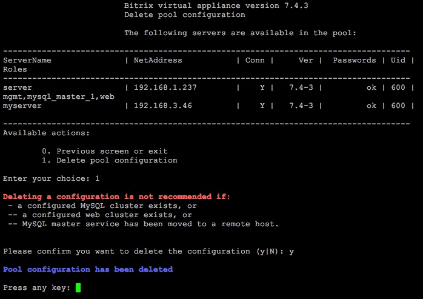
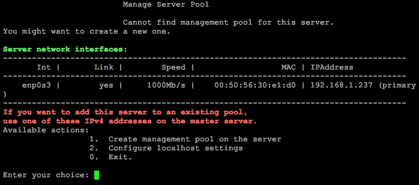

# 7. Удаление конфигурации пула (7. Remove pool configuration)

**Навигация**
- [← Оглавление курса](index.md)
- [← Предыдущий: 8829 — 6. Настройка таймзоны в пуле (6. Configure pool timezone)](lesson_8829.md)
- [Следующий: 8831 — 8. Обновление PHP и MySQL (8. Update PHP and MySQL) →](lesson_8831.md)

Официальная страница урока: https://dev.1c-bitrix.ru/learning/course/index.php?COURSE_ID=37&LESSON_ID=8995

**Внимание** При удалении конфигурации пула происходит сброс информации о нодах и настроек подключения к ним. Поэтому не рекомендуется это делать, если:

- Сконфигурирован [MySQL-кластер](lesson_9323.md) (master-slave);
- Сконфигурирован [Web-кластер](/learning/course/index.php?COURSE_ID=37&CHAPTER_ID=08873);
- [Перенесена MySQL-мастер база](lesson_9337.md#change_master) на другой сервер пула.

Удаление конфигурации пула осуществляется с помощью меню 1. Manage servers in the pool &gt; 7. Remove pool configuration. После подтверждения конфигурация пула будет удалена:

Меню же вернется к своему первоначальному состоянию:

**Внимание!** Задачи могут выполняться довольно длительное время (до 2-3 часов и более) в зависимости от сложности задачи, объема данных, используемых в этих задачах, мощности и загруженности сервера. Проверить текущие выполняемые задачи можно с помощью меню [10. Background pool tasks &gt; 1. View running tasks](lesson_8845.md). Если по каким-либо причинам нужно посмотреть лог-файлы выполнения задач, то они находятся в директории `/opt/webdir/temp`.
