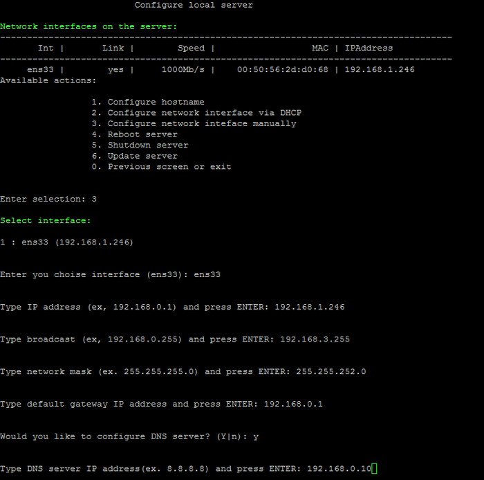
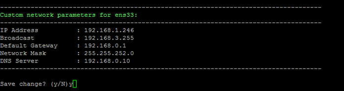

# 3. Настройка IP-адреса сервера вручную (3. Configure network inteface manually)

**Навигация**
- [← Оглавление курса](index.md)
- [← Предыдущий: 8837 — 2. Настройка IP-адреса сервера через DHCP (2. Configure network interface via DHCP)](lesson_8837.md)
- [Следующий: 12125 — 4. Перезагрузка сервера (4. Reboot server) →](lesson_12125.md)

Официальная страница урока: https://dev.1c-bitrix.ru/learning/course/index.php?COURSE_ID=37&LESSON_ID=9315

Для задания IP-адреса в ручном режиме необходимо:

- Перейти в главном меню 2. Manage localhost - 3. Configure network interface manually.
- Выбрать сетевой интерфейс (в данном примере - **ens33**).
- Ввести данные:
  

  - **Type IP address** -  новый IP-адрес сервера;
  - **Type broadcast** -  широковещательный адрес сети;
  - **Type network mask** -  маска подсети;
  - **Type default gateway** -  шлюз по умолчанию;
  - **Type DNS server** -  адрес DNS-сервера.
- Проверить введенные данные и дать согласие на изменение параметров сети сервера:
  
