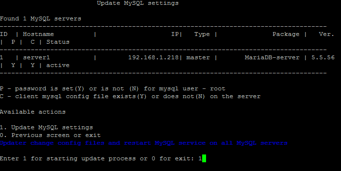

# 1. Обновить настройки для всех MySQL-серверов (1. Update settings for all MySQL servers)

**Навигация**
- [← Оглавление курса](index.md)
- [← Предыдущий: 20722 — 7. Использование бета-версии BitrixEnv (7. Enable or disable bitrix-env beta versions)](lesson_20722.md)
- [Следующий: 9319 — 2. Изменить пароль пользователя root для MySQL (2. Change password for MySQL root user) →](lesson_9319.md)

Официальная страница урока: https://dev.1c-bitrix.ru/learning/course/index.php?COURSE_ID=37&LESSON_ID=9317

Чтобы обновить настройки для всех MySQL-серверов, нужно перейти в главном меню 3. Configure MySQL service for the pool - 1. Update settings for all MySQL servers:

Опция обновляет конфигурацию одного или нескольких MySQL-серверов в пуле (если такое имеется) и приводит их к дефолтным настройкам для виртуальной машины.

**Внимание!** Задачи могут выполняться довольно длительное время (до 2-3 часов и более) в зависимости от сложности задачи, объема данных, используемых в этих задачах, мощности и загруженности сервера. Проверить текущие выполняемые задачи можно с помощью меню 10. Background tasks in the pool &gt; 1. View running tasks. Если по каким-либо причинам нужно посмотреть лог-файлы выполнения задач, то они находятся в директории `/opt/webdir/temp`.
