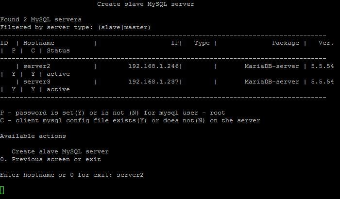
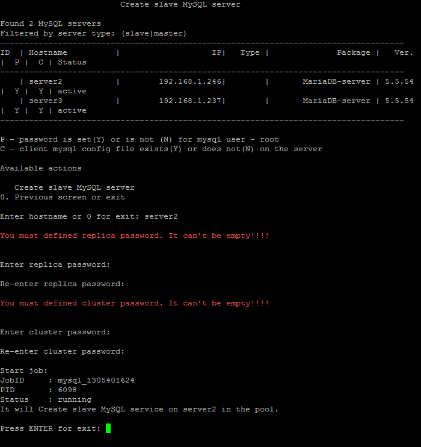
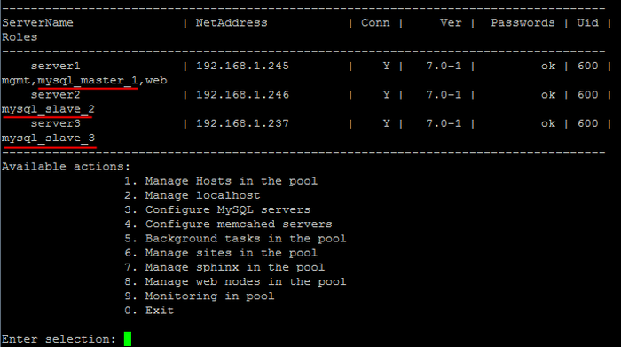

# 4. Создать slave MySQL-сервер (4. Create MySQL slave)

**Навигация**
- [← Оглавление курса](index.md)
- [← Предыдущий: 9321 — 3. Остановить/Запустить службу MySQL на сервере (3. Stop/Start MySQL service on the server)](lesson_9321.md)
- [Следующий: 9337 — 5. Смена master сервера MySQL (5. Change master MySQL server) →](lesson_9337.md)

Официальная страница урока: https://dev.1c-bitrix.ru/learning/course/index.php?COURSE_ID=37&LESSON_ID=9323

### Конфигурация master-slave

В «1C-Битрикс: Виртуальная машина» можно быстро развернуть кластерную конфигурацию master-slave [«1С-Битрикс: Управление сайтом»](http://www.1c-bitrix.ru/products/cms/) и [«Битрикс24 в коробке»](http://www.1c-bitrix.ru/products/intranet/).

Ключевые особенности:

- гибкая балансировка нагрузки SQL
- простота администрирования
- дешевое и быстрое неограниченное масштабирование
- он-лайн бэкап
- не требуется доработка логики веб-приложения

Схема «master - slave» реализуется средствами MySQL. Платформа «1С-Битрикс» позволяет гибко балансировать нагрузку между серверами, участвующими в репликации.

**Внимание!** Перед тем как начинать конфигурировать схему «master - slave» в *BitrixVM/BitrixEnv* нужно предварительно установить продукты [«1С-Битрикс: Управление сайтом»](http://www.1c-bitrix.ru/products/cms/) или в [«Битрикс24 в коробке»](http://www.1c-bitrix.ru/products/intranet/) с модулем [Веб-кластер](http://www.1c-bitrix.ru/products/intranet/features/webcluster.php). Данный модуль входит только в старшие редакции продуктов «1С-Битрикс».

### Как создать slave сервер MySQL

Для создания slave сервера MySQL нужно:

- Выбрать пункт меню 3. Configure MySQL service for the pool &gt; 4. Create MySQL slave, ввести имя хоста в пуле, на котором будет создан slave сервер MySQL (в данном примере - **server2**):
  
- Придумать и ввести пароли репликации и кластера:
  
  **Примечание**: Пароли репликации и кластера нужно ввести один раз, в дальнейшем при добавлении новых серверов эти пароли спрашиваться не будут.
- Подождать, пока задача по добавлению slave cервера MySQL будет закончена.
- Создадим аналогичным образом еще один slave сервер MySQL (**server3**). В итоге получим три сервера MySQL: master (**server1**) и два slave (**server2** и **server3**):
  

**Внимание!** Задачи могут выполняться довольно длительное время (до 2-3 часов и более) в зависимости от сложности задачи, объема данных, используемых в этих задачах, мощности и загруженности сервера. Проверить текущие выполняемые задачи можно с помощью меню 10. Background tasks in the pool &gt; 1. View running tasks. Если по каким-либо причинам нужно посмотреть лог-файлы выполнения задач, то они находятся в директории `/opt/webdir/temp`.
