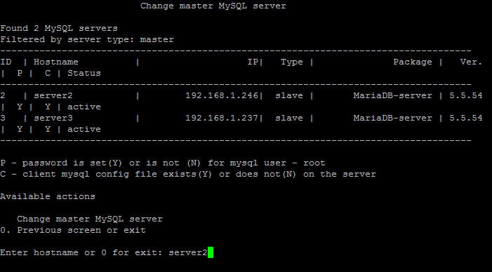
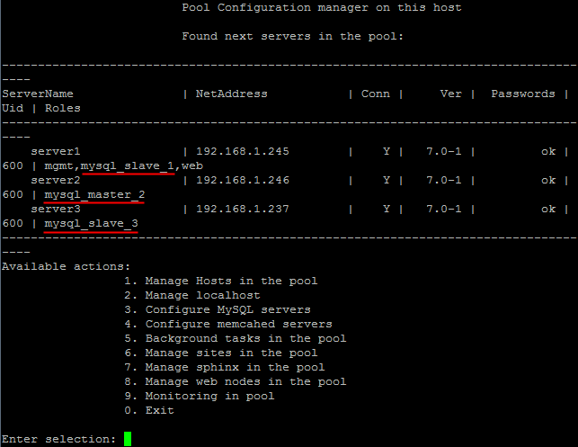

# 5. Смена master сервера MySQL (5. Change master MySQL server)

**Навигация**
- [← Оглавление курса](index.md)
- [← Предыдущий: 9323 — 4. Создать slave MySQL-сервер (4. Create MySQL slave)](lesson_9323.md)
- [Следующий: 9339 — 6. Удаление slave сервера MySQL (6. Remove slave MySQL server) →](lesson_9339.md)

Официальная страница урока: https://dev.1c-bitrix.ru/learning/course/index.php?COURSE_ID=37&LESSON_ID=9337

Для переноса **master** сервера MySQL на другую машину необходимо:

- Выбрать пункт меню 3. Configure MySQL service for the pool &gt; 5. Change master MySQL server.
  **Примечание**: Данный пункт меню появится только тогда, когда будет создан хотя бы 1 slave-сервер MySQL с помощью меню 3. Configure MySQL servers &gt; 4. Create slave MySQL server.
- Ввести имя хоста для будущего master сервера из списка доступных slave (например **server2**):
  
- Подождать, пока задача по смене будет закончена.
- В итоге серверы станут: master (**server2**) и два slave (**server1** и **server3**):
  

Таким образом, мы перенесли master сервер MySQL с машины **server1** на **server2**.

**Внимание!** Задачи могут выполняться довольно длительное время (до 2-3 часов и более) в зависимости от сложности задачи, объема данных, используемых в этих задачах, мощности и загруженности сервера. Проверить текущие выполняемые задачи можно с помощью меню 10. Background tasks in the pool &gt; 1. View running tasks. Если по каким-либо причинам нужно посмотреть лог-файлы выполнения задач, то они находятся в директории `/opt/webdir/temp`.
