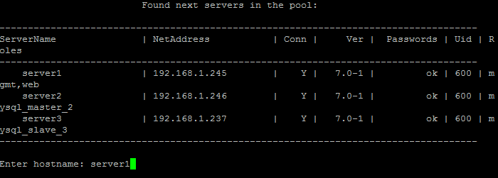
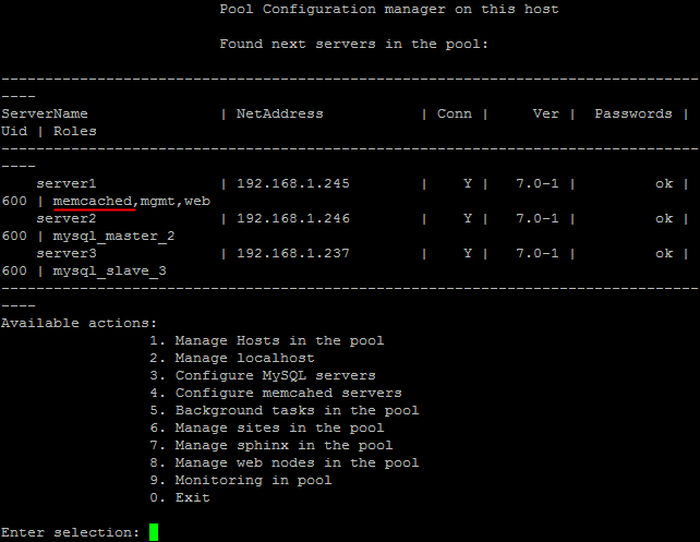

# 1. Настройка службы memcached (1.Configure memcached service)

**Навигация**
- [← Оглавление курса](index.md)
- [← Предыдущий: 9339 — 6. Удаление slave сервера MySQL (6. Remove slave MySQL server)](lesson_9339.md)
- [Следующий: 9345 — 2. Обновить настройки memcached сервера (2. Update settings on all memcached servers) →](lesson_9345.md)

Официальная страница урока: https://dev.1c-bitrix.ru/learning/course/index.php?COURSE_ID=37&LESSON_ID=9341

Для создания memcached сервера нужно:

- Выбрать пункт меню Configure Memcached service for the pool &gt; 1. Configure memcached service.
  Ввести имя хоста в пуле, на котором будет запущен сервер (в данном примере - **server1**):
  
  Подождать, пока задача по запуску будет закончена:
  

**Внимание!** Задачи могут выполняться довольно длительное время (до 2-3 часов и более) в зависимости от сложности задачи, объема данных, используемых в этих задачах, мощности и загруженности сервера. Проверить текущие выполняемые задачи можно с помощью меню 10. Background tasks in the pool &gt; 1. View running tasks. Если по каким-либо причинам нужно посмотреть лог-файлы выполнения задач, то они находятся в директории `/opt/webdir/temp`.
