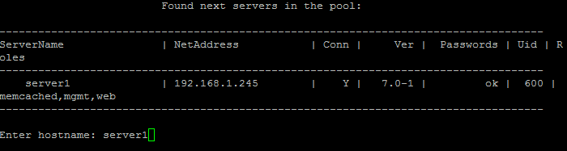

# 3. Удаление memcached сервера (3. Remove memcached server)

**Навигация**
- [← Оглавление курса](index.md)
- [← Предыдущий: 9345 — 2. Обновить настройки memcached сервера (2. Update settings on all memcached servers)](lesson_9345.md)
- [Следующий: 9363 — 1. Настроить сервисы мониторинга (1. Configure monitoring services) →](lesson_9363.md)

Официальная страница урока: https://dev.1c-bitrix.ru/learning/course/index.php?COURSE_ID=37&LESSON_ID=9343

Для удаления memcached сервера необходимо:

- Выбрать пункт меню 4. Configure memcached servers &gt; 3. Remove memcached server.
  **Примечание**: Данный пункт меню появится только тогда, когда будет создан хотя бы 1 memcached-сервер с помощью меню 4. Configure memcached servers &gt; 1. Create memcached server.
- Ввести имя хоста удаляемого сервера (например **server1**):
  
- Подождать, пока задача по удалению будет закончена.

**Внимание!** Задачи могут выполняться довольно длительное время (до 2-3 часов и более) в зависимости от сложности задачи, объема данных, используемых в этих задачах, мощности и загруженности сервера. Проверить текущие выполняемые задачи можно с помощью меню 5. Background tasks in the pool &gt; 1. View running tasks. Если по каким-либо причинам нужно посмотреть лог-файлы выполнения задач, то они находятся в директории `/opt/webdir/temp`.
