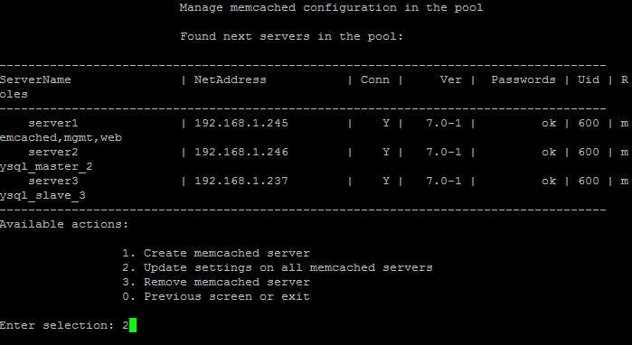

# 2. Обновить настройки memcached сервера (2. Update settings on all memcached servers)

**Навигация**
- [← Оглавление курса](index.md)
- [← Предыдущий: 9341 — 1. Настройка службы memcached (1.Configure memcached service)](lesson_9341.md)
- [Следующий: 9343 — 3. Удаление memcached сервера (3. Remove memcached server) →](lesson_9343.md)

Официальная страница урока: https://dev.1c-bitrix.ru/learning/course/index.php?COURSE_ID=37&LESSON_ID=9345

Чтобы обновить настройки для всех memcached -серверов, нужно перейти в главном меню 4. Configure memcached servers - 2. Update settings on all memcached servers:

**Примечание**: Данный пункт меню появится только тогда, когда будет создан хотя бы 1 memcached-сервер с помощью меню 4. Configure memcached servers &gt; 1. Create memcached server.

Эта опция запускает проверку текущей конфигурации одного или нескольких memcached-серверов в пуле (если такие имеются).

**Внимание!** Задачи могут выполняться довольно длительное время (до 2-3 часов и более) в зависимости от сложности задачи, объема данных, используемых в этих задачах, мощности и загруженности сервера. Проверить текущие выполняемые задачи можно с помощью меню 5. Background tasks in the pool &gt; 1. View running tasks. Если по каким-либо причинам нужно посмотреть лог-файлы выполнения задач, то они находятся в директории `/opt/webdir/temp`.
