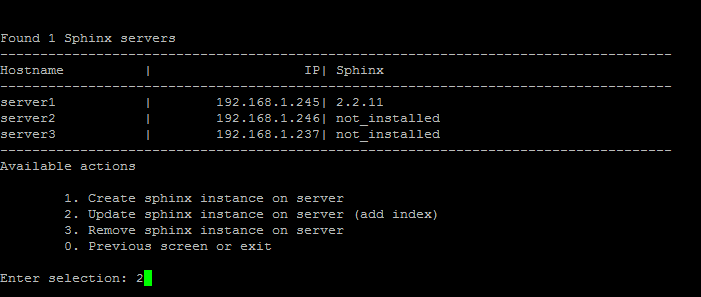
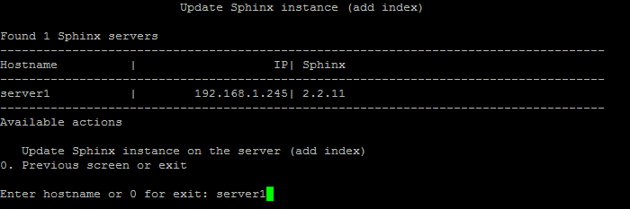
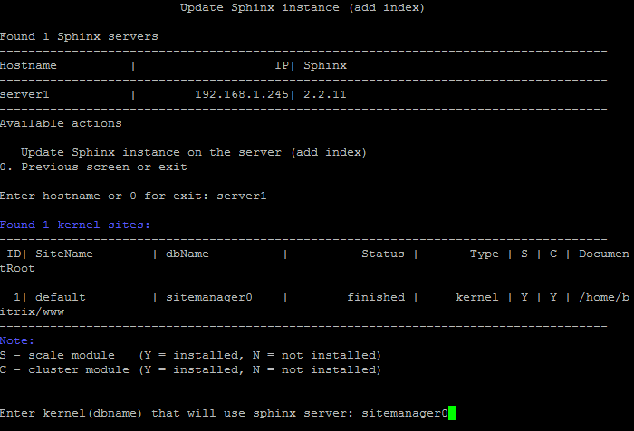
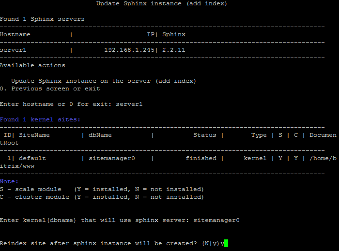

# 2. Обновить настройки sphinx (создать индекс) (2. Update sphinx instance on server (add index))

**Навигация**
- [← Оглавление курса](index.md)
- [← Предыдущий: 9347 — 1. Создать инстанс sphinx на сервере (1. Create sphinx instance on server)](lesson_9347.md)
- [Следующий: 9351 — 3. Удалить sphinx на сервере (3. Remove sphinx instance on server) →](lesson_9351.md)

Официальная страница урока: https://dev.1c-bitrix.ru/learning/course/index.php?COURSE_ID=37&LESSON_ID=9349

Чтобы обновить настройки для всех Sphinx-инстансов, нужно перейти в главном меню 7. Configure Sphinx service for the pool &gt; 2. Update sphinx instance on server (add index):

- 
  **Примечание**: Данный пункт меню появится только тогда, когда будет создан хотя бы один инстанс с помощью меню 7. Configure Sphinx service for the pool &gt; 1. Create sphinx instance on server.
- Далее ввести имя хоста, где будет запущен сервер поиска (в данном примере **server1**):
  
- Выбрать базу данных ядра системы сайта из списка:
  
- Дать согласие на запуск полной переиндексации после установки сервера:
  
- Подождать, пока задача по установке и переиндексации будет закончена.

Эта опция запускает проверку текущей конфигурации одного или нескольких Sphinx-инстансов в пуле (если такие имеются) и запускает принудительную переиндексацию.

**Внимание!** Задачи могут выполняться довольно длительное время (до 2-3 часов и более) в зависимости от сложности задачи, объема данных, используемых в этих задачах, мощности и загруженности сервера. Проверить текущие выполняемые задачи можно с помощью меню 10. Background pool tasks &gt; 1. View running tasks. Если по каким-либо причинам нужно посмотреть лог-файлы выполнения задач, то они находятся в директории `/opt/webdir/temp`.

**Примечание:** Ручная настройка поискового механизма **Sphinx** описана в данном [уроке](/learning/course/index.php?COURSE_ID=35&LESSON_ID=5935).
