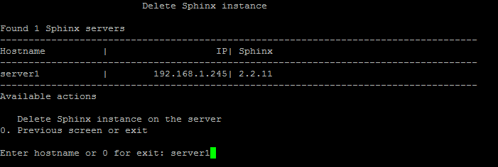
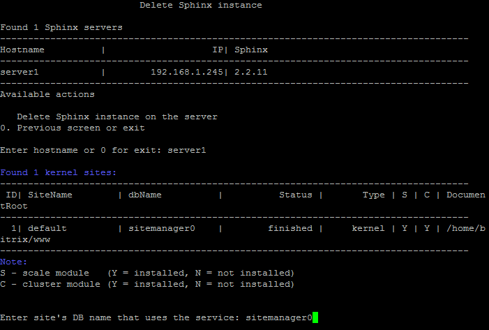

# 3. Удалить sphinx на сервере (3. Remove sphinx instance on server)

**Навигация**
- [← Оглавление курса](index.md)
- [← Предыдущий: 9349 — 2. Обновить настройки sphinx (создать индекс) (2. Update sphinx instance on server (add index))](lesson_9349.md)
- [Следующий: 9359 — 1. Создание веб-сервера (1. Create web role on server) →](lesson_9359.md)

Официальная страница урока: https://dev.1c-bitrix.ru/learning/course/index.php?COURSE_ID=37&LESSON_ID=9351

Для удаления Sphinx-инстанса с сервера необходимо:

- Выбрать пункт меню 7. Manage sphinx in the pool &gt; 3. Remove sphinx instance on server.
  **Примечание**: Данный пункт меню появится только тогда, когда будет создан хотя бы один инстанс с помощью меню 7. Configure Sphinx service for the pool &gt; 1. Create sphinx instance on server.
- Ввести имя хоста удаляемого Sphinx-инстанса (например **server1**):
  
- Выбрать базу данных ядра системы сайта из списка:
  
- Подождать, пока задача по удалению будет закончена.

**Внимание!** Задачи могут выполняться довольно длительное время (до 2-3 часов и более) в зависимости от сложности задачи, объема данных, используемых в этих задачах, мощности и загруженности сервера. Проверить текущие выполняемые задачи можно с помощью меню 10. Background pool tasks &gt; 1. View running tasks. Если по каким-либо причинам нужно посмотреть лог-файлы выполнения задач, то они находятся в директории `/opt/webdir/temp`.
