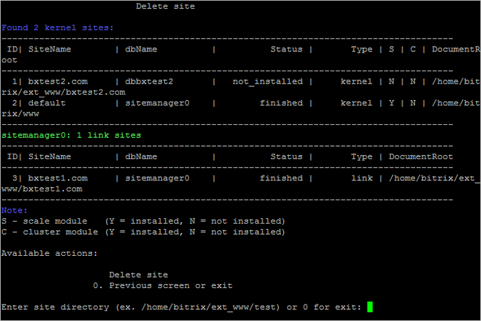

# 2. Удалить сайт (2. Delete site)

**Навигация**
- [← Оглавление курса](index.md)
- [← Предыдущий: 8849 — 1. Создание сайта (1. Create site)](lesson_8849.md)
- [Следующий: 8851 — 3. Настройка задач cron (3. Change cron tasks on site) →](lesson_8851.md)

Официальная страница урока: https://dev.1c-bitrix.ru/learning/course/index.php?COURSE_ID=37&LESSON_ID=9353

Для удаления записи о дополнительном сайте необходимо в административном меню выбрать пункт 6. Configure pool sites &gt; 2. Delete site и выбрать директорию удаляемого сайта (**Enter site directory**):

**Внимание!** Мастер удаления дополнительного сайта удаляет папку и базу данных дополнительного сайта, поэтому необходимо предварительно сделать бекап важных данных.

**Внимание!** Задачи могут выполняться довольно длительное время (до 2-3 часов и более) в зависимости от сложности задачи, объема данных, используемых в этих задачах, мощности и загруженности сервера. Проверить текущие выполняемые задачи можно с помощью меню 10. Background pool tasks &gt; 1. View running tasks. Если по каким-либо причинам нужно посмотреть лог-файлы выполнения задач, то они находятся в директории `/opt/webdir/temp`.
