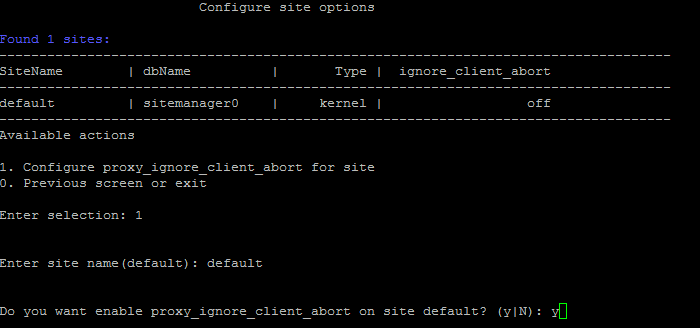
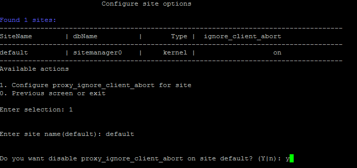

# 1. Настроить параметр proxy_ignore_client_abort (1. Configure proxy_ignore_client_abort for site)

**Навигация**
- [← Оглавление курса](index.md)
- [← Предыдущий: 8867 — Конфигурационный файл сайта](lesson_8867.md)
- [Следующий: 8869 — 11. Сайты с ошибками (11. Show sites with errors) →](lesson_8869.md)

Официальная страница урока: https://dev.1c-bitrix.ru/learning/course/index.php?COURSE_ID=37&LESSON_ID=9357

**Внимание!** Включение глобально параметра nginx `proxy_ignore_client_abort` нужно делать в крайних случаях, обычно это делать не требуется. Лучше это делать вручную и для конкретных `location`, а не глобально на весь сервер. В следующих версиях BitrixVM/BitrixEnv этот пункт меню будет переработан.

Включение параметра nginx `proxy_ignore_client_abort` может быть полезным при неполадках в работе **Телефонии**, **Открытых линиях**. Данный параметр определяет, закрывать ли соединение с проксированным сервером в случае, если клиент закрыл соединение, не дождавшись ответа.

Для управления необходимо:

- Из меню запустить мастер 10. Configure site options &gt; 1. Configure proxy_ignore_client_abort for site, ввести имя сайта и согласиться на включение параметра `proxy_ignore_client_abort`:
  
- Дождаться завершения данной задачи.

Аналогичным образом отключается данный параметр:

**Внимание!** Задачи могут выполняться довольно длительное время (до 2-3 часов и более) в зависимости от сложности задачи, объема данных, используемых в этих задачах, мощности и загруженности сервера. Проверить текущие выполняемые задачи можно с помощью меню 10. Background pool tasks &gt; 1. View running tasks. Если по каким-либо причинам нужно посмотреть лог-файлы выполнения задач, то они находятся в директории `/opt/webdir/temp`.
