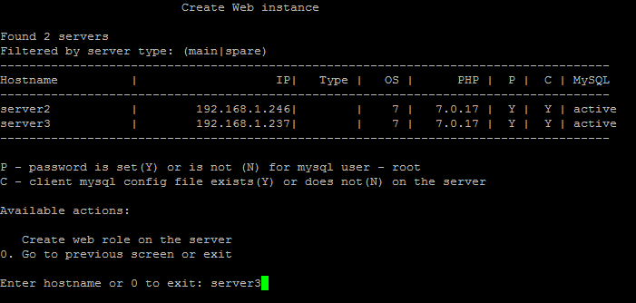
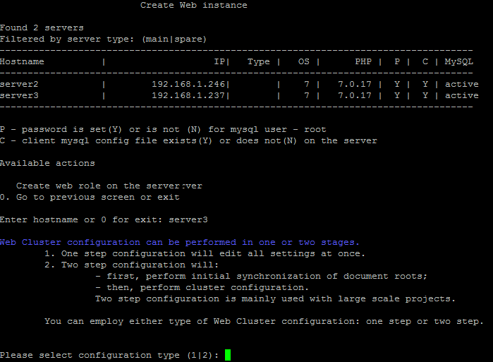
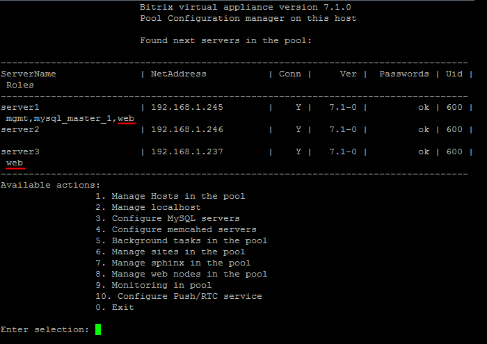
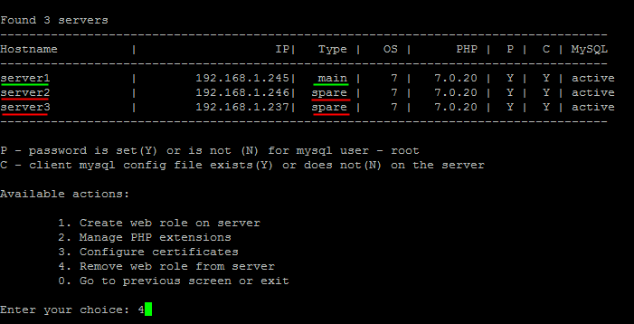

# 1. Создание веб-сервера (1. Create web role on server)

**Навигация**
- [← Оглавление курса](index.md)
- [← Предыдущий: 9351 — 3. Удалить sphinx на сервере (3. Remove sphinx instance on server)](lesson_9351.md)
- [Следующий: 9375 — 2. Настроить модули PHP (2. Manage PHP extensions) →](lesson_9375.md)

Официальная страница урока: https://dev.1c-bitrix.ru/learning/course/index.php?COURSE_ID=37&LESSON_ID=9359

Для создания роли веб-сервера нужно:

- Выбрать пункт меню 8. Manage pool web servers &gt; 1. Create web role on server и ввести имя хоста в пуле, на котором будет создан веб-сервер (в данном примере - **server3**):
  
- Выбрать вариант создания роли:
  

  1. **one step** - все действия по созданию web-роли будут произведены за 1 шаг. Данный вариант рекомендуется на простых проектах, где не так много данных.
  2. **two steps** - действия по созданию web-роли будут произведены за 2 шага для уменьшения ошибок в процессе создания роли. Данный вариант рекомендуется на крупных проектах, где очень много данных.
    **Внимание!** Если вы выбрали вариант **two steps**, после выполнения задачи 1-го шага нужно запустить 2-й шаг таким же образом на этом же сервере.
- Подождать, пока задачи по созданию веб-сервера будут закончены. И мы увидим, что у нас 2 сервера с ролью **web** в пуле: **server1** и **server3**:
  
- Добавим еще одному серверу в пуле **web**-роль (**server2**) аналогичным способом. Мы видим, что у сервера с балансировщиком web-роль имеет тип **main**, а у дополнительных серверов пула - **spare**:
  

**Внимание!** Задачи могут выполняться довольно длительное время (до 2-3 часов и более) в зависимости от сложности задачи, объема данных, используемых в этих задачах, мощности и загруженности сервера. Проверить текущие выполняемые задачи можно с помощью меню 10. Background pool tasks &gt; 1. View running tasks. Если по каким-либо причинам нужно посмотреть лог-файлы выполнения задач, то они находятся в директории `/opt/webdir/temp`.
