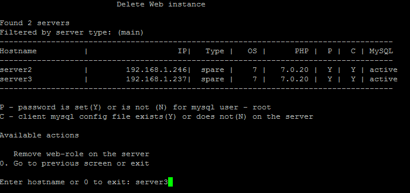
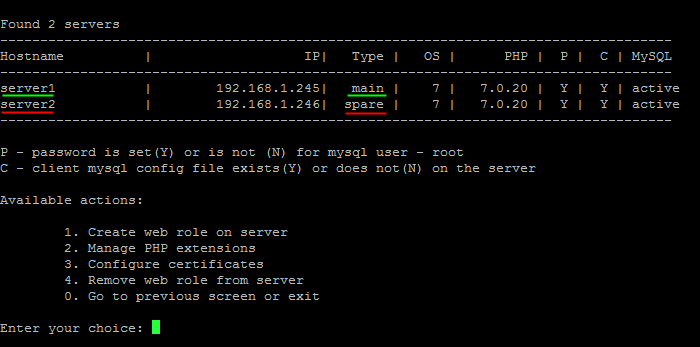

# 4. Удаление роли web c сервера (4. Remove web role from server)

**Навигация**
- [← Оглавление курса](index.md)
- [← Предыдущий: 11455 — 3. Восстановление сертификата по умолчанию (3. Restore default certificate)](lesson_11455.md)
- [Следующий: 9379 — 1. Настроить NodeJS RTC сервис (1. Install/Update NodeJS RTC Service) →](lesson_9379.md)

Официальная страница урока: https://dev.1c-bitrix.ru/learning/course/index.php?COURSE_ID=37&LESSON_ID=9361

Для удаления веб-сервера необходимо:

- Выбрать пункт меню 8. Manage pool web servers &gt; 4. Remove web role from server:
  
- Ввести имя хоста сервера, у которого удаляется роль **web** (например **server3**):
  
  **Внимание!** Удалять web-роль можно только типа **spare**, тип **main** (сервер с балансировщиком) удалять нельзя.
- Подождать, пока задача по удалению роли будет закончена.
- В итоге из 3 веб-серверов только на двух останется web-роль (main - **server1**, spare -  **server2**):
  

**Внимание!** Задачи могут выполняться довольно длительное время (до 2-3 часов и более) в зависимости от сложности задачи, объема данных, используемых в этих задачах, мощности и загруженности сервера. Проверить текущие выполняемые задачи можно с помощью меню 10. Background pool tasks &gt; 1. View running tasks. Если по каким-либо причинам нужно посмотреть лог-файлы выполнения задач, то они находятся в директории `/opt/webdir/temp`.
