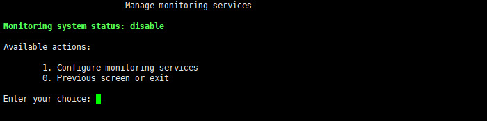
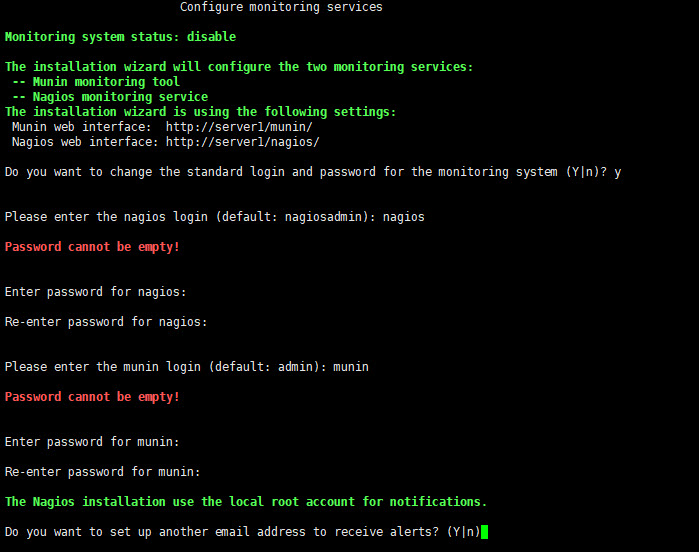
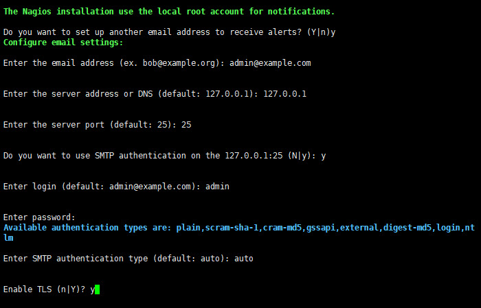
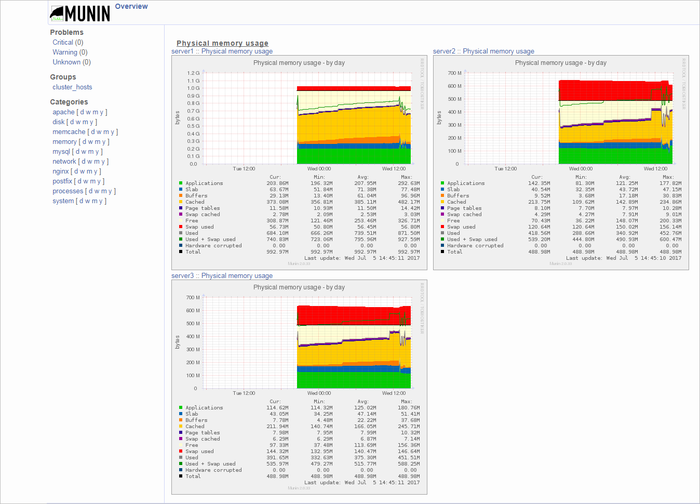
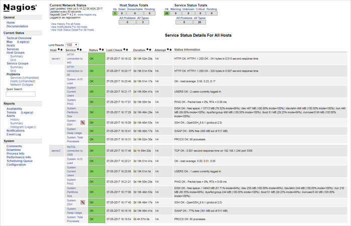
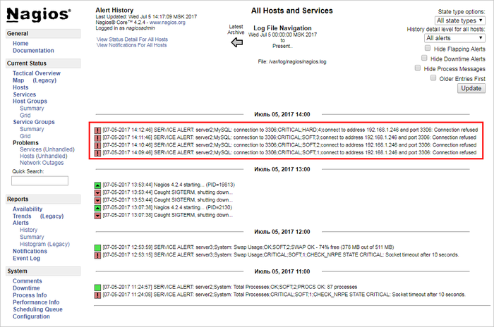
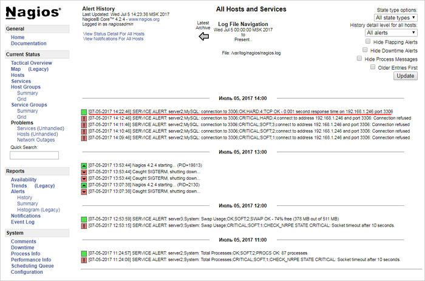

# 1. Настроить сервисы мониторинга (1. Configure monitoring services)

**Навигация**
- [← Оглавление курса](index.md)
- [← Предыдущий: 9343 — 3. Удаление memcached сервера (3. Remove memcached server)](lesson_9343.md)
- [Следующий: 9365 — 2. Выключить сервисы мониторинга  (2. Disable monitoring services) →](lesson_9365.md)

Официальная страница урока: https://dev.1c-bitrix.ru/learning/course/index.php?COURSE_ID=37&LESSON_ID=9363

### Начало работы


**Внимание!** Для корректной работы сервиса мониторинга необходима версия виртуальной машины не ниже 7.3.1.


Для начала работы систем мониторинга необходимо:


1. В главном меню виртуальной машины выбрать пункт 5.Configure pool monitoring &gt; 1. Configure monitoring services:
  
2. Затем мастер предложит задать **логин** и **пароль** для сервисов мониторинга сервера **Nagios** и **Munin**:
  
  Логины / пароли по умолчанию (рекомендуется сменить на свои):
  **Nagios**: nagiosadmin / nagiosBitrixMon
  **Munin**: admin / muninBitrixMon
3. Далее нужно будет указать e-mail для системных уведомлений **Nagios** и данные почтового сервера для отправки e-mail. Если отказаться, будет по умолчанию использоваться e-mail root-пользователя:
  

  - **email address** - адрес отправителя, от которого будет осуществляться пересылка писем. В данном случае этот email будет использоваться также как и получатель уведомлений от Nagios.
  - **server address or DNS** - ip- или dns-адрес почтового сервера. Если нажать Enter, то будет использован адрес по умолчанию (127.0.0.1)
  - **server port** - порт сервера. Порт зависит от типа соединения, 25 - для обычного и 465 - для зашифрованного (с использованием SSL). Если нажать Enter, то будет использован порт по умолчанию (25).
  - Если необходима SMTP-авторизация, то в строке **SMTP authentication** наберите `y` и введите логин и пароль для доступа к SMTP-серверу, в противном случае - `n`.
  - Если выбрана опция SMTP-авторизации, то понадобится ввести тип авторизации **type of authentication method**: `auto`, `plain`, `scram-sha-1`, `cram-md5`, `gssapi`, `external`, `digest-md5`, `login`, `ntlm`.
  - Если необходим TLS-протокол защищенной передачи данных, то в строке **TLS enabled** наберите `y`, в противном случае - `n`.
4. Затем мастер сделает необходимые настройки и запустит сервисы мониторинга сервера.


**Внимание!** Задачи могут выполняться довольно длительное время (до 2-3 часов и более) в зависимости от сложности задачи, объема данных, используемых в этих задачах, мощности и загруженности сервера. Проверить текущие выполняемые задачи можно с помощью меню 10. Background pool tasks &gt; 1. View running tasks. Если по каким-либо причинам нужно посмотреть лог-файлы выполнения задач, то они находятся в директории `/opt/webdir/temp`.


### Мониторинг


Для мониторинга сервера из браузера нужно зайти по адресам и авторизоваться под учетными записями мониторинга:


- Munin - http://адрес_сервера/munin/:
  
- Nagios - http://адрес_сервера/nagios/:
  


**Примечание:** Сменить пароли для систем мониторинга можно с помощью повторного запуска пункта меню 5.Configure pool monitoring &gt; 1. Configure monitoring services.


### Как проверить e-mail уведомления от Nagios


Проверить работу нотификаций можно легко:


- Например, остановим сервис МySQL:
  **CentOS 6**:
  ```
  service mysqld stop
  ```
  **CentOS 7**:
  ```
  systemctl stop mysqld.service
  ```
- По умолчанию Nagios будет записывать в лог 3 сообщения со статусом **CRITICAL;SOFT** каждую минуту, а 4-му сообщению даст статус **CRITICAL;HARD**:
  
  В итоге сообщение примерно такого содержания должно прийти на почту, указанную в п.3 настройки уведомлений для админа (поле **from address**):
  ```
  Subject: ** PROBLEM Service Alert: server2/MySQL: connection to 3306 is CRITICAL **
  ***** Nagios *****
  Notification Type: PROBLEM
  Service: MySQL: connection to 3306
  Host: server2
  Address: 192.168.1.246
  State: CRITICAL
  Date/Time: Wed Jul 5 14:12:46 MSK 2017
  Additional Info:
  connect to address 192.168.1.246 and port 3306: Connection refused
  ```
- После запуска службы MySQL командой `# service mysqld start` (CentOS 6) или `# systemctl start mysqld.service` (CentOS 7) в логе Nagios-а появится запись со статусом **OK;HARD**:
  
  И должно прийти сообщение на почту:
  ```
  Subject: ** RECOVERY Service Alert: server2/MySQL: connection to 3306 is OK **
  ***** Nagios *****
  Notification Type: RECOVERY
  Service: MySQL: connection to 3306
  Host: server2
  Address: 192.168.1.246
  State: OK
  Date/Time: Wed Jul 5 14:22:46 MSK 2017
  Additional Info:
  TCP OK - 0.001 second response time on 192.168.1.246 port 3306
  ```
- Как видим, все работает - при возникновении неполадок на каком-либо сервере Nagios отправит уведомление админу на почту с указанием проблемы.


**Примечание**: Подробнее о email уведомлениях можно прочитать [в документации Nagios](http://nagios.sourceforge.net/docs/3_0/notifications.html).
