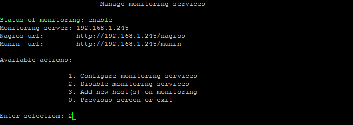
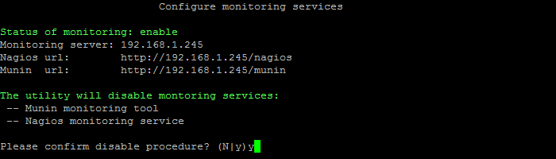

# 2. Выключить сервисы мониторинга  (2. Disable monitoring services)

**Навигация**
- [← Оглавление курса](index.md)
- [← Предыдущий: 9363 — 1. Настроить сервисы мониторинга (1. Configure monitoring services)](lesson_9363.md)
- [Следующий: 9367 — 3. Добавить хосты для мониторинга (3. Add new host(s) on monitoring) →](lesson_9367.md)

Официальная страница урока: https://dev.1c-bitrix.ru/learning/course/index.php?COURSE_ID=37&LESSON_ID=9365

Для выключения сервисов мониторинга Nagios и Munin необходимо:

- Выбрать пункт меню 5. Configure pool monitoring &gt; 2. Disable monitoring services:
  
- Согласиться на действие:
  
- Подождать, пока задача выключения сервисов мониторинга будет закончена.

**Внимание!** Задачи могут выполняться довольно длительное время (до 2-3 часов и более) в зависимости от сложности, объема данных, используемых в этих задачах, мощности и загруженности сервера. Проверить текущие выполняемые задачи можно с помощью меню 5. Configure pool monitoring &gt; 1. View running tasks. Если по каким-либо причинам нужно посмотреть лог-файлы их выполнения, то они находятся в директории `/opt/webdir/temp`.
