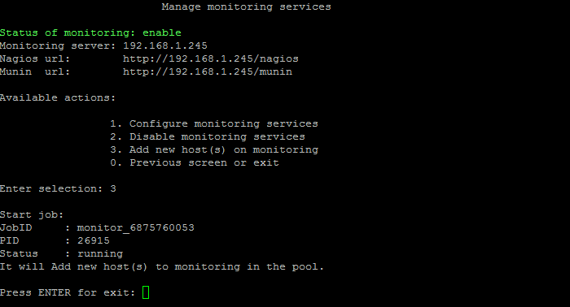

# 3. Добавить хосты для мониторинга (3. Add new host(s) on monitoring)

**Навигация**
- [← Оглавление курса](index.md)
- [← Предыдущий: 9365 — 2. Выключить сервисы мониторинга  (2. Disable monitoring services)](lesson_9365.md)
- [Следующий: 8849 — 1. Создание сайта (1. Create site) →](lesson_8849.md)

Официальная страница урока: https://dev.1c-bitrix.ru/learning/course/index.php?COURSE_ID=37&LESSON_ID=9367

Если запущены системы мониторинга серверов и был добавлен новый хост в кластер, то система сама отследит новую машину и запустит задачу на добавление этой машины в мониторинг.

Пункт меню 5. Configure pool monitoring &gt; 3. Add new host(s) on monitoring позволяет вручную запустить добавление нового хоста в систему мониторинга, если по каким-либо причинам он не добавился в мониторинг:

**Примечание:** При выборе 5. Configure pool monitoring &gt; 3. Add new host(s) on monitoring) задача на автоматическое добавление нового хоста в мониторинг запустится сразу, без каких-либо запросов.

**Внимание!** Задачи могут выполняться довольно длительное время (до 2-3 часов и более) в зависимости от сложности задачи, объема данных, используемых в этих задачах, мощности и загруженности сервера. Проверить текущие выполняемые задачи можно с помощью меню 10. Background pool tasks &gt; 1. View running tasks. Если по каким-либо причинам нужно посмотреть лог-файлы выполнения задач, то они находятся в директории `/opt/webdir/temp`.
