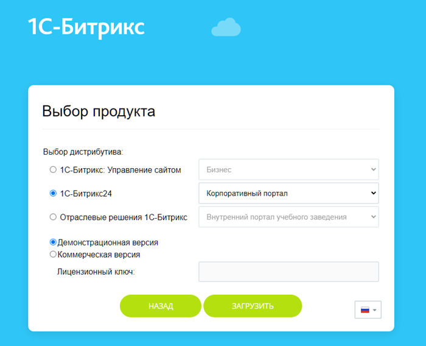

# Установка дистрибутива сайта в BitrixVM/BitrixEnv

**Навигация**
- [← Оглавление курса](index.md)
- [← Предыдущий: 11681 — VMBitrix.CRM](lesson_11681.md)
- [Следующий: 8815 — Перенос продукта «1C-Битрикс» в виртуальную среду BitrixVM/BitrixEnv →](lesson_8815.md)

Официальная страница урока: https://dev.1c-bitrix.ru/learning/course/index.php?COURSE_ID=37&LESSON_ID=9369

Для установки продукта «1С-Битрикс»:

Введите в адресной строке браузера адрес

			**bitrix url**

                    

		, указанный в [BitrixVM](lesson_29238.md) или [BitrixEnv](lesson_29234.md). В конце добавьте к нему bitrixsetup.php, например, https://192.168.1.245/bitrixsetup.php. Откроется окно выбора продукта:

Выбирайте интересующий вас продукт. После загрузки запустится мастер установки продукта.

Подробнее рассказываем в учебном курсе [Виртуальная машина BitrixVM](lesson_29244.md).
