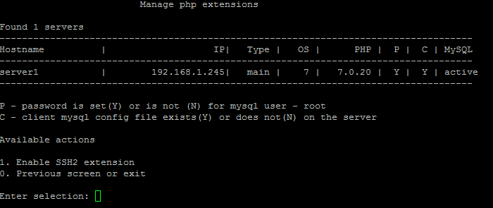
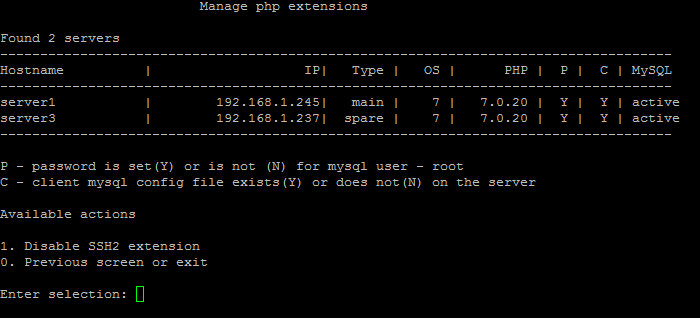

# 2. Настроить модули PHP (2. Manage PHP extensions)

**Навигация**
- [← Оглавление курса](index.md)
- [← Предыдущий: 9359 — 1. Создание веб-сервера (1. Create web role on server)](lesson_9359.md)
- [Следующий: 11451 — 1. Настройка сертификата Let's encrypt (1. Configure "Let's encrypt" certificate) →](lesson_11451.md)

Официальная страница урока: https://dev.1c-bitrix.ru/learning/course/index.php?COURSE_ID=37&LESSON_ID=9375

В разделе  8.  Manage pool web servers &gt; 2. Manage PHP extensions можно включить дополнительные модули PHP, которые могут понадобится в продуктах «1C-Битрикс».

На данный момент можно включить модуль **SSH2** для PHP:

Выключается данный модуль аналогично:

**Внимание!** Задачи могут выполняться довольно длительное время (до 2-3 часов и более) в зависимости от сложности задачи, объема данных, используемых в этих задачах, мощности и загруженности сервера. Проверить текущие выполняемые задачи можно с помощью меню 10. Background pool tasks &gt; 1. View running tasks. Если по каким-либо причинам нужно посмотреть лог-файлы выполнения задач, то они находятся в директории `/opt/webdir/temp`.
