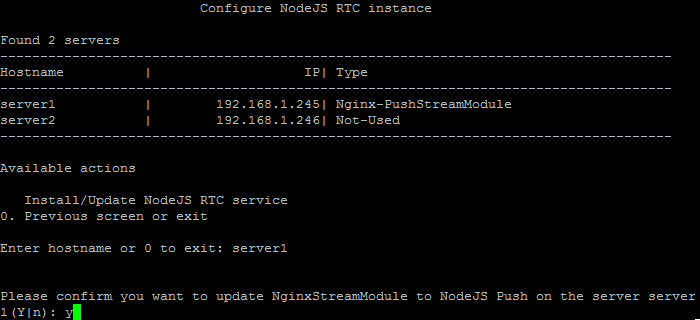
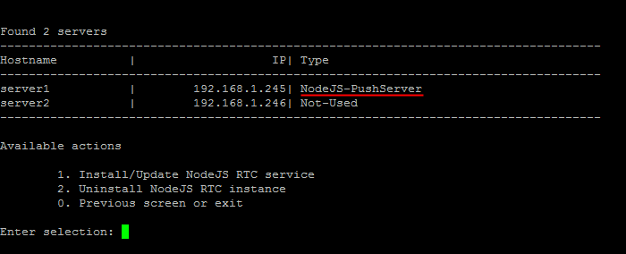

# 1. Настроить NodeJS RTC сервис (1. Install/Update NodeJS RTC Service)

**Навигация**
- [← Оглавление курса](index.md)
- [← Предыдущий: 9361 — 4. Удаление роли web c сервера (4. Remove web role from server)](lesson_9361.md)
- [Следующий: 9381 — 2. Удалить NodeJS RTC инстанс (2. Uninstall NodeJS RTC instance) →](lesson_9381.md)

Официальная страница урока: https://dev.1c-bitrix.ru/learning/course/index.php?COURSE_ID=37&LESSON_ID=9379

Модуль сервера очередей *Nginx-PushStreamModule* устарел и может работать нестабильно (зависание сообщений, падения). В результате чего сообщения могут не доставляться, это вызывает высокую нагрузку на службу PHP из-за особенностей работы модуля Nginx. Также он ограничен в функционале – в нем нет поддержки protobuf и персональных каналов, которые работают без сервера, нет возможности опроса публичного канала, чтобы узнать, кто в сети, и т.д.

Поэтому крайне рекомендуется использовать вместо устаревшего *Nginx-PushStreamModule* новый **NodeJS-Pushserver**.

Чтобы перейти на новый модуль NodeJS RTC вместо Nginx-PushStreamModule, нужно:

1. В главном меню виртуальной машины выбрать пункт 9. Configure Push/RTC service for the pool &gt; 1. Install/Update NodeJS RTC Service:
  
2. Ввести имя хоста, где нужно запустить NodeJS RTC сервис (в примере мы выбрали **server1** c запущенным сервисом NginxStreamModule), согласиться на смену модуля NginxStreamModule на NodeJS Push:
  
3. Подождать, пока задачи по запуску NodeJS RTC Push&Pull сервера будут закончены:
  

**Примечание** В пуле может быть только один сервис Push&Pull. Если у вас запущен Push&Pull сервис на одном сервере, и вы выбираете в качестве сервера другую машину, то мастер остановит Push&Pull сервис на первой машине и запустит его на другой.

**Внимание!** Задачи могут выполняться довольно длительное время (до 2-3 часов и более) в зависимости от сложности задачи, объема данных, используемых в этих задачах, мощности и загруженности сервера. Проверить текущие выполняемые задачи можно с помощью меню 10. Background pool tasks &gt; 1. View running tasks. Если по каким-либо причинам нужно посмотреть лог-файлы выполнения задач, то они находятся в директории `/opt/webdir/temp`.

### Доп. материалы:

- [Настройка сервера очередей Push and Pull](https://dev.1c-bitrix.ru/learning/course/index.php?COURSE_ID=48&LESSON_ID=2033)
- [Переход с Nginx-PushStreamModule на Bitrix Push server 2.0](https://dev.1c-bitrix.ru/learning/course/index.php?COURSE_ID=48&LESSON_ID=21582)
- [Переход с Bitrix Push server 1.0 на Bitrix Push server 2.0](https://dev.1c-bitrix.ru/learning/course/index.php?COURSE_ID=48&LESSON_ID=21580)
- [Использование отдельного сервера очередей](https://dev.1c-bitrix.ru/learning/course/index.php?COURSE_ID=48&LESSON_ID=21594)
- [Настройка и запуск push сервера на стороннем окружении](https://dev.1c-bitrix.ru/learning/course/index.php?COURSE_ID=48&LESSON_ID=8609)
