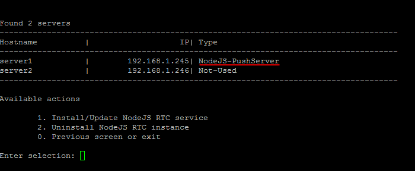
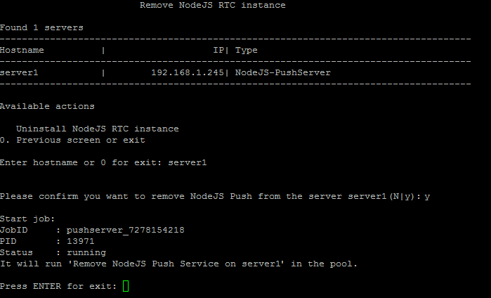
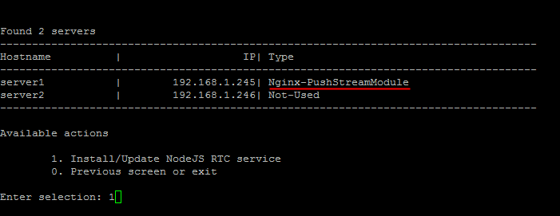

# 2. Удалить NodeJS RTC инстанс (2. Uninstall NodeJS RTC instance)

**Навигация**
- [← Оглавление курса](index.md)
- [← Предыдущий: 9379 — 1. Настроить NodeJS RTC сервис (1. Install/Update NodeJS RTC Service)](lesson_9379.md)
- [Следующий: 8845 — 10. Фоновые задачи (10. Background pool tasks) →](lesson_8845.md)

Официальная страница урока: https://dev.1c-bitrix.ru/learning/course/index.php?COURSE_ID=37&LESSON_ID=9381

Чтобы перейти с NodeJS RTC обратно на модуль Nginx-PushStreamModule, нужно:

1. В главном меню виртуальной машины выбрать пункт 9. Configure Push/RTC service for the pool &gt; 2. Uninstall NodeJS RTC instance:
  
2. Ввести имя хоста, где нужно перейти обратно на Nginx-PushStreamModule (в примере мы выбрали **server1** c запущенным сервисом NodeJS RTC), согласиться на удаление NodeJS RTC:
  
3. Подождать, пока задачи по запуску Nginx-PushStreamModule Push&Pull сервера будут закончены:
  

**Внимание!** Задачи могут выполняться довольно длительное время (до 2-3 часов и более) в зависимости от сложности задачи, объема данных, используемых в этих задачах, мощности и загруженности сервера. Проверить текущие выполняемые задачи можно с помощью меню 10. Background pool tasks &gt; 1. View running tasks. Если по каким-либо причинам нужно посмотреть лог-файлы выполнения задач, то они находятся в директории `/opt/webdir/temp`.
