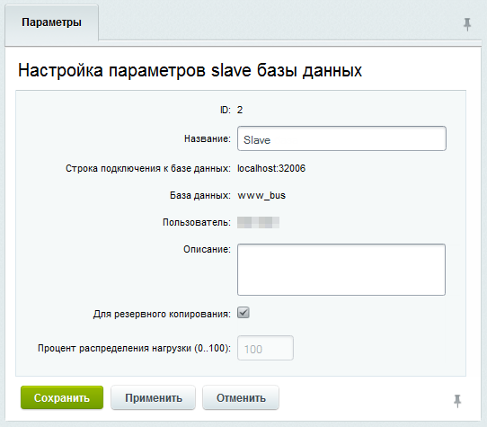

# Резервная копия

**Навигация**
- [← Оглавление курса](index.md)
- [← Предыдущий: 2773 — Master-Slave репликация](lesson_2773.md)
- [Следующий: 3088 — Master-master репликация →](lesson_3088.md)

Официальная страница урока: https://dev.1c-bitrix.ru/learning/course/index.php?COURSE_ID=41&LESSON_ID=10273

|  | ### Настройка базы данных для использования в качестве резервной копии |
| --- | --- |

В данном случае slave база данных будет использоваться только для создания копии основной базы данных. В отличие от случая, описанного выше, операций чтения из нее происходить не будет.

Для перевода базы в этот режим в форме

			Настройка параметров slave базы данных

                    Подключение и настройка дополнительных (slave) баз данных осуществляется на странице Slave базы данных (Настройки &gt; Веб-кластер &gt; Группа #1 &gt; Репликация).

[Подробнее](lesson_2773.md)...

		 отметьте опцию **Для резервного копирования:**

Резервное копирование производится в постоянном режиме.
