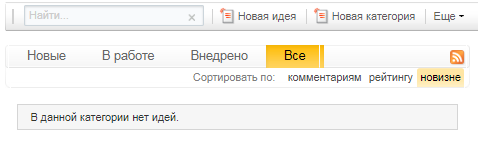
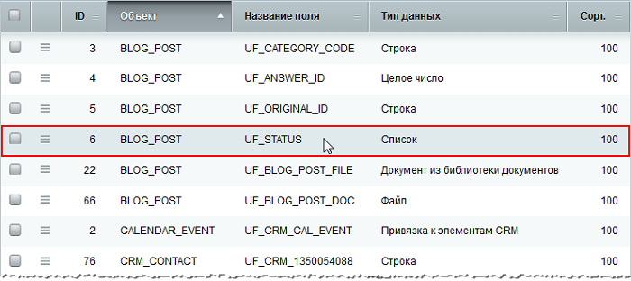
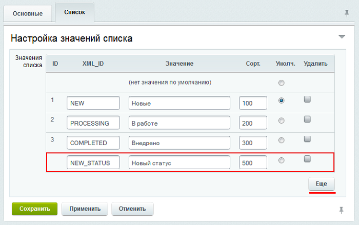

# Создание и редактирование статусов

**Навигация**
- [← Оглавление курса](index.md)
- [← Предыдущий: 6906 — Создание сервиса](lesson_6906.md)
- [Следующий: 20008 — Проверьте себя →](lesson_20008.md)

Официальная страница урока: https://dev.1c-bitrix.ru/learning/course/index.php?COURSE_ID=41&LESSON_ID=11137

|  | ### Создание и редактирование статусов |
| --- | --- |

Каждой предложенной идее присваивается свой статус. Статус - характеристика объекта, отражающая его состояние в настоящий момент. В модуле **Менеджер идей** статус служит идентификатором этапа, на котором сейчас находится идея. По умолчанию задано

			три типа статусов

                    

		:

- новые
- в работе
- внедрено

Эти статусы при желании можно легко отредактировать, либо не менее легко создать новые (это делает Администратор сайта).

Давайте добавим новый статус:

1. Перейдите на страницу **Пользовательские поля** (Настройки &gt; Настройки продукта &gt; Пользовательские поля)
  
2. В закладке **Список** откройте форму редактирования пользовательского поля `UF_STATUS`. С помощью кнопки **Еще** добавьте новую строку и заполните строки **Значение** и **XML_ID**:
  
3. Сохраните внесенные изменения.
4. И в заключении для вступления настроек в силу перейдите в публичную часть сайта на страницу со списком идей и [сбросьте кеш](https://dev.1c-bitrix.ru/learning/course/index.php?COURSE_ID=34&LESSON_ID=3270).
