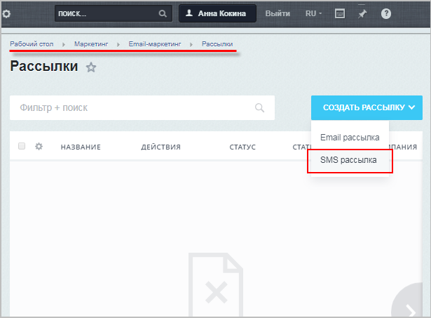

# Настройка SMS-рассылки

**Навигация**
- [← Оглавление курса](index.md)
- [← Предыдущий: 20218 — Проверьте себя](lesson_20218.md)
- [Следующий: 11233 — Настройка модуля →](lesson_11233.md)

Официальная страница урока: https://dev.1c-bitrix.ru/learning/course/index.php?COURSE_ID=41&LESSON_ID=11141

Настройка SMS-рассылки включает три этапа:

1. Настройка модуля
  Настройка модуля осуществляется в Административном разделе (Настройки &gt;Настройки продукта &gt; Настройки модулей &gt; Служба сообщений).
  [Подробнее](lesson_11233.md)...
2. Подключение одного из sms-сервисов:

  - Подключение сервиса SMS.RU
    Даже если вы уже зарегистрированы на sms.ru, вам нужно выполнить настройку на этой странице. Просто используйте те данные, которые вы указали при самостоятельной регистрации. Разберем по шагам, как подключить сервис SMS.RU.
    [Подробнее](lesson_11229.md)...
  - Подключение сервиса sms.edna.ru
                        Чтобы подключить сервис в продукте нам понадобятся API-ключ (X-API-KEY) и Subject ID SMS-канала Edna.
    [Подробнее](lesson_22074.md)...
3. Создание маркетинговой рассылки
  Создать рассылку можно из двух разделов: **Рассылки** (Маркетинг &gt; Email-маркетинг &gt; Рассылки) и **Старт** (Маркетинг &gt; Email-маркетинг &gt; Старт). Процесс создания рассылок одинаков, за исключением начальной кнопки (кнопки создания новой рассылки)
  [Подробнее](https://dev.1c-bitrix.ru/learning/course/index.php?COURSE_ID=139&LESSON_ID=11237&LESSON_PATH=11427.2761.11235.11237)...

При верном выполнении всех действий Вы сможете выбирать, какую именно рассылку сделать:

