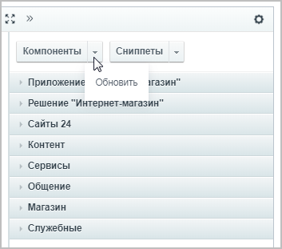
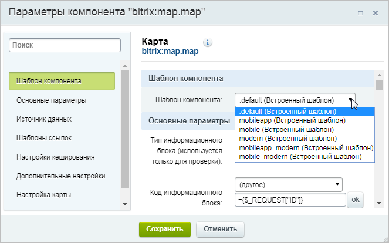
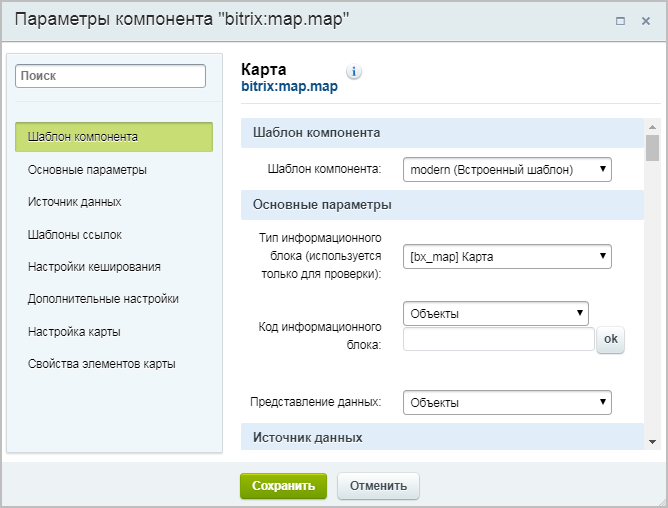
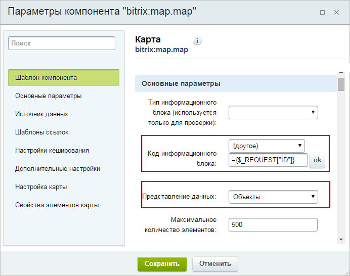
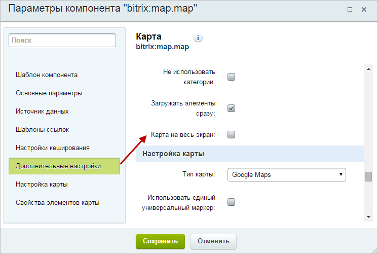
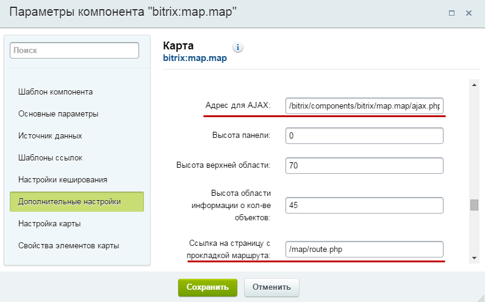

# Основная информация

**Навигация**
- [← Оглавление курса](index.md)
- [← Предыдущий: 6409 — Заполнение событий](lesson_6409.md)
- [Следующий: 6466 — Отображение объектов, туристических маршрутов, событий →](lesson_6466.md)

Официальная страница урока: https://dev.1c-bitrix.ru/learning/course/index.php?COURSE_ID=41&LESSON_ID=11151

### О компоненте


**Важно!** С 1 февраля 2023 года продажа решения **1С-Битрикс: Интерактивная карта объектов** (bitrix.map) прекращена. Техническая поддержка по купленным ранее решениям будет оказываться до окончания их срока действия. Поддержка будет оказана при условии активной лицензии платформы 1С-Битрикс.


Карта выводится

			традиционным

                    Нужный компонент переносится на страницу в визуальном редакторе.


[Подробнее](/learning/course/index.php?COURSE_ID=34&LESSON_ID=9163#add_component)...

		 для сайтов на CMS "1С-Битрикс: Управление сайтом" способом -

			компонентом

                    Компонент – это программный код, оформленный в визуальную оболочку, выполняющий определённую функцию какого-либо модуля по выводу данных в Публичной части. Мы можем вставлять этот блок кода на страницы сайта без непосредственного написания кода. [Подробнее...](https://dev.1c-bitrix.ru/learning/course/index.php?COURSE_ID=34&CHAPTER_ID=04457)

			Карта (bitrix:map.map)


Если вы не можете найти этот компонент в списке, то
попробуйте обновить список компонентов:




		.


В вашем распоряжении три шаблона:

- **modern** для использования в версии сайта для обычных компьютеров и планшетов, включает себя новые режимы отображения (используется с типом представления данных "Объекты").
- **mobile_modern** – улучшенная версия шаблона **mobile** для использования в версии сайта для мобильных телефонов.
- **mobileapp_modern** – улучшенная версия шаблона **mobileapp** для использования в версии сайта для мобильного приложения.


**Примечание**: Ранее в стандартной поставке этот компонент имел

			шесть




		 шаблонов (дополнительные шаблоны: **.default**, **mobileapp**, **mobile**). Эти шаблоны не рекомендуется использовать в новых установках, т.к. они уже не поддерживаются и не обновляются (они оставлены для тех клиентов, которые уже пользуются данными шаблонами).


## Список всех шаблонов (в т.ч. и устаревших)

- **.default** для использования в версии сайта для обычных компьютеров и планшетов.
- **mobileapp** для использования в версии сайта для мобильного приложения.
- **mobile** для использования в версии сайта для мобильных телефонов.
- **modern** для использования в версии сайта для обычных компьютеров и планшетов, включает себя новые режимы отображения (используется с типом представления данных "Объекты").
- **mobileapp_modern** – улучшенная версия шаблона **mobileapp**.
- **mobile_modern** – улучшенная версия шаблона **mobile**.


Шаблон **.default** рассчитан на использование всей ширины страницы. Если у вас в шаблоне есть правая или левая колонка с меню или другими блоками, то вам потребуется отредактировать шаблон сайта так, чтобы на странице с картой эти колонки убирались. В противном случае карта может отображаться не правильно.


В

			параметрах компонента




		 карты вам нужно задать:


- Тип и код информационного блока;
- Представление данных (объекты /
  			маршруты
  При выборе типа данных **маршруты** вместо настройки **Позиция иконки** будут две дополнительные настройки:
  - Замкнутый маршрут;
  - Тип маршрута.
  		 / события);
- Тип карты (Google/Яндекс);
- Высоту области с картой;
- Адрес для AJAX (для шаблонов **modern_***, указано значение по умолчанию).


**Внимание!** Если данные на карте не отображаются – проверьте правильность

			значений параметров




		 **Код информационного блока** и **Представление данных**. Объекты, события и маршруты имеют разную структуру хранения и если тип данных не соответствует – скорее всего, вы получите пустую карту, либо ошибку.


Также следует проверить, чтоб в разделе **Свойства элементов карты** были правильно указаны требуемые свойства в зависимости от типа данных, выбранных ранее в пункте **Представление данных**.


### Особенности применения шаблона modern


В параметрах компонента для шаблона **modern** доступна новая опция **Карта на весь экран**.





При ее включении будет выведено уведомление о том, что пользователю нужно самостоятельно разместить "кнопку", отвечающую за показ карты. Так же будут отображены два параметра: **Разворачивать на весь экран сразу** и **Использовать скользящие панели** (подробнее про организацию работы в полноэкранном режиме можно посмотреть на странице

			Полноэкранный режим отображения карты.


При этом станут доступны два дополнительных параметра:


**Разворачивать на весь экран сразу** - при включении этой опции карта

в полноэкранном режиме открывается сразу же при загрузке страницы.

В случае если параметр отключен, карта будет скрыта, и в этом случае

для отображения карты необходимо разместить элемент со специальным

атрибутом для отображения слоя с картой.


**Скользящие панели** - в случае включения этого параметра, данные

выводятся в режиме с тремя панелями: категории – подкатегории – объекты.

В этом интерфейсе при клике на маркер информация об объекте

размещается как четвёртая панель, позволяя размещать любое количество

информации.


[Подробнее](lesson_6927.md)...


Карта автоматически позиционируется, чтобы вместить все заполненные объекты. Если при открытии раздела карта показывает не только ваш город, а половину страны или весь мир — значит, координаты как минимум для одного из объектов при заполнении были введены неверно.


### Особенности применения шаблонов для мобильной версии


При использовании шаблона для мобильной версии появляется два обязательных для заполнения параметра: **Адрес для AJAX** и **Ссылка на страницу с прокладкой маршрута**.





Этот параметр содержит путь к скрипту для ajax запроса текстового описания выбранного на карте объекта.


## Пример кода стандартного скрипта для получения описания

```
<?
define("NO_KEEP_STATISTIC", true);
define("BX_STATISTIC_BUFFER_USED", false);
define("NO_LANG_FILES", true);
define("NOT_CHECK_PERMISSIONS", true);
define("BX_PUBLIC_TOOLS", true);

require($_SERVER["DOCUMENT_ROOT"]."/bitrix/modules/main/include/prolog_before.php");
Cmodule::IncludeModule("iblock");

function fixEncoding($value)
{
    return \Bitrix\Main\Config\Configuration::getValue("utf_mode") ? $value : \Bitrix\Main\Text\Encoding::convertEncoding($value, LANG_CHARSET, "utf-8");
}

if (!empty($_GET["item"]))
{
switch ($_GET["type"])
    {
        case "routes":
            $rsObject = CIBlockSection::GetList(
                array(),
                array("ID" => substr($_GET["item"], -(strlen($_GET["item"]) - 1)))
            );
            if ($arObject = $rsObject->GetNext())
            {
                echo "<p>" . $arObject["DESCRIPTION"] . "</p>";
            }
            break;
        default:
            $rsObject = CIBlockElement::GetList(
                array(),
                array("ID" => substr($_GET["item"], -(strlen($_GET["item"]) - 1))),
                false,
                false,
                array("PREVIEW_TEXT", "DETAIL_TEXT")
            );

            if ($arObject = $rsObject->GetNext())
            {
                echo "<p>" . !empty($arObject["DETAIL_TEXT"]) ? $arObject["DETAIL_TEXT"] : $arObject["PREVIEW_TEXT"] . "</p>";
            }
    }
}
else if (!empty($_GET["cat"]))
{
    switch ($_GET["type"])
    {
        default:
            $rsCategory = CIBlockSection::GetList(
                array(),
                array("ID" => substr($_GET["cat"], -(strlen($_GET["cat"]) - 1)))
            );
            if ($arCategory = $rsCategory->GetNext())
            {
                $arSelect = array("NAME", "IBLOCK_SECTION_ID", "PREVIEW_PICTURE", "PREVIEW_TEXT");
                foreach ($_GET["prop"] as $code)
                {
                    $arSelect[] = "PROPERTY_" . $code;
                }
$rsObjects = CIBlockElement::GetList(
                    array(),
                    array("SECTION_ID" => $arCategory["ID"], "!PROPERTY_" . $_GET["prop"]["latitude"] => false, "!PROPERTY_" . $_GET["prop"]["longitude"] => false),
                    false,
                    false,
                    $arSelect
                );
                $result = array();
                while ($arObject = $rsObjects->GetNext())
                {
                    $result[] = array(
                        "name"        => fixEncoding($arObject["NAME"]),
                        "address"     => fixEncoding($arObject["PROPERTY_" . $_GET["prop"]["address"] . "_VALUE"]),
                        "photo"       => CFile::GetPath($arObject["PREVIEW_PICTURE"]),
                        "url"         => $arObject["PROPERTY_" . $_GET["prop"]["link"] . "_VALUE"],
                        "description" => fixEncoding($arObject["PREVIEW_TEXT"]),
                        "opening"     => fixEncoding($arObject["PROPERTY_" . $_GET["opening"] . "_VALUE"]),
                        "lat"         => $arObject["PROPERTY_" . $_GET["prop"]["latitude"] . "_VALUE"],
                        "lng"         => $arObject["PROPERTY_" . $_GET["prop"]["longitude"] . "_VALUE"],
                        "cat"         => "s" . $arObject["IBLOCK_SECTION_ID"]
                    );
                }
                echo json_encode($result);
            }
    }
}
?>
```


**Ссылка на страницу с прокладкой маршрута** содержит путь к странице с размещенным на ней компонентом **map.routing**.
