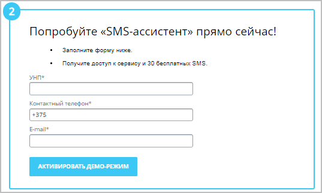
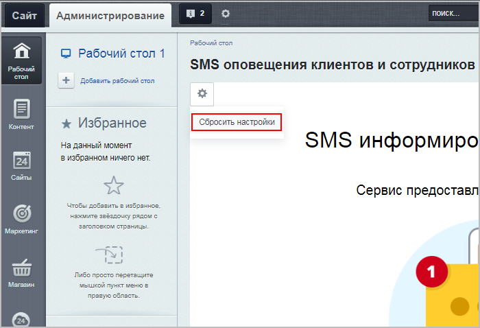

# Настройка модуля

**Навигация**
- [← Оглавление курса](index.md)
- [← Предыдущий: 11141 — Настройка SMS-рассылки](lesson_11141.md)
- [Следующий: 11229 — Подключение сервиса SMS.RU →](lesson_11229.md)

Официальная страница урока: https://dev.1c-bitrix.ru/learning/course/index.php?COURSE_ID=41&LESSON_ID=11233

### Настройка модуля

Прежде всего, не забудьте установить

			этот модуль

                    

		 (Настройки &gt;Настройки продукта &gt; Модули).

Настройка модуля осуществляется в Административном разделе на странице Настройки &gt; Настройки продукта &gt; Настройки модулей &gt; Служба сообщений.

<!-- &lt;p&gt;
 &lt;a href="javascript:ShowImg('/images/portal_admin/messaging_service/setting-new.png',926,573)"&gt;&lt;img alt="Нажмите на рисунок, чтобы увидеть рисунок в полномасштабном режиме" src="/images/portal_admin/messaging_service/setting-new-sm.png" style="cursor: pointer;"&gt;&lt;/a&gt;
&lt;/p&gt;

&lt;p&gt;&lt;div class="warning"&gt;&lt;b&gt;Важно! &lt;/b&gt; Поля &lt;b&gt;Идентификатор партнера компании SMS.RU&lt;/b&gt; и &lt;b&gt;Секретный ключ партнера компании SMS.RU&lt;/b&gt; будут заполнены автоматически, и их &lt;b&gt;не нужно менять&lt;/b&gt;. Смысл остальных полей понятен интуитивно.&lt;/div&gt;&lt;/p&gt; -->

<!-- пока спрятан из-за иностр. сервисов
&lt;p&gt;
 &lt;a href="javascript:ShowImg('/images/portal_admin/messaging_service/messageservice_settings_2.png',974,607)"&gt;&lt;img alt="Нажмите на рисунок, чтобы увидеть рисунок в полномасштабном режиме" class="border" src="/images/portal_admin/messaging_service/messageservice_settings_2-sm.png" style="cursor: pointer;"&gt;&lt;/a&gt;
&lt;/p&gt; -->

При настройке модуля нужно подключить хотя бы одну из служб отправки SMS. Все доступные для подключения службы отображены в списке в поле **Службы отправки SMS**. Для перехода к настройкам выбранной службы, **кликните по названию компании** в списке. Откроется новая страница с описанием и формой настройки для этой службы.

Более подробные инструкции, как привязать выбранный сервис к Вашему *«1С-Битрикс: Управление сайтом»* или *«Битрикс24 в коробке»*, описаны в соответствующих уроках:

- [Подключение сервиса SMS.RU](lesson_11229.md)
- [Подключение сервиса sms.edna.ru](lesson_22074.md)
- [Подключение сервиса Edna.ru WhatsApp*](lesson_25072.md)

* Компания Meta, владеющая WhatsApp, признана экстремистской и запрещена на территории Российской Федерации.

**Примечание**: **SMS-ассистент**. В списке служб отправки SMS есть служба **SMS-ассистент** — это сервис для СМС-рассылки в Республике Беларусь. Укажите логин и пароль своего аккаунта в [этом сервисе](https://sms-assistent.by/) и нажмите кнопку

			Подключить

		, или же можете протестировать работу этого сервиса в демо-режиме (30 бесплатных СМС), указав в

			специальной форме

		 следующие данные:

- УНП
  Учётный номер плательщика (**УНП**) — единый уникальный номер, присваиваемый каждому плательщику при постановке на учёт в налоговом органе в Беларуси, и используемый по всем налогам, сборам, пошлинам, в том числе по таможенным платежам.
- Контактный телефон
- E-mail

### Отключение сервиса

Чтобы **отвязать** сервис откройте настройки модуля **Служба сообщений** в Административном разделе (Настройки &gt;Настройки продукта &gt; Настройки модулей &gt; Служба сообщений), в поле **Службы отправки SMS** выберите отвязываемый сервис, далее кликните по шестеренке в левом верхнем углу и нажмите **Сбросить настройки**.

### Документация по теме

- [Настройки модуля](https://dev.1c-bitrix.ru/user_help/settings/message_service/settings.php)
