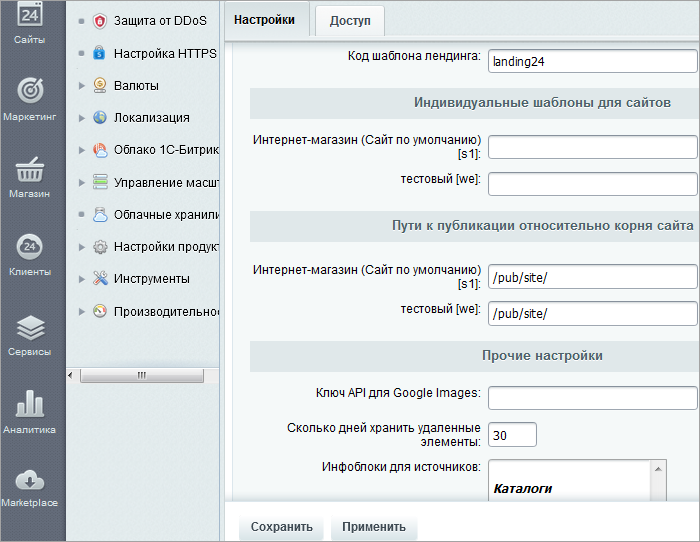
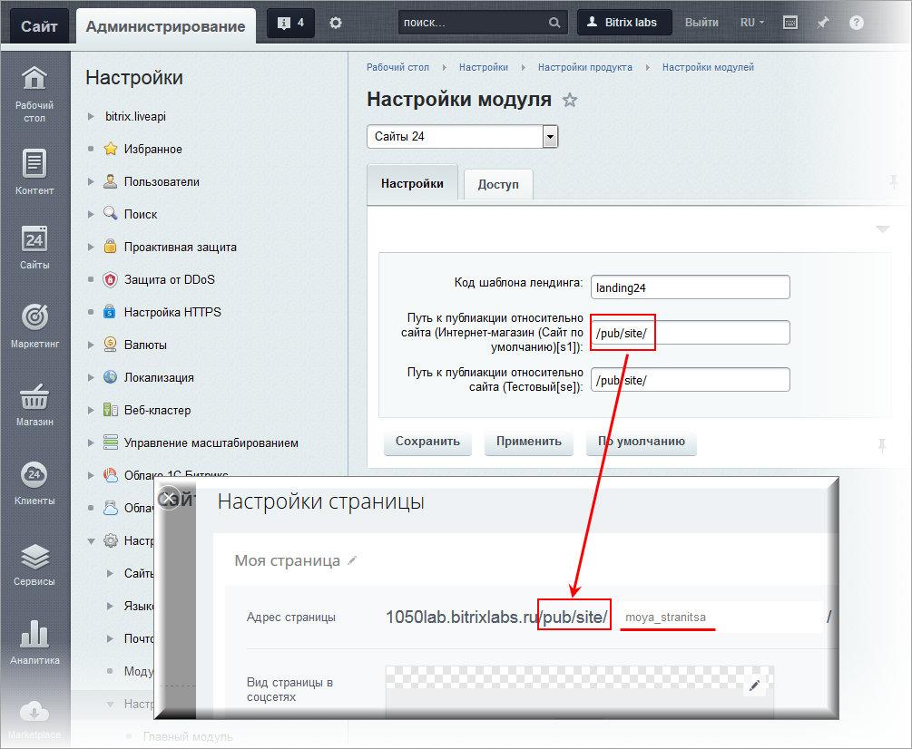
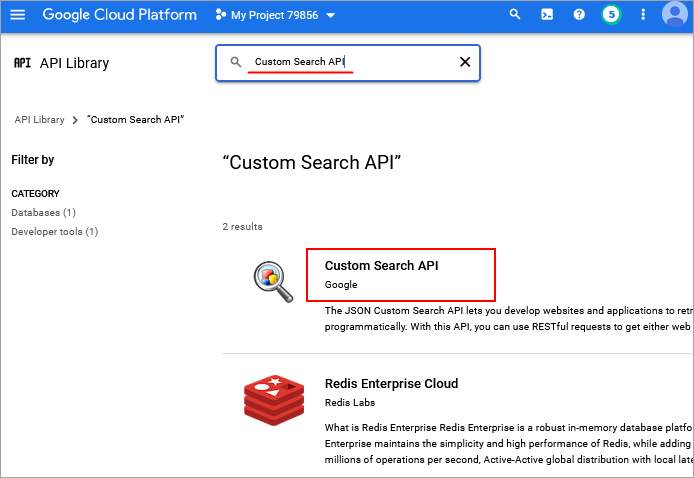
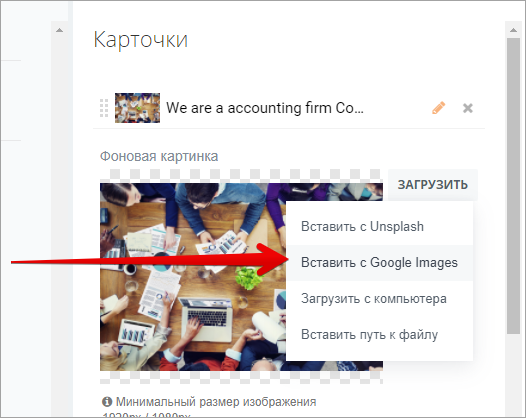

# Настройки модуля Сайты 24

**Навигация**
- [← Оглавление курса](index.md)
- [← Предыдущий: 20190 — Практические задания](lesson_20190.md)
- [Следующий: 12629 — Сайты 24 на собственном домене →](lesson_12629.md)

Официальная страница урока: https://dev.1c-bitrix.ru/learning/course/index.php?COURSE_ID=41&LESSON_ID=11261

**Внимание!** Если используется собственное веб-окружение, а не штатная виртуальная машина BitrixVM, то нужно учесть, что модуль Сайты24 по нестандартным портам работать не будет. Корректная работа в коробке **Битрикс24** возможна только при работе портала по стандартным портам (443). Для работы созданного модулем сайта на контроллере прописывается редирект на портал, где нет возможности указать нестандартный порт.

Для настройки модуля **Сайты 24** перейдите на страницу Настройки &gt; Настройка Продукта &gt; Настройки модулей &gt; Сайты 24:

 

На закладке **Настройки** указываются код шаблона лендинга и индивидуальные шаблоны для сайтов.

Здесь же указываются пути к лендингам относительно вашего домена, т.е. сайта главного модуля. Именно по такому адресу созданная страница будет доступна после публикации.

В **Прочих настройках** можно указать

			Ключ API для Google Images

                    Ключ API потребуется для корректной работы с сервисами Google. Общая [Инструкция получения ключа API Google](https://dev.1c-bitrix.ru/user_help/components/content/google_maps/map_google_key.php) приведена в документации.

Для использования в карточках **Сайтов24** коллекции картинок **Google Images** нужно подключить сервис Custom Search API.

После подключения можно будет выбирать в карточках картинки из коллекции Google:

		, Сколько дней хранить удаленные элементы и Инфоблоки для источников

На закладке **Доступ** настраиваются права работы групп пользователей с модулем **Сайты 24**.

Работа в данной вкладке аналогична таковой для модуля

			Веб-формы.

                     На вкладке **Доступ** указывается уровень доступа к настройкам форм и результатам заполнения.

	 Чтобы добавить право доступа для какой-либо группы пользователей, нажмите ссылку **Добавить право доступа**. В противном случае ко всем группам пользователей, кроме администраторов, будет применено право доступа **По умолчанию**.

 [Подробнее](lesson_2858.md)...

**Примечание**: подробное описание полей формы приведено в [Пользовательской документации](/user_help/sites24/index.php) к продукту.

Как использовать модуль, подробно рассказано в курсе Контент-менеджер в главе

			Сайты24.

                     **Сайты24** — встроенный в CMS "1С-Битрикс: Управление сайтом" конструктор сайтов, позволяющий создавать веб-страницы без программирования. Сайты 24 идеально подходит для создания неограниченного числа страниц, лендингов и полноценных сайтов и взаимодействия с вашим интернет магазином.

 [Подробнее](https://dev.1c-bitrix.ru/learning/course/index.php?COURSE_ID=34&CHAPTER_ID=011223&LESSON_PATH=3905.4753.11223)...

|  | #### Материалы по теме: |
| --- | --- |

- [Сайты24 и собственный домен в коробке](https://dev.1c-bitrix.ru/community/blogs/antonds/sayty24-and-private-domain-in-the-box.php)
