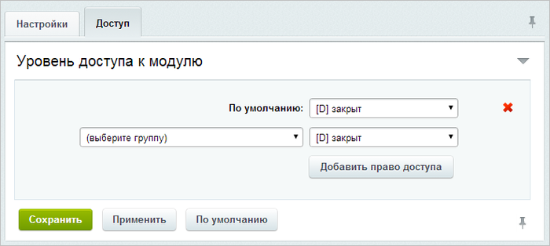

# Настройки модуля

**Навигация**
- [← Оглавление курса](index.md)
- [← Предыдущий: 9257 — Возможности E-mail маркетинга](lesson_9257.md)
- [Следующий: 8619 — Текстовая версия письма →](lesson_8619.md)

Официальная страница урока: https://dev.1c-bitrix.ru/learning/course/index.php?COURSE_ID=41&LESSON_ID=11321

|  | ### Настройки модуля |
| --- | --- |

Управление основными настройками модуля выполняется на странице настройки модуля **E-mail-маркетинг** (Настройки &gt; Настройки продукта &gt; Настройки модулей &gt; E-mail-маркетинг).

На закладке **Настройки** задаются глобальные настройки параметров модуля, которые определяют:

- интервалы пошаговой рассылки;
- методы автоматической отправки (
  			Агенты
  **Агент** - автоматическая генерация выпусков осуществляется внутренними средствами системы.
  [Подробнее об агентах в курсе "Разработчик Bitrix Framework"](https://dev.1c-bitrix.ru/learning/course/index.php?COURSE_ID=43&CHAPTER_ID=03436)...
  		 или
  			Крон
  **Крон** - используется при установке системы на сервер под управлением ОС **Unix** (предусматривает использование компьютерной программы **cron** ОС **Unix**).
  [Подробнее о cron](https://ru.wikipedia.org/wiki/Cron)...
  		);
- количество потоков при
  			сборке сегмента рассылки
                      Большие сегменты могут собираться достаточно долго, т.к. чем больше сущностей в CRM, тем дольше происходит фильтрация нужных адресов. Для оптимизации процесса сборка сегментов осуществляется пошагово. А для ускорения организована многопоточность при сборке.
  [Подробнее о сегментах](https://dev.1c-bitrix.ru/learning/course/index.php?COURSE_ID=139&CHAPTER_ID=011265).
  		 и при отправке (если используется отправка на **Агентах**, то лучше использовать 1 поток, так как отправка в 10 потоков рекомендуется только для запуска через **Крон**);
- указание url пользовательских страниц подписки и отписки;
- адреса автора рассылки и адреса для проверки рассылки.

**Примечание**: подробное описание каждого параметра приведено в

			пользовательской документации

						[Описание компонента «E-mail маркетинг. Настройки модуля» в пользовательской документации.](http://dev.1c-bitrix.ru/user_help/detail.php?ID=1315249)

		 по модулю **E-mail маркетинг**.

На закладке

			**Доступ**

                    

		 настраиваются уровни прав доступа к модулю для групп пользователей сайта. С помощью ссылки **Добавить право доступа** создаются дополнительные уровни доступа к модулю для конкретных групп.

**Важно!**

			добавлять компоненты

Чаще всего (если не всегда) периодическая рассылка должна каждый раз содержать уникальный контент.

Для этого в системе есть **компоненты**, которые могут отправлять периодически новый контент в письмах. Соответственно, клиенты всегда будут получать, например, свежие новости, новинки товаров и т.п.

[Подробнее](https://dev.1c-bitrix.ru/learning/course/index.php?COURSE_ID=139&LESSON_ID=11237)...

		 в рассылку могут только те группы пользователей, у которых в

			уровне доступа

**Уровни доступа** — определенный комплекс операций в системе, доступный для выполнения пользователем. Они предназначены для создания системы управления пользователями. Уровни доступа определяются администратором и могут быть как изменены, так и созданы. Обладают свойством "наследования", то есть если для текущего раздела/страницы явно не задан уровень прав, тогда устанавливается то право, которое задано для вышележащего раздела.

[Подробнее](https://dev.1c-bitrix.ru/learning/course/?COURSE_ID=35&LESSON_ID=2015)...

		 к **Главному модулю** отмечена операция

			Ограниченная модификация шаблонов.

