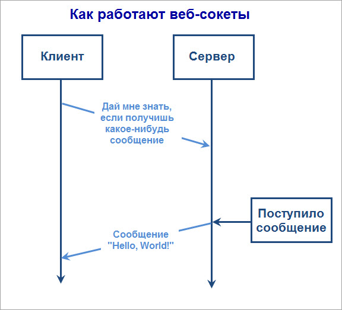
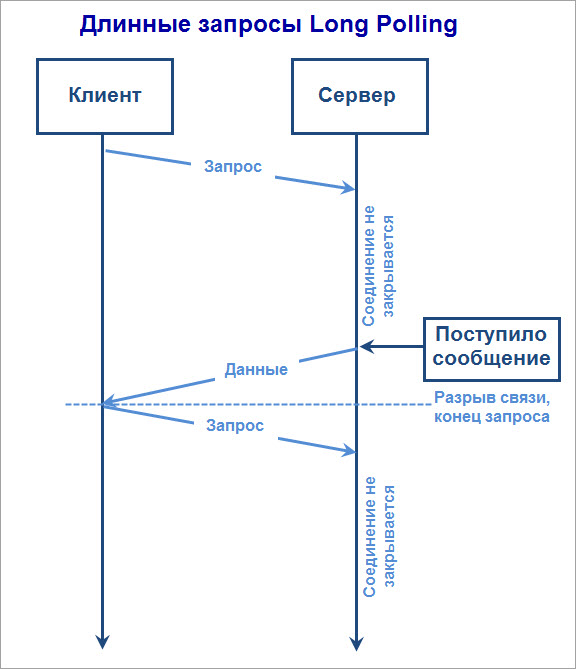
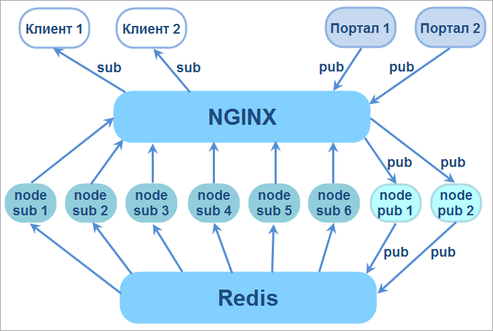

# Как работает Push-сервер

**Навигация**
- [← Оглавление курса](index.md)
- [← Предыдущий: 11651 — Что делает Push and Pull](lesson_11651.md)
- [Следующий: 21636 — Информация о версиях сервера очередей →](lesson_21636.md)

Официальная страница урока: https://dev.1c-bitrix.ru/learning/course/index.php?COURSE_ID=41&LESSON_ID=11759

Когда пользователь входит на сайт, его браузер, настольное или мобильное приложение устанавливают и держат постоянное соединение с Push-сервером.

### Как работает Push-сервер

Обычно это делается с помощью

			WebSocket

                    **Веб-сокеты** - это технология, позволяющая открыть постоянное двунаправленное

	 сетевое соединение между браузером пользователя и сервером.

	 С его помощью вы можете отправить сообщение на сервер и получить ответ

	 без выполнения http запроса.

	 Причем этот процесс будет событийно-управляемым.

 

		, который используют 95% современных браузеров. А если технология WebSocket не поддерживается браузером, то используется

			Long Polling

                    Другое название способа - "Очередь ожидающих запросов". Краткая схема такова:

	 1. Отправляется запрос на сервер

	 2. Соединение не закрывается сервером, пока не появится событие

	 3. Событие отправляется в ответ на запрос

	 4. Клиент тут же отправляет новый ожидающий запрос

 

		 — постоянный долгий опрос. Это

			ajax-запрос

                    AJAX (**A**synchronous **J**avascript **A**nd **X**ml») – технология обращения к серверу без перезагрузки страницы

		, который в течение 40 секунд ждет ответа от сервера. В случае получения ответа или при наступлении таймаута, запрос повторяется.

Для *"1С-Битрикс: Управление сайтом"* разработан собственный Push-сервер:

### Схема работы Push-сервера

- Пользователь пишет какое-то сообщение на портале.
- Сообщение поступает на
  			NGINX-сервер
                      **NGINX-сервер** - мощный веб-сервер, использующий не-потоковую, управляемую событиями архитектуру
  		. Он обрабатывает и держит множество TCP и HTTPS-соединений, занимается балансировкой нагрузки и выполняет другие важные функции, такие как кеширование HTTP и использование в качестве обратного прокси.
- Сообщение отправляется в PHP-часть бэкенда, там оно сохраняется, а потом транслируется в Push-сервер.
- Push-сервер состоит из восьми процессов приложения
  			Node.js
                      **Node.js** — программная платформа, основанная на движке V8 (транслирующем JavaScript в машинный код), превращающая JavaScript из узкоспециализированного языка в язык общего назначения.
  [Подробнее...](https://ru.wikipedia.org/wiki/Node.js)
  		 - 6 процессов обслуживают входящие соединения, 2 процесса отвечают за публикацию сообщений.
- Все восемь процессов Node.js-приложения имеют постоянное соединение с
  			Redis
                      **Redis** - нереляционное (для хранения используется не система из строк и столбцов, а модель, оптимизированная для хранения определённого типа содержимого) хранилище на основе пар «ключ‑значение». В нем могут храниться не только ключ-значение, но и ключ-словарь, ключ-список, то есть более сложные структуры данных. [Подробнее...](https://redis.io/)
  		. В Redis сохраняются все сообщения, статистика по каналам и состояние онлайна.
- В самом сообщении содержатся все атрибуты данных, то есть автор, адресат и т.д. Один из двух процессов, отвечающих за публикацию сообщений, принимает это сообщение, обрабатывает его и публикует в Redis.
- Redis записывает сообщение и оповещает другие шесть процессов о том, что поступило новое сообщение и его можно разослать подписчикам.
- Для работы с WebSocket используется
  			open-source
                      **Открытое программное обеспечение**, свободный софт — программное обеспечение, пользователи которого имеют права на его неограниченную установку, запуск, свободное использование, изучение, распространение и изменение, а также распространение копий и результатов изменения
  		 модуль Node.js под названием [ws](https://www.npmjs.com/package/ws).
- Для безопасной работы с push-сервером каждый пользователь получает уникальный идентификатор канала при подсоединении. Это случайная строка из 32 символов и добавленная к ней специальная подпись, уникальная для этого конкретного идентификатора канала. Сами каналы регулярно меняются, как и их идентификаторы.
- Сам канал хранится на сервере 24 часа, но запись в него осуществляется не более 12 часов. Остальное время хранения необходимо для того, чтобы пользователь смог получить ранее отправленные сообщения. Ведь если вечером ноутбук "уснул" с одним идентификатором канала, то утром он "проснется" с ним же и обратится на сервер. После отправки сообщений сервер закрывает старый канал и создает для этого пользователя новый.

### Варианты работы Push-сервера «1С-Битрикс»

Для работы *"1С-Битрикс: Управление сайтом"* и *"Битрикс24 в коробке"* рекомендуется использовать виртуальную машину

			BitrixVM

                    **«1C-Битрикс: Виртуальная машина»** - бесплатный программный продукт, готовый к немедленному использованию виртуальный сервер, полностью настроенный, протестированный и адаптированный для оптимальной работы как с продуктами «1С-Битрикс», так и с любыми PHP-приложениями. Имеется в версии для Windows и для Unix систем.
[Подробнее...](https://dev.1c-bitrix.ru/learning/course/index.php?COURSE_ID=37)

		, где всё уже настроено. Если по каким-то причинам использование BitrixVM невозможно, то в используемом окружении необходимо настроить push-сервер.

Скачать исходные файлы Push-сервера из нашей виртуальной машины можно по адресу: `/opt/push-server/`.

Настройки хранятся в файле `config/config.json`.

Один из примеров настройки и запуска Push-сервера на стороннем окружении приведен в [уроке](lesson_8609.md).

### Документация по теме

- [Настройки модуля (документация)](http://dev.1c-bitrix.ru/user_help/settings/pull/settings.php)
- [Зачем настраивать модуль Push&Pull](http://dev.1c-bitrix.ru/community/blogs/product_features/why-configure-pushpull.php) (блог)
- Работа с модулем [для разработчиков](https://dev.1c-bitrix.ru/learning/course/index.php?COURSE_ID=43&CHAPTER_ID=05413)
- [API модуля](http://dev.1c-bitrix.ru/api_help/push_pull/index.php)
- [Работа с модулем "Push & Pull"](https://dev.1c-bitrix.ru/community/blogs/hazz/work-with-push-and-pull.php)
