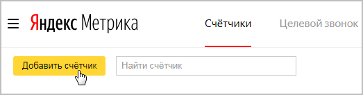
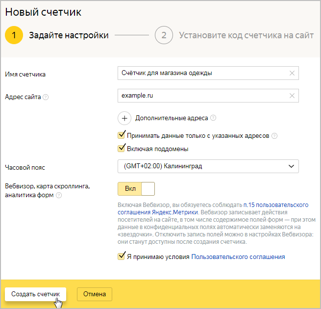
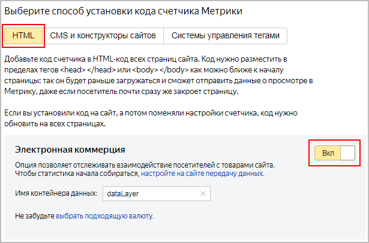
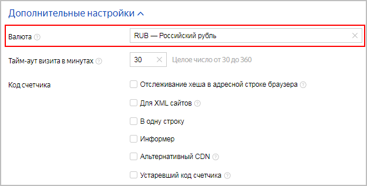
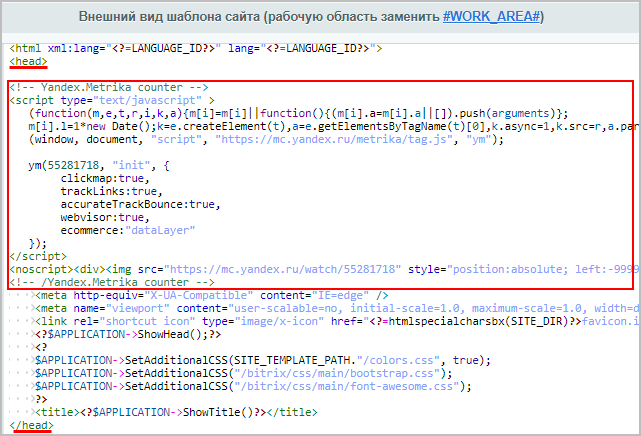
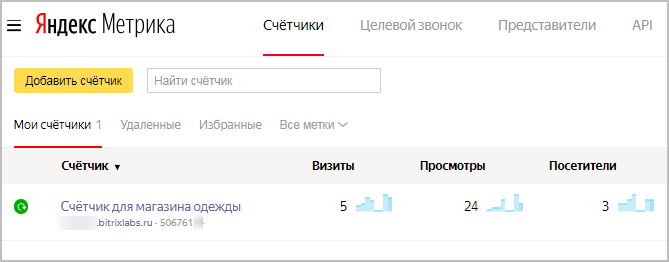
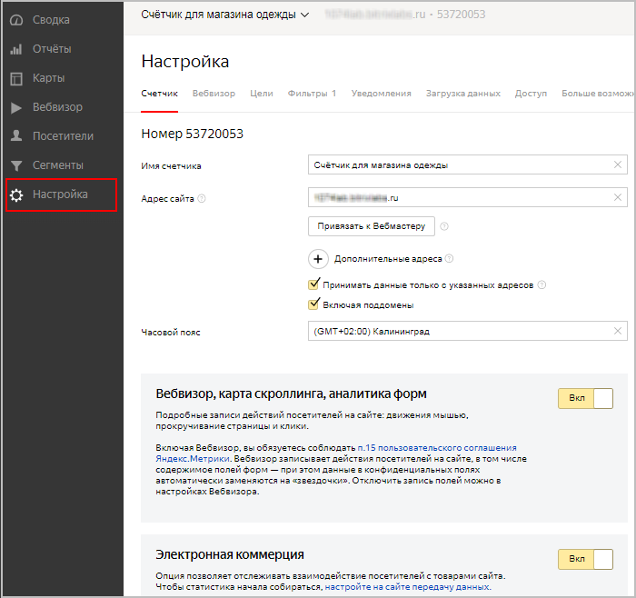

# Подключение счётчиков Яндекс.Метрики

**Навигация**
- [← Оглавление курса](index.md)
- [← Предыдущий: 2101 — Настройки модуля Веб-аналитика](lesson_2101.md)
- [Следующий: 12259 — Как подключить электронную коммерцию Яндекс →](lesson_12259.md)

Официальная страница урока: https://dev.1c-bitrix.ru/learning/course/index.php?COURSE_ID=41&LESSON_ID=11805

|  | ### Подключение счётчиков Яндекс.Метрики |
| --- | --- |

Рассмотрим, как подключить один из удобных инструментов веб-аналитики – **Яндекс. Метрику**.

1. [Создайте учетную запись](https://passport.yandex.ru/registration?mode=register) на Яндексе. Если у вас уже есть учетная запись, нажмите кнопку **Перейти** на странице [Метрики](https://metrika.yandex.ru);
2. Создайте счетчик, нажав кнопку
  			Добавить счетчик.
  
  		 Откроется страница настроек счетчика (первый этап):
  
  ## Настройки счётчика
  - **Имя счетчика** - указанное в этом поле имя будет отображаться на странице **Мои счетчики** и в верхнем меню переключения между счетчиками. Если имя не задано, то будет использоваться значение поля **Адрес сайта**.
  - **Адрес сайта** - основной домен сайта. Поле обязательно для заполнения. Префикс схемы/протокола (`http://, https://`) указывать не следует.
    Опция **Принимать данные только с указанных доменов** выбирается, когда в отчетах есть
    			данные посторонних сайтов.
                         Чаще всего такая ситуация возникает в следующих случаях:
    - Кто-то (скорее всего по ошибке) инициализировал счетчик с вашим номером на своем сайте.
    - Страницы ваших сайтов просматривались через прокси-сервис.
    - Существует практически точная копия содержимого ваших страниц на других доменах. При копировании контента был скопирован и код счетчика.
    Опция **Включая поддомены** позволяет учитывать при фильтрации поддомены основного и дополнительных сайтов (`subdomain.example.ru, other.subdomain.example.ru, ...`).
  - **Часовой пояс** - указывается, соответственно, часовой пояс сайта.
  - **Вебвизор, карта скроллинга, аналитика форм** - при включенной опции можно отследить действия посетителей сайта максимально подробно: действия на каждой странице, передвижения курсора мыши, клики по ссылкам и т.д.
  Перед созданием счётчика необходимо принять условия [Пользовательского соглашения.](https://yandex.ru/legal/metrica_termsofuse/)
3. На следующем этапе выберите способ установки кода счетчика Метрики `HTML` (т.к. в дальнейшем мы будем вставлять html-код счётчика в шаблон нашего сайта) и включите опцию **Электронная коммерция** – это позволит отслеживать взаимодействие посетителей с товарами сайта. Подробнее о подключении электронной коммерции читайте в
  			следующем уроке.
  **Электронная коммерция Яндекс** позволяет оценить эффективность работы Вашего интернет-магазина (например, какие товары или бренды пользуются наибольшим спросом или какие источники приносят наибольший доход) с помощью наглядных отчётов.
  [Подробнее](lesson_12259.md)...
  
  **Примечание**: При работе с *Битрикс24* выберите способ установки `CMS и конструкторы сайтов` (т.к. в *Битрикс24* есть готовый плагин, в котором нужно только указать номер Вашего счётчика), и далее действуйте согласно
  			соответствующей инструкции.
  **Яндекс.Метрика** — сервис для оценки посещаемости веб-сайтов, и анализа поведения пользователей. Для его использования на Битрикс24.Сайтах необходимо ввести номер счетчика в настройках сайта или отдельной страницы.
  [Подробнее](https://helpdesk.bitrix24.ru/open/9494147/?sphrase_id=84214172)...
  В
  			Дополнительных настройках
  
  		 укажите валюту, с которой хотите работать.
4. Далее скопируйте код счетчика, нажав соответствующую
  			кнопку.
  
5. Откройте шаблон вашего сайта в режиме изменения (Настройки &gt; Настройки продукта &gt; Сайты &gt; Шаблоны сайта (шаблон нужного сайта)):
  
  **Примечание**: Если один шаблон используется для
  			нескольких сайтов
  В *Bitrix Framework* имеется возможность на базе одного экземпляра продукта создавать и поддерживать неограниченное количество сайтов (кроме [лицензий](https://www.1c-bitrix.ru/products/cms/license.php) "Первый сайт" - 1 сайт и "Старт" - 2 сайта).
  [Подробнее](https://dev.1c-bitrix.ru/learning/course/?COURSE_ID=103&LESSON_ID=281)...
  		, то сначала скопируйте этот шаблон,
  			примените
  Откройте в Административном разделе страницу Настройки &gt; Настройки продукта &gt; Сайты &gt; Список сайтов. С помощью меню действий откройте для редактирования нужный сайт.
  Выберите шаблон, который вы хотите применить, и условия. Рекомендуем пользоваться функцией предпросмотра с помощью иконки  для проверки верности выбора шаблона.
  [Подробнее](https://dev.1c-bitrix.ru/learning/course/index.php?COURSE_ID=34&LESSON_ID=1994)...
  		 скопированный шаблон к нужному сайту и затем вставьте в этот шаблон код счётчика, как описано в следующем пункте.
6. Скопированный код счётчика добавьте в файл, как описано [в инструкции Яндекс](https://yandex.ru/support/metrica/general/creating-counter.html): между тегами &lt;head&gt;&lt;/head&gt; или &lt;body&gt;&lt;/body&gt;. Например так:
  
7. Нажмите кнопку
  			Начать пользоваться.
  

Готово! Счетчик **Яндекс.Метрики**

			подключен!

Вы можете отслеживать его на [странице счетчиков](https://metrika.yandex.ru/list/) **Яндекс.Метрики**

В следующих уроках смотрите, как в **Яндекс.Метрике** настраивать и использовать **Электронную коммерцию** и **Цели**.

**Примечания**: При необходимости Вы можете изменить параметры созданного счетчика на странице

			Настройки.

		 Однако после внесения изменений не забудьте скопировать новый код и заменить его в шаблоне сайта.

Допускается создание нескольких счётчиков. О том, как их разместить на сайте, читайте в [Яндекс Справке](https://yandex.ru/support/metrica/code/install-several-counters.html).
