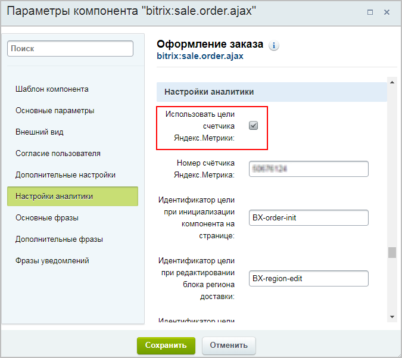
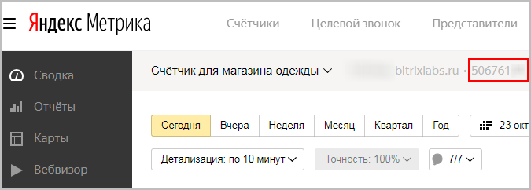
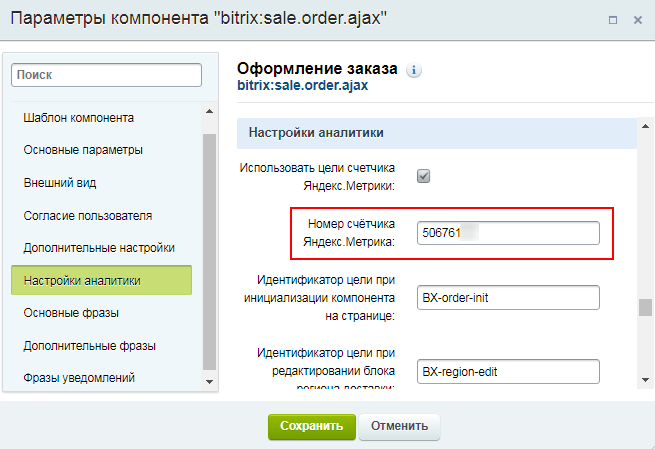
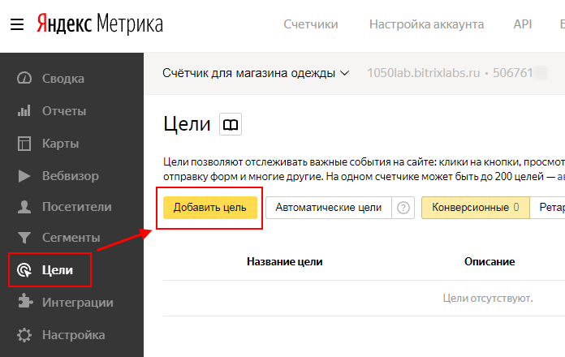
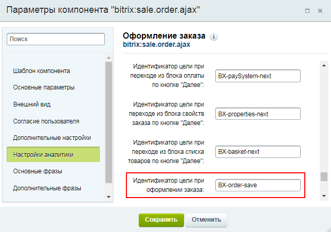
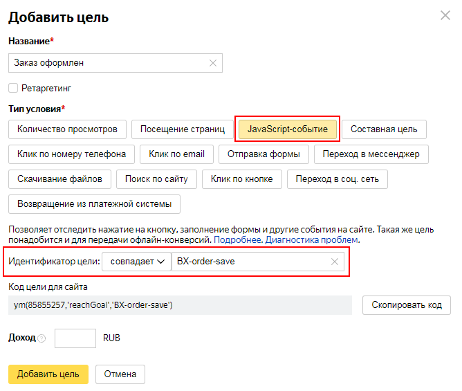

# Цели Яндекс.Метрики: статистика оформленных заказов.

**Навигация**
- [← Оглавление курса](index.md)
- [← Предыдущий: 12259 — Как подключить электронную коммерцию Яндекс](lesson_12259.md)
- [Следующий: 11831 — Подключение Google Аналитики и Google Tag Manager →](lesson_11831.md)

Официальная страница урока: https://dev.1c-bitrix.ru/learning/course/index.php?COURSE_ID=41&LESSON_ID=11807

|  | ### Цели Яндекс.Метрики: статистика оформленных заказов. |
| --- | --- |

**Цели** Яндекс.Метрики позволяют отслеживать

			конкретные действия

В Яндекс.Метрике вы можете настроить следующие типы целей:

- Количество просмотров. Просмотр определенного числа страниц сайта.

- Посещение страниц. Просмотр заданных страниц сайта.

- Отследить клик на email. Отслеживание нажатия на все адреса на сайте или на указанный адрес.

- Отследить клик на телефон. Отслеживание нажатия на все номера телефонов на сайте или на

указанный номер.

- JavaScript-событие. Информация о достижении цели передается с помощью JavaScript (например,

нажатие кнопки «Отправить заявку»).

- Составная цель. Сочетает в себе перечисленные выше типы целей.

[Подробнее...](https://yandex.ru/support/metrica/reports/add-goals.html)

		 посетителей сайта.

В предыдущих уроках мы разобрали, как

			подключить счётчик

Рассмотрим, как подключить один из удобных инструментов веб-аналитики – **Яндекс. Метрику**.

[Создайте учетную запись](https://passport.yandex.ru/registration?mode=register) на Яндексе. Если у вас уже есть учетная запись, нажмите кнопку **Войти** на странице [Метрики](https://metrika.yandex.ru).

[Подробнее](lesson_11805.md)...

		 Яндекс.Метрики и как

			подключить электронную коммерцию

**Электронная коммерция Яндекс** позволяет оценить эффективность работы Вашего интернет-магазина (например, какие товары или бренды пользуются наибольшим спросом или какие источники приносят наибольший доход) с помощью наглядных отчётов.

[Подробнее](lesson_12259.md)...

		 Яндекс.

Теперь рассмотрим, как использовать **Цели** для отслеживания действий при оформлении заказа (компонент

			sale.order.ajax

                    Компонент служит для оформления заказа на одной странице с использованием технологии AJAX. Компонент является стандартным и входит в дистрибутив модуля.

						[Описание компонента «Оформление заказа» в пользовательской документации.](http://dev.1c-bitrix.ru/user_help/detail.php?ID=146775)

		).

1. В настройках параметров
  			компонента
                      Компонент – это программный код, оформленный в визуальную оболочку, выполняющий определённую функцию какого-либо модуля по выводу данных в Публичной части. Мы можем вставлять этот блок кода на страницы сайта без непосредственного написания кода. [Подробнее...](https://dev.1c-bitrix.ru/learning/course/index.php?COURSE_ID=34&CHAPTER_ID=04457)
  		 **sale.order.ajax** во вкладке **Настройки аналитики** отметьте следующие опции:
  Появятся дополнительные поля настроек:
  
  > **Примечание**: Обратите внимание на поля типа `Идентификатор цели при ...`. Это названия как раз тех событий процедуры оформления заказа, которые можно отслеживать с помощью инструмента **Цели** Яндекс.Метрики. Ознакомьтесь с этими полями и скопируйте имена нужных вам событий (позднее при создании **Целей** нужно будет прописывать эти названия).

  - **Использовать цели счетчика Яндекс.Метрики**
  - **Отправлять данные электронной торговли в Google и Яндекс** (возможность отслеживать метрики добавления/удаления/покупки товаров)
2. Скопируйте
  			номер
  
  		 ранее созданного счётчика **Яндекс.Метрики** и вставьте его в
  			соответствующее поле
  
  		 настроек компонента **sale.order.ajax**;
3. Далее в [Яндекс.Метрике](https://metrika.yandex.ru) в разделе **Цели** (Счётчики &gt; [созданный ранее счётчик] &gt; Цели) нажмите кнопку **Добавить цель**:
  
4. В открывшемся окне выберите тип условия **JavaScript-событие**, укажите название цели.
  В поле **Идентификатор цели** вставьте один из
  			Идентификаторов цели
  
  		, указанных в настройках компонента **sale.order.ajax**, и сохраните изменения.
  
  ## Возможные идентификаторы цели (компонент sale.order.ajax Компонент служит для оформления заказа на одной странице с использованием технологии AJAX. Компонент является стандартным и входит в дистрибутив модуля. Описание компонента «Оформление заказа» в пользовательской документации. )
  **BX-order-init** - Идентификатор цели при инициализации компонента на странице
  **BX-region-edit** - Идентификатор цели при редактировании блока региона доставки
  **BX-delivery-edit** - Идентификатор цели при редактировании блока доставки
  **BX-pickUp-edit** - Идентификатор цели при редактировании блока пунктов самовывоза
  **BX-paySystem-edit** - Идентификатор цели при редактировании блока оплаты
  **BX-properties-edit** - Идентификатор цели при редактировании блока свойств заказа
  **BX-basket-edit** - Идентификатор цели при редактировании блока списка товаров
  **BX-region-next** - Идентификатор цели при переходе из блока региона доставки по кнопке "Далее"
  **BX-delivery-next** - Идентификатор цели при переходе из блока доставки по кнопке "Далее"
  **BX-pickUp-next** - Идентификатор цели при переходе из блока пунктов самовывоза по кнопке "Далее"
  **BX-paySystem-next** - Идентификатор цели при переходе из блока оплаты по кнопке "Далее"
  **BX-properties-next** - Идентификатор цели при переходе из блока свойств заказа по кнопке "Далее"
  **BX-basket-next** - Идентификатор цели при переходе из блока списка товаров по кнопке "Далее"
  **BX-order-save** - Идентификатор цели при оформлении (сохранении) заказа

Готово! Теперь на [странице счетчиков](https://metrika.yandex.ru/list/) **Яндекс.Метрики** вы сможете отслеживать число выполненных на вашем сайте определенных действий:

