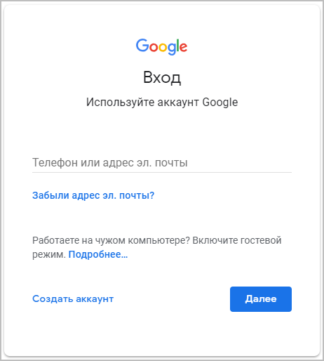
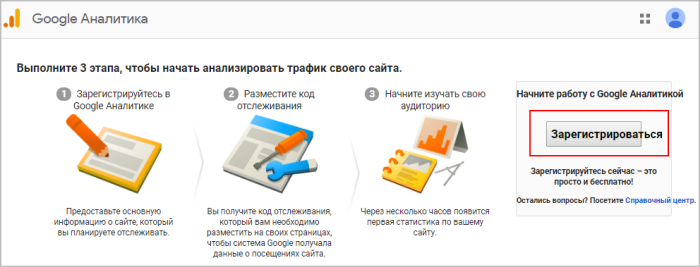
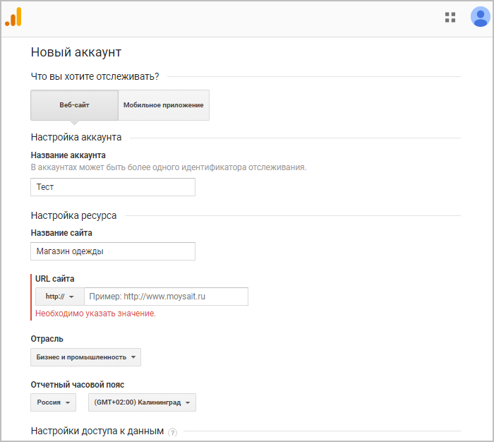
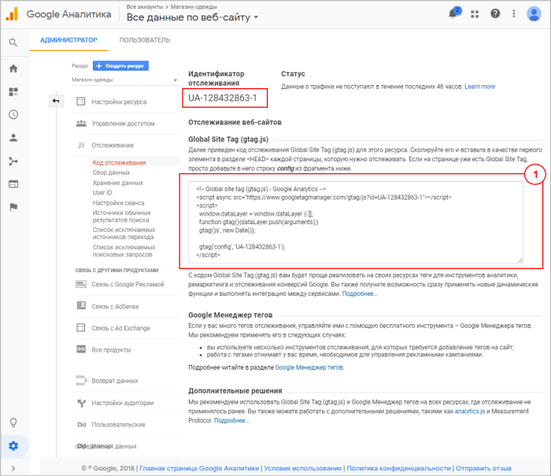
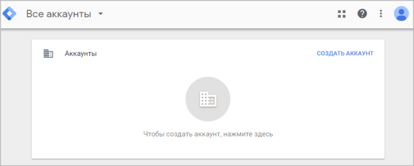
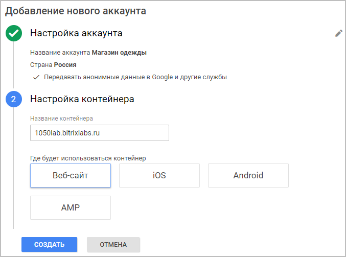
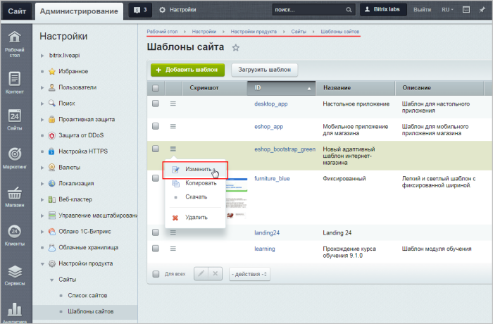
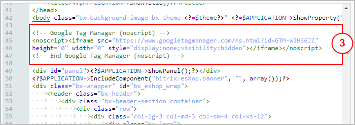
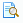
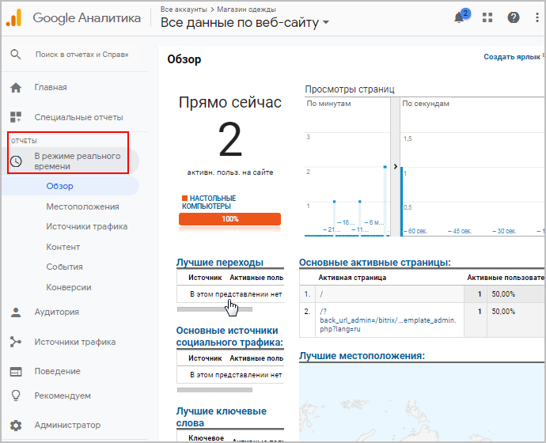

# Подключение Google Аналитики и Google Tag Manager

**Навигация**
- [← Оглавление курса](index.md)
- [← Предыдущий: 11807 — Цели Яндекс.Метрики: статистика оформленных заказов.](lesson_11807.md)
- [Следующий: 11833 — Создание тегов Google Tag Manager для событий интернет-магазина →](lesson_11833.md)

Официальная страница урока: https://dev.1c-bitrix.ru/learning/course/index.php?COURSE_ID=41&LESSON_ID=11831

### О подключении Google Аналитики и Google Tag Manager

Еще один вид счетчика **событий** (т.е. клиентских "кликов" по определенным местам/кнопкам сайта) -

			Google Аналитика.

**Google Analytics** (сокращённо GA) — бесплатный сервис, предоставляемый Google для создания детальной статистики посетителей веб-сайтов. Статистика собирается на сервере Google, пользователь только размещает JS-код на страницах своего сайта. Код отслеживания срабатывает, когда пользователь открывает страницу в своем веб-браузере (при условии разрешенного выполнения Javascript в браузере).

[Подробнее](https://ru.wikipedia.org/wiki/Google_Analytics)...

Для отслеживания **событий магазина** в Google Аналитике воспользуемся новым инструментом от Google -

			Google Tag Manager.

**Google Tag Manager** — бесплатный инструмент для управления маркетинговыми активностями и отслеживанием тегов (меток) на сайте. Причем тегируются посетители сайта, выполнивших определенные действия на сайте. Таким образом, можно отследить реальное количество уникальных посетителей.

[Подробнее](https://www.google.com/intl/ru/tagmanager/)...

**Примечание**: Можно подключить один из счетчиков: или **Google Аналитики**, или **Google Tag Manager** (в зависимости от того, каким функционалом Вы хотите пользоваться).

**Google Аналитика** позволяет отслеживать посещаемость сайта.

 **Google Tag Manager** имеет расширенный функционал (не только посещаемость, но и

			события магазина

Отслеживаемые события магазина:

**showDetail** - детальный просмотр товара;

**addToCart** - добавление товара в корзину;

**checkout** - переход на страницу оформления заказа;

**purchase** - завершение оформления заказа (заказ совершен).

**removeFromCart** - удаление товара из корзины.

[Подробнее](lesson_11833.md)...

		, а также детальные

			отчеты

                     В Google Analytics представлены перечисленные ниже стандартные отчеты по

электронной торговле. Для работы с дополнительными отчетами настройте отслеживание

расширенной электронной торговли.

Стандартные отчеты:

**Обзор.** Сводные данные – Доход, Коэффициент транзакций, Количество транзакций, Средняя стоимость

заказа и другие показатели.

**Эффективность товаров.**  Доход от продукта, Покупки, Количество, Средняя цена и
Среднее количество с разбивкой по Коду товара и Категории.

**Эффективность продаж.** Доход с разбивкой по Дате.

**Транзакции.** Доход, Налог, Доставка и Количество с разбивкой по Идентификатору транзакции.

**Время до покупки.** Число дней до транзакции и Сеансы до транзакции.

[Подробнее](https://support.google.com/analytics/answer/1037249?hl=ru)...

		 по товарам.

 **Google Аналитику** можно настроить **во всех редакциях** продукта *"1С-Битрикс: Управление сайтом"*, а **Google Tag Manager** имеет смысл настраивать в редакциях **Малый бизнес** и выше (т.к. настраиваемые события связаны с передачей информации интернет-магазина).

В данном уроке рассмотрим, как подключить оба инструмента (Вы можете выбрать один на свое усмотрение). Вне зависимости от подключаемого инструмента все результаты (отчеты) будут выводиться на странице [Google Аналитики](https://analytics.google.com).

Принцип подключения **Google Аналитики** и **Google Tag Manager** такой же, что и **Яндекс.Метрики**: необходимо зарегистрироваться на соответствующих ресурсах, получить коды отслеживания и вставить их в шаблон сайта.

### Процесс подключения пошагово

Разберем процесс подключения пошагово:

1. [Создайте аккаунт Google](https://accounts.google.com). Если у вас уже есть аккаунт, авторизуйтесь и нажмите кнопку
  			Далее
  
  		;
2. Создайте
  
  		 аккаунт [Google Аналитики](https://analytics.google.com) или, если он у вас уже есть, войдите в него.
  
  Выберите **Веб-сайт**, укажите
  			название аккаунта.
  Название аккаунта лучше выбрать такое, по которому будет легче понять его назначение.
  		 Пропишите также название сайта и введите его
  			URL.
  Необходимо выбрать стандарт протокола (`http://` или `https://`) и ввести доменное имя (доменное имя вводится без каких-либо дополнительных символов, а также без косой черты в конце).
  		 Выберите **категорию отрасли** и укажите
  			часовой пояс для отчетов.
  Этот параметр используется в отчетах при разделении суток.
  Выбранный часовой пояс влияет лишь на представление данных в отчетах,
  а не на процесс их сбора. Например, если вы выберете "США, Тихоокеанское время",
  то начало и конец каждого дня будут определяться по тихоокеанскому времени, даже
  если посетители живут в Нью-Йорке, Лондоне или Москве.
  Если ваш аккаунт Google Аналитики связан с Google Рекламой, будет автоматически
  выбран часовой пояс, заданный в настройках Google Рекламы. Изменить его вы
  не сможете. Это делается для того, чтобы обеспечить точность отчетов по
  кампаниям Google Рекламы.
  Изменение часового пояса повлияет только на данные, которые будут получены
  в дальнейшем. Текущие отчеты останутся прежними. Если вы обновите свой часовой
  пояс после начала использования ресурса, в данных отчетов может появиться ровная
  полоса или пик. В течение некоторого времени после изменения этой настройки отчеты
  могут создаваться по часовому поясу, который использовался ранее.
  [Подробнее...](https://support.google.com/analytics/answer/1009694?hl=ru)
  Кликните на кнопку
  			Получить идентификатор отслеживания,
  
  		 и далее примите "Условия использования Google Аналитики", предварительно ознакомившись с ними;
3. Скопируйте **Идентификатор отслеживания** и **Код отслеживания** (идентификатор отслеживания понадобится нам в следующем уроке):
  
4. Теперь
  			создайте аккаунт
  
  		 на [Google Tag Manager](https://tagmanager.google.com):

  - Настройте
    			аккаунт;
    
  - Настройте
    			контейнер
    
    		 (создается автоматически при создании аккаунта).
5. Прочитайте и примите "Соглашение об Условиях использования Диспетчера тегов".
6. Скопируйте **Код Диспетчера тегов Google**:
  
7. Откройте шаблон вашего сайта в режиме изменения (Настройки &gt; Настройки продукта &gt; Сайты &gt; Шаблоны сайта (шаблон нужного сайта)):
  
8. Скопированные **Код Диспетчера тегов Google** или **Код отслеживания** (в зависимости от подключаемого инструмента) добавьте в шаблон сайта:
  
  
  **Примечания**:
  1. **Код отслеживания** 1 и одна часть  **Кода Диспетчера тегов Google** 2 вставляются в
    			header
    **Header** - файл, который отвечает за генерацию заголовка всех страниц сайта.
    		 шаблона сайта, а вторую часть **Кода Диспетчера тегов Google** 3 нужно вставить после открывающего тега `<body>`.
  2. В некоторых случаях модуль Проактивная защита может модифицировать часть кода, в частности `<script>` менять на `<sc ript>`. В этом случае нужно добавить эту часть кода в
    			Исключения Ативируса
                        При необходимости могут быть заданы исключения из проактивного фильтра (закладка Исключения), т.е. проактивный фильтр не будет применяться на страницах, указанных на данной закладке.
    [Подробнее ...](https://dev.1c-bitrix.ru/learning/course/index.php?COURSE_ID=35&LESSON_ID=2674)
  3. Если один шаблон используется для
    			нескольких сайтов
    В *Bitrix Framework* имеется возможность на базе одного экземпляра продукта создавать и поддерживать неограниченное количество сайтов (кроме [лицензий](https://www.1c-bitrix.ru/products/cms/license.php) "Первый сайт" - 1 сайт и "Старт" - 2 сайта).
    [Подробнее](https://dev.1c-bitrix.ru/learning/course/?COURSE_ID=103&LESSON_ID=281)...
    		, то сначала скопируйте этот шаблон,
    			примените
    Откройте в Административном разделе страницу Настройки &gt; Настройки продукта &gt; Сайты &gt; Список сайтов. С помощью меню действий откройте для редактирования нужный сайт.
    Выберите шаблон, который вы хотите применить, и условия. Рекомендуем пользоваться функцией предпросмотра с помощью иконки  для проверки верности выбора шаблона.
    [Подробнее](https://dev.1c-bitrix.ru/learning/course/index.php?COURSE_ID=34&LESSON_ID=1994)...
    		 скопированный шаблон к нужному сайту и затем вставьте в этот шаблон код.

Готово! **Google Аналитика** и **Google Tag Manager** подключены!

Вы сразу сможете просматривать [множество отчетов](https://analytics.google.com/analytics/web/#/realtime/rt-overview/)

			в режиме реального времени

		: количество посетителей на сайте, основные активные страницы и т.д. (Отчёты &gt; В режиме реального времени).

В

			следующем уроке

В этом уроке рассмотрим, как создать тег с триггерами для отслеживания следующих событий:

**showDetail** - детальный просмотр товара;

**addToCart** - добавление товара в корзину;

**checkout** - переход на страницу оформления заказа;

**purchase** - завершение оформления заказа (заказ совершен).

[Подробнее](lesson_11833.md)...

		 вы узнаете, как пользоваться **Google Tag Manager** и настраивать теги.
