# Создание тегов Google Tag Manager для событий интернет-магазина

**Навигация**
- [← Оглавление курса](index.md)
- [← Предыдущий: 11831 — Подключение Google Аналитики и Google Tag Manager](lesson_11831.md)
- [Следующий: 23090 — Уровень данных →](lesson_23090.md)

Официальная страница урока: https://dev.1c-bitrix.ru/learning/course/index.php?COURSE_ID=41&LESSON_ID=11833

### Теги для событий магазина

В

			предыдущем уроке

Еще один вид счетчика событий (т.е. клиентских "кликов" по определенным местам/кнопкам сайта) - Google Аналитика.

Для отслеживания событий в Google Аналитике воспользуемся новым инструментом от Google - Google Tag Manager.

Принцип подключения Google Аналитики и Google Tag Manager такой же, что и Яндекс.Метрики: необходимо зарегистрироваться на соответствующих ресурсах, получить коды отслеживания и вставить их в шаблон сайта.

Разберем процесс подключения пошагово:

[Подробнее](lesson_11831.md)...

		 мы разобрались, как подключить на сайт счетчики Google.

В этом уроке вы узнаете, как создать

			тег

**Теги** — это метка-идентификатор, представляющая собой кусочек JavaScript-кода.

		 с

			триггерами

**Триггеры** — это условия срабатывания тегов.

		 для отслеживания покупательской активности (событий) в интернет-магазине:

- **showDetail** - детальный просмотр товара;
- **addToCart** - добавление товара в корзину;
- **checkout** - переход на страницу оформления заказа;
- **purchase** - завершение оформления заказа (заказ совершен);
- **removeFromCart** - удаление товара из корзины.

**Примечание**: О том, как задать срабатывание тегов не только на события интернет-магазина, но и на множество других событий или переменных, читайте

			в соответствующем уроке.

Вы можете задать срабатывание тегов не только на события интернет-магазина ,

но и на множество других событий или переменных. Например, на такие, как нажатие

определенной кнопки, скачивание файла, или на переменную "общая сумма покупки".

Для таких потребностей рекомендуется использовать **Google Tag Manager**

совместно с уровнем данных .

Очень удобно использовать **уровень данных** при отслеживании таких

событий взаимодействия пользователя с элементами сайта, при которых не меняется

URL страницы (например, открытие слайдера, попапа и других всплывающих элементов,

заполнение или отправка формы и т.п.).

[Подробнее](lesson_23090.md)...

Рассмотрим пошагово, как с помощью тегов **Google Tag Manager** отследить указанные выше

			события интернет-магазина.

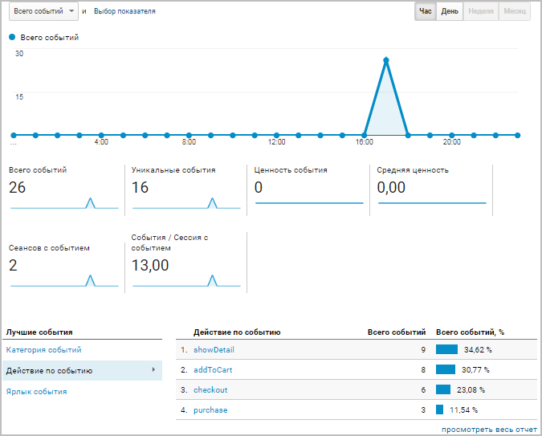

### Создание тегов Google Tag Manager

1. Прежде всего,
  			отредактируйте
  
  		 на Вашем сайте страницы каталога, корзины и оформления заказа: на каждой из этих страниц найдите
  			компонент
                      Компонент – это программный код, оформленный в визуальную оболочку, выполняющий определённую функцию какого-либо модуля по выводу данных в Публичной части. Мы можем вставлять этот блок кода на страницы сайта без непосредственного написания кода. [Подробнее...](https://dev.1c-bitrix.ru/learning/course/index.php?COURSE_ID=34&CHAPTER_ID=04457)
  		, отвечающий за вывод информации. В настройках параметров таких компонентов (**sale.order.ajax**, **sale.basket.basket** и **catalog**) во вкладке **Настройки аналитики** отметьте опцию
  			Отправлять данные электронной торговли в Google и Яндекс
  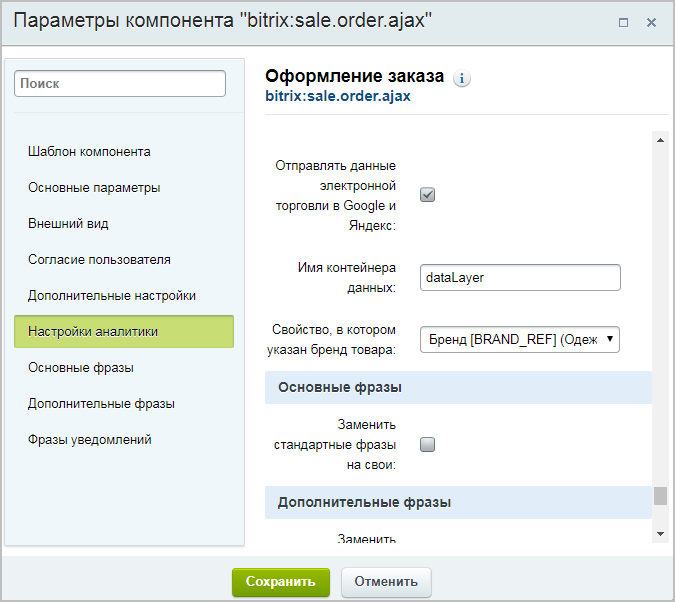
  		 (возможность отслеживать метрики добавления/удаления/покупки товаров);
  **Важно!** Указанное в уроке решение доступно для редакций продукта **Малый бизнес** и выше.
  Если в настройках компонентов Вашего сайта нет опции **Отправлять данные электронной торговли в Google и Яндекс**, то вероятная причина – использование
  			кастомизированного
  Кастомизация шаблона компонента, как правило, преследует две цели:
  1) Приведение формы вывода данных компонента в соответствие с дизайном сайта;
  2) Организация вывода данных компонента в виде, недоступном в стандартном варианте.
  [Подробнее](https://dev.1c-bitrix.ru/learning/course/index.php?COURSE_ID=43&CHAPTER_ID=04778)...
  		 (изменённого) шаблона компонента, в котором отсутствуют необходимые параметры в файле **.parameters.php**.
  Установите
  			стандартный
  
  		 шаблон (**.default** или **bootstrap_v4**) и проверьте наличие указанной опции. Если опция появилась, то можете либо использовать стандартный шаблон, либо обратиться к разработчику компонента Вашего сайта за необходимыми доработками.
2. Далее в [Google Tag Manager](https://tagmanager.google.com)
  			создайте триггеры:
  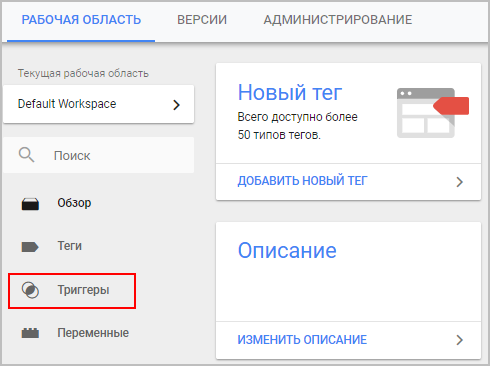
  
  Здесь укажите имя нужного события и выберите в качестве типа триггера
  			Пользовательское событие
  
  ## Посмотреть скриншоты настроек всех триггеров.
  - **showDetail** - детальный просмотр товара;
    
  - **addToCart** - добавление товара в корзину;
    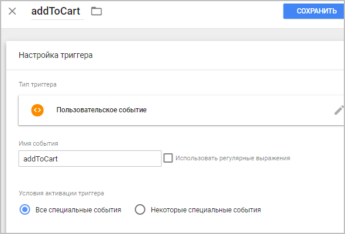
  - **checkout** - переход на страницу оформления заказа;
    
  - **purchase** - завершение оформления заказа (заказ совершен).
    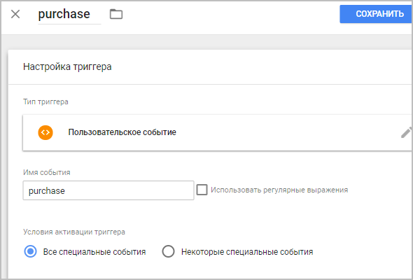
  - **removeFromCart** - удаление товара из корзины.
    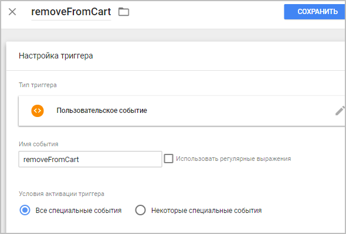
3. Теперь
  			создайте тег.
  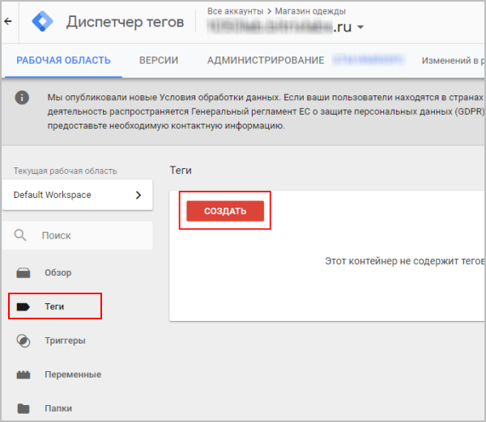
  		 Потребуется настроить конфигурацию тега и добавить созданные триггеры.
  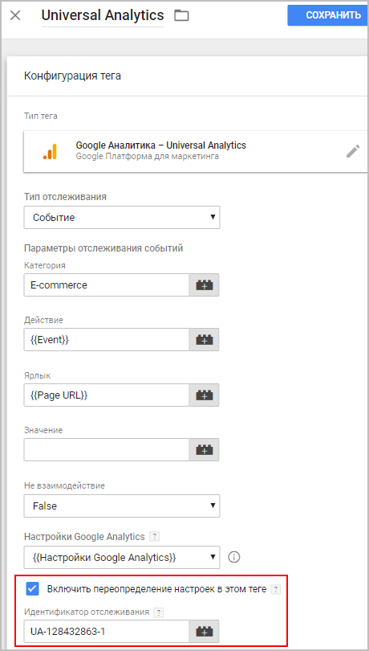
  #### Необходимые настройки конфигурации тега:
  **Примечание**: Если Вы хотите видеть детальные отчеты по товарам (а не только по событиям), то необходимо подключить **Электронную торговлю Google** (см.
  			урок
  Для использования возможностей электронной торговли необходимо выполнить два действия:
  1) Подключите к своему интернет-магазину Google Tag Manager и создайте тег.
  При настройке тега необходимо в Дополнительных условиях настроить Электронную торговлю.
  2) Включите отслеживание электронной торговли в Google Аналитике (Администратор &gt; Представление &gt; Настройки электронной торговли).
  [Подробнее](lesson_12307.md)...
  		). Для этого при настройке тега необходимо в **Дополнительных условиях** настроить опцию
  			Электронная торговля.
  
  После настройки конфигурации тега
  			добавьте созданные триггеры.
  

  - **Тип тега** -
    			`Google Аналитика - Universal Analytics`
    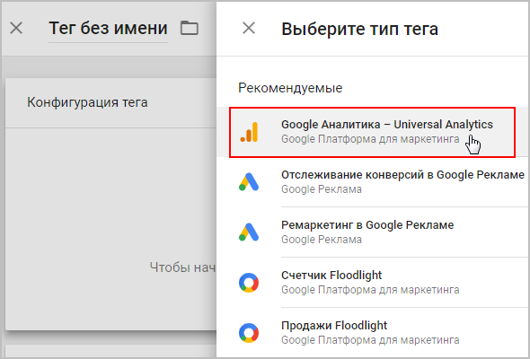
  - **Тип отслеживания** - `Событие`
  - **Категория** - указывается произвольное имя
  - **Действие** -
    			`Event`
    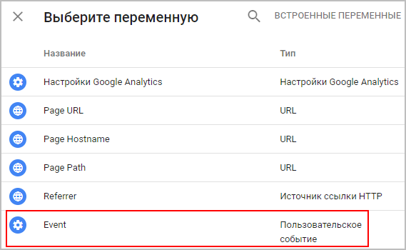
  - **Ярлык** -
    			`Page URL`
    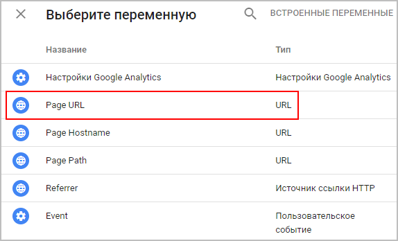
  - **Не взаимодействие** - `False`
  - **Настройки Google Analytics** -
    			`Настройки Google Analytics`
    
  - **Включить переопределение настроек в этом теге** - отметьте эту опцию, и в появившемся окне укажите скопированный ранее
    			Идентификатор отслеживания
    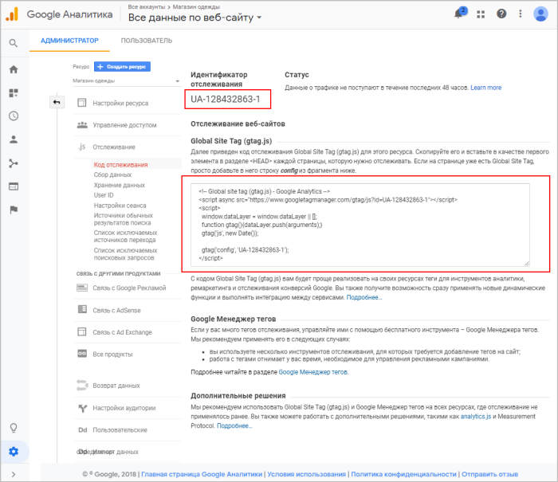
4. Теперь нужно, чтобы созданные тег с триггерами начали работать. Для этого нажмите в правом верхнем углу экрана кнопку
  			Отправить.
  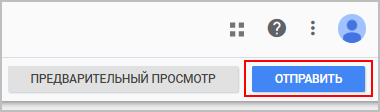
  		 В открывшемся окне укажите
  			название и описание версии
  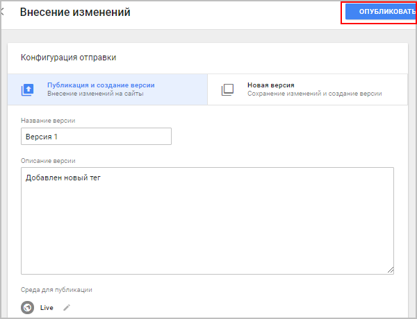
  		 настроек (название и описание указываются произвольно), и нажмите кнопку **Опубликовать**.

**Готово!** Тег с триггерами создан и уже начал работать.

### Результат

Проверить правильность настройки триггеров можно в режиме реального времени на странице Google Аналитики (Отчёты &gt; В режиме реального времени &gt; События):

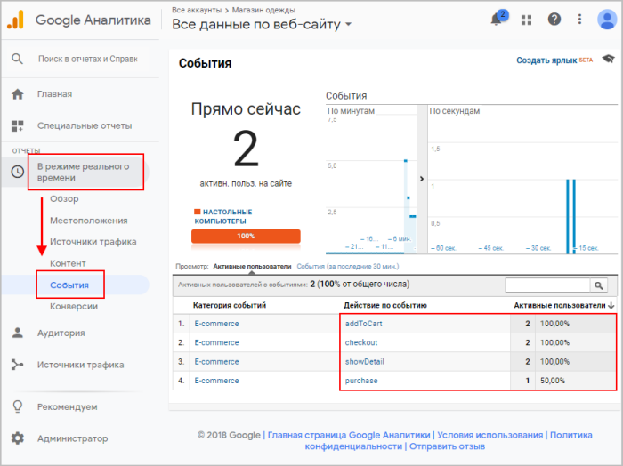
