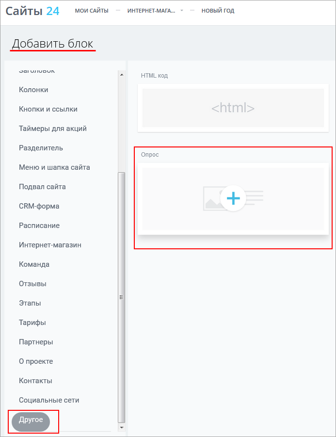

# Блок с компонентом внутри

**Навигация**
- [← Оглавление курса](index.md)
- [← Предыдущий: 12629 — Сайты 24 на собственном домене](lesson_12629.md)
- [Следующий: 20218 — Проверьте себя →](lesson_20218.md)

Официальная страница урока: https://dev.1c-bitrix.ru/learning/course/index.php?COURSE_ID=41&LESSON_ID=11975

В презентации [1С-Битрикс: Управление Сайтом 18.0](https://youtu.be/6oTf99A2GgI?t=2592) было объявлено, что в модуль Сайты24 можно добавлять стандартные или собственные компоненты. Для этого их нужно "обернуть" в специальный код и разместить в блоках. Таким образом можно реализовать практически любую бизнес-логику.


> Создать свой блок достаточно просто. Вам потребуется знание PHP и HTML и тщательное изучение документации [о создании блока](https://dev.1c-bitrix.ru/api_d7/bitrix/landing/block/create_block.php) и [о файле манифеста](https://dev.1c-bitrix.ru/rest_help/landing/block/blocks.php).<!-- Также рекомендуем посмотреть &lt;a href="https://www.youtube.com/watch?v=ZLtxNSKkBKI" target="_blank"&gt;вебинар&lt;/a&gt;. -->


Например, давайте разместим в блоке

			компонент опроса

                    Все компоненты расположены на специальной панели в визуальном редакторе


 

		. Это ведь довольно частый кейс, чтобы узнать что-то о наших посетителях или их потребностях. Возьмем для простоты уже готовый опрос, который мы делали в уроке [Создание и публикация опроса](https://dev.1c-bitrix.ru/learning/course/index.php?COURSE_ID=34&LESSON_ID=11393).


### Видеоурок


<!-- &lt;iframe title="Блок с компонентом внутри" src="//www.youtube.com/embed/U-tlu1s5Hmg?feature=oembed&rel=0" allowfullscreen="" width="853" height="480" frameborder="0"&gt;
	&lt;/iframe&gt; -->


### Порядок работы


**Обратите внимание!** [Работа с php-скриптом](https://dev.1c-bitrix.ru/learning/course/index.php?COURSE_ID=35&LESSON_ID=1904) в визуальном редакторе имеет некоторые особенности. Если вы создаете файлы и папки средствами интерфейса административного раздела, в папках автоматически создаются индексные страницы index.php - их можно удалить. А в файлах добавляются коды вызова  footer.php и header.php - их тоже следует удалять.


1. Создаем в `/bitrix/blocks/` папку `proba`, а в ней папку `opros`.
  > Все блоки обязательно размещаются на диске по пути **/bitrix/blocks/**. Папку для добавления своего блока вы можете назвать как угодно, используя латиницу, цифры, символы "." и "-". Помните, что имя папки будет служить также и символьным кодом блока и должно быть **уникально**.
2. Создаем файл `block.php`. Это тело блока. В нём размещаем код (с помощью виз. редактора, как HTML):
  ```
  <section class="landing-block">
          <div class="landing-node-text">
          Здесь будет опрос
          </div>
  </section>
  ```
3. Создаем файл `.description.php`. Это и есть "обертка" - файл манифеста. Открываем его на редактирование
  			как PHP
                      
  		. Удаляем содержимое и размещаем код:
  ```
  <?php
  if (!defined('B_PROLOG_INCLUDED') || B_PROLOG_INCLUDED !== true)
  {
     die();
  }
  return array(
      'block' => array(
          'name' => "Опрос",
      ),
      'cards' => array(),
      'nodes' => array(
          '.landing-block-text' => array(
              'name' => "Заголовок",
              'type' => 'text',
          )
          ),
          '.landing-block-node-text' => array(
              'name' => "Текст",
              'type' => 'text',
          )
  );
  ?>
  ```
4. Очищаем кэш с помощью кода и
  			выполнения php-команды
                      
  		:
  ```
  if (\Bitrix\Main\Loader::includeModule('landing'))
  {
     \Bitrix\Landing\Block::clearRepositoryCache();
  }
  ```
5. Создаем страницу
                       
  		 в разделе **Сайты 24**.
6. Проверяем, появился ли наш блок в
  			списке блоков
                      
  		. И размещаем его на созданной странице.
7. Теперь можно добавить в файл `block.php` код самого компонента. Не забудьте проверить ID опроса (VOTE_ID):
  ```
  <?$APPLICATION->IncludeComponent(
  	"bitrix:voting.current",
  	"",
  	Array(
  		"AJAX_MODE" => "N",
  		"AJAX_OPTION_ADDITIONAL" => "",
  		"AJAX_OPTION_HISTORY" => "N",
  		"AJAX_OPTION_JUMP" => "N",
  		"AJAX_OPTION_STYLE" => "Y",
  		"CACHE_TIME" => "3600",
  		"CACHE_TYPE" => "A",
  		"CHANNEL_SID" => "-",
  		"VOTE_ALL_RESULTS" => "N",
  		"VOTE_ID" => "6"
  	)
  );?><br>
  ```
8. Чтобы увидеть изменения на странице после изменений в файле  `block.php`, следует удалить со страницы старый блок и добавить новый. Либо на время разработки добавить в код константу [LANDING_DEVELOPER_MODE](https://dev.1c-bitrix.ru/api_d7/bitrix/landing/block/create_block.php#const). Кэш при этом очищать не нужно.
9. Если вы хотите редактировать что-то в компоненте, вам нужно будет менять файл манифеста, а именно задавать ключи `nodes`, `style` и др. Подробно о полях манифеста рассказано в [документации](https://dev.1c-bitrix.ru/rest_help/landing/block/manifest.php#fields).
10. Не забываем очищать кэш после каждого изменения в файле манифеста, то есть в `.description.php`.
11. В случае возникновения ошибок при выполнении скрипта можно включить расширенный
  			вывод ошибок
                      Секция **exception_handling** отвечает за обработку ошибок.
  [Подробнее...](https://dev.1c-bitrix.ru/learning/course/index.php?COURSE_ID=43&CHAPTER_ID=02795#exception_handling)
  		 в файле настройки параметров ядра `.settings.php`.


 Другие компоненты вы можете вставлять таким же образом. Примеры кодов вызова компонентов можно найти в  [Пользовательской документации](https://dev.1c-bitrix.ru/user_help/components/index.php).


### Документация по теме


- [Текущий опрос (комплексный компонент)](https://dev.1c-bitrix.ru/user_help/components/services/votes/voting_current.php)
- [Создание блока](https://dev.1c-bitrix.ru/api_d7/bitrix/landing/block/create_block.php)
- [Файл манифеста](https://dev.1c-bitrix.ru/rest_help/landing/block/manifest.php)
