# Как подключить электронную коммерцию Яндекс

**Навигация**
- [← Оглавление курса](index.md)
- [← Предыдущий: 11805 — Подключение счётчиков Яндекс.Метрики](lesson_11805.md)
- [Следующий: 11807 — Цели Яндекс.Метрики: статистика оформленных заказов. →](lesson_11807.md)

Официальная страница урока: https://dev.1c-bitrix.ru/learning/course/index.php?COURSE_ID=41&LESSON_ID=12259

|  | ### Как подключить электронную коммерцию Яндекс |
| --- | --- |

**Электронная коммерция Яндекс** позволяет оценить эффективность работы Вашего интернет-магазина (например, какие товары или бренды пользуются наибольшим спросом или какие источники приносят наибольший доход) с помощью

			наглядных отчётов.

Информацию о товарах и брендах, которые пользуются наибольшим спросом содержат

отчеты **Популярные товары**, **Популярные категории и бренды**.

Общую информацию о доходах сайта и источниках, которые приносят наибольший

доход (например, поисковые системы, реклама или прямые переходы) — отчет **Заказы**.

Детализированную информацию о составе заказов, товарах, которые были добавлены

в корзину и товарах, которые были куплены, содержат отчеты **Содержимое заказов**,
**Товары в корзине**, **Заказанные товары**, **Промокоды**.

[Подробнее](https://yandex.ru/support/metrica/reports/ecommerce.html)...

**Важно!** Указанное в уроке решение доступно для редакций продукта **Малый бизнес** и выше.

Если в настройках компонентов Вашего сайта нет опции **Включить отправку данных в электронную торговлю**, то вероятная причина – использование

			кастомизированного

Кастомизация шаблона компонента, как правило, преследует две цели:

1) Приведение формы вывода данных компонента в соответствие с дизайном сайта;

2) Организация вывода данных компонента в виде, недоступном в стандартном варианте.

[Подробнее](https://dev.1c-bitrix.ru/learning/course/index.php?COURSE_ID=43&CHAPTER_ID=04778)...

		 (изменённого) шаблона компонента, в котором отсутствуют необходимые параметры в файле **.parameters.php**.

Установите

			стандартный

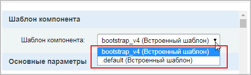

		 шаблон (**.default** или **bootstrap_v4**) и проверьте наличие указанной опции. Если опция появилась, то можете либо использовать стандартный шаблон, либо обратиться к разработчику компонента Вашего сайта за необходимыми доработками.

Для использования возможностей электронной коммерции необходимо выполнить два действия:

1. Создайте и подключите к сайту счетчик Яндекс.Метрики, отметив опцию **Электронная коммерция** (эти действия подробно описаны в
  			предыдущем уроке
  Рассмотрим, как подключить один из удобных инструментов веб-аналитики - **Яндекс. Метрику**:
  **-** Создайте учетную запись на Яндексе. Если у вас уже есть учетная запись, нажмите кнопку **Войти** на странице [Метрики](https://metrika.yandex.ru);
  **-** Создайте счетчик, нажав кнопку **Добавить счетчик.**.
  [Подробнее](lesson_11805.md)...
  		);
  Если же счетчик Яндекс.Метрики уже подключен, то проверьте, включена ли эта опция в **Настройке** счетчика:
  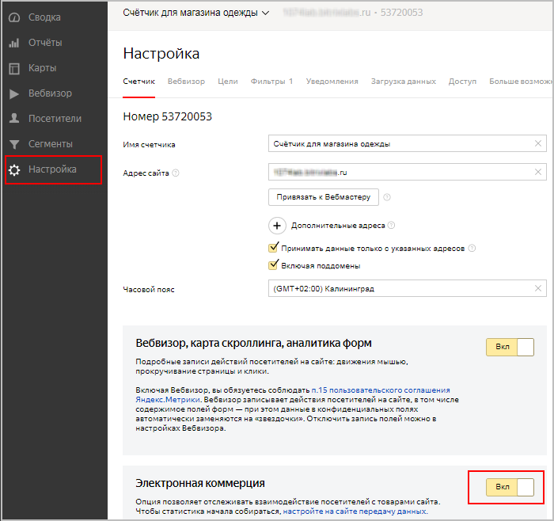
  **Примечание**: Если **Электронная коммерция** ранее была выключена в Вашем счётчике, то после её включения обновите
  			код счётчика в шаблоне сайта
  Код счётчика необходимо скопировать из настроек Яндекс.Метрики и заново добавить в шаблон Вашего сайта (Настройки &gt; Настройки продукта &gt; Сайты &gt; Шаблоны сайта (шаблон нужного сайта)), как описано в пунктах 4-6 [соответствующего урока](lesson_11805.md).
  		. Убедитесь, что код счётчика в шаблоне сайта содержит строку: `ecommerce:"dataLayer"`.
2. В Вашем интернет-магазине
  			отредактируйте страницы
  
  		 каталога товаров, корзины и оформления заказа: на каждой из этих страниц найдите соответствующий
  			компонент
                      Компонент – это программный код, оформленный в визуальную оболочку, выполняющий определённую функцию какого-либо модуля по выводу данных в Публичной части. Мы можем вставлять этот блок кода на страницы сайта без непосредственного написания кода. [Подробнее...](https://dev.1c-bitrix.ru/learning/course/index.php?COURSE_ID=34&CHAPTER_ID=04457)
  		 и в его настройках включите отправку данных в электронную торговлю:
  > **Примечание**: **Имя контейнера данных** (`dataLayer`) не нужно менять - оно соответствует имени контейнера, заданному при настройке Яндекс.Метрики.
  **Свойство брендов** (или **Свойство, в котором указан бренд товаров**) - выберите свойство инфоблока, откуда система должна брать название бренда товара (производитель, марка, модель и т.п.).

  - страница
    			Каталог
                        Вам необходимо найти на сайте страницу, на которой выводится каталог товаров:
    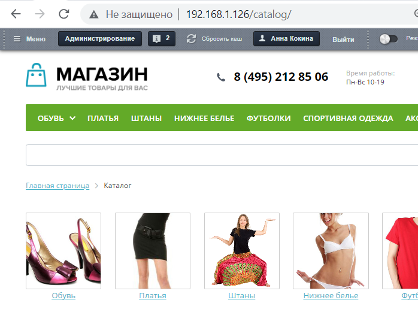
    		 (компонент
    			catalog
                         Комплексный компонент осуществляет вывод полного каталога товаров из определенного инфоблока.
    						[Описание компонента «Каталог (комплексный компонент)» в пользовательской документации.](http://dev.1c-bitrix.ru/user_help/detail.php?ID=62978)
    		):
    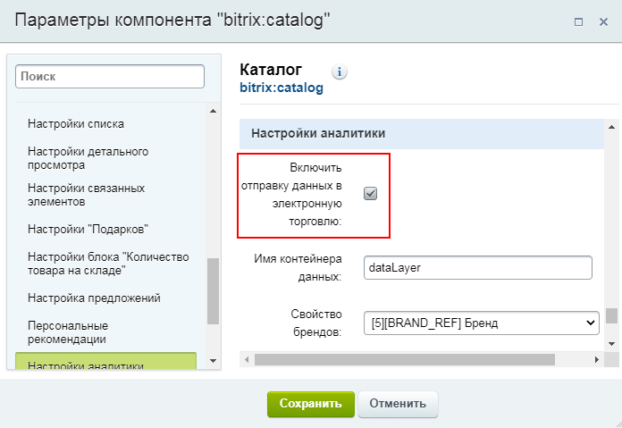
  - страница
    			Корзина
                        Вам необходимо найти на сайте страницу, на которой выводится корзина покупателя:
     
    		 (компонент
    			sale.basket.basket
                        Одностраничный компонент отображает список товаров, отправленных пользователем в корзину.
    						[Описание компонента «Корзина» в пользовательской документации.](http://dev.1c-bitrix.ru/user_help/detail.php?ID=63316)
    		):
    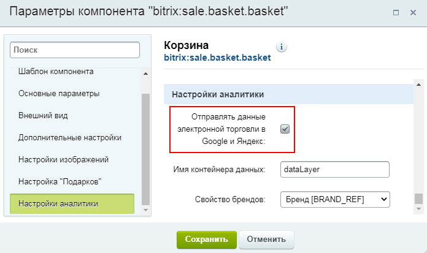
  - страница
    			Оформление заказа
                        Вам необходимо найти на сайте страницу, на которой выводится форма оформления заказа:
    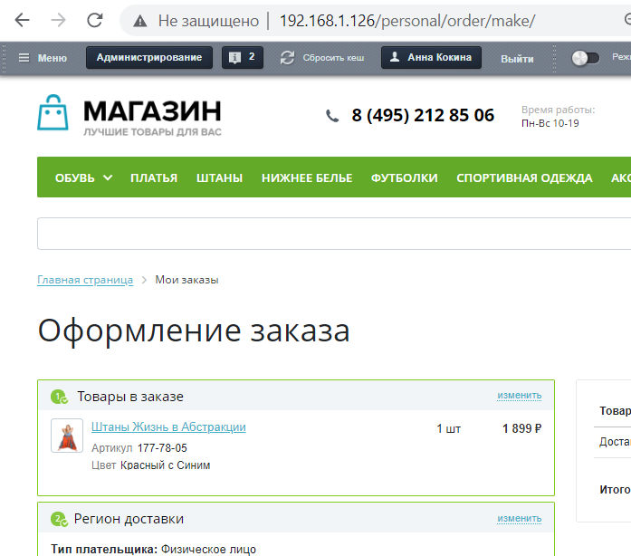
    		 (компонент
    			sale.order.ajax
                        Компонент служит для оформления заказа на одной странице с использованием технологии AJAX. Компонент является стандартным и входит в дистрибутив модуля.
    						[Описание компонента «Оформление заказа» в пользовательской документации.](http://dev.1c-bitrix.ru/user_help/detail.php?ID=146775)
    		):
    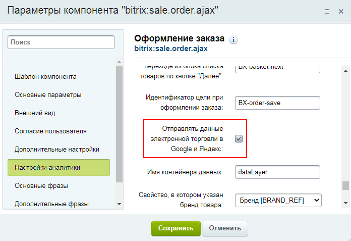
    Настройки компонента **sale.order.ajax** (Оформление заказа) имеют
    			дополнительные опции
    Опции **Использовать цели счётчика Яндекс.Метрики**, а также номер счётчика и настройки целей.
    		 для подключения еще одного функционала Яндекс.Метрики – **Целей**. Об этом подробнее читайте в
    			следующем уроке.
    **Цели** Яндекс.Метрики позволяют отслеживать конкретные действия посетителей сайта.
    Рассмотрим, как использовать **Цели** для отслеживания действий при оформлении заказа (компонент sale.order.ajax).
    [Подробнее](lesson_11807.md)...

Готово! В течение нескольких часов Вам станут доступны

			отчёты

Группа отчетов позволяет анализировать данные, относящиеся к электронной коммерции.

Для формирования отчетов необходимо использовать возможности сервиса по учету и анализу данных электронной коммерции — Ecommerce. При первой передаче данных отчеты станут доступны в течение нескольких часов.

[Подробнее](https://yandex.ru/support/metrica/reports/ecommerce.html)...

		 по электронной коммерции (Отчёты &gt; Стандартные отчеты &gt; Электронная коммерция &gt; (нужный тип отчета)):

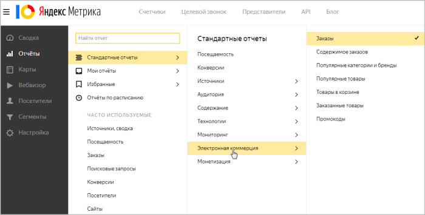

## Примеры отчётов.

- **Заказы**
  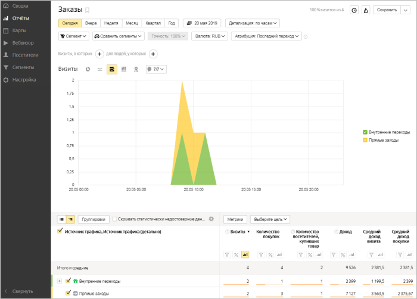
- **Содержимое заказов**
  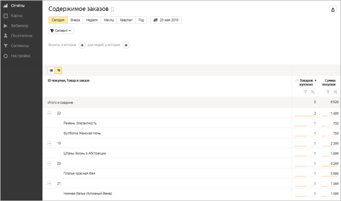
- **Популярные категории и бренды**
  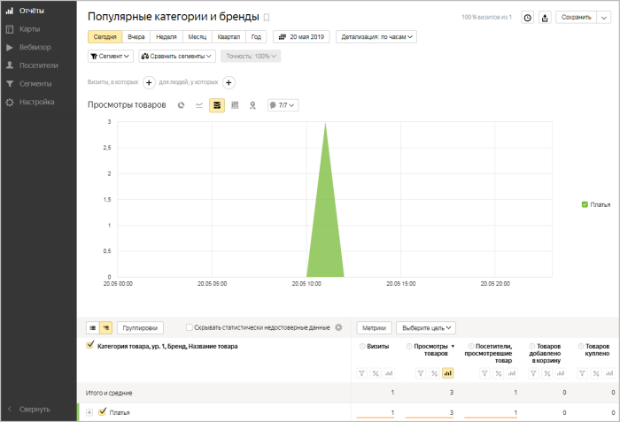
- **Популярные товары**
  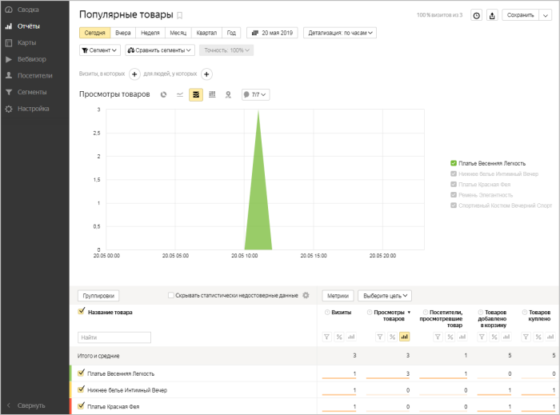
- **Товары в корзине**
  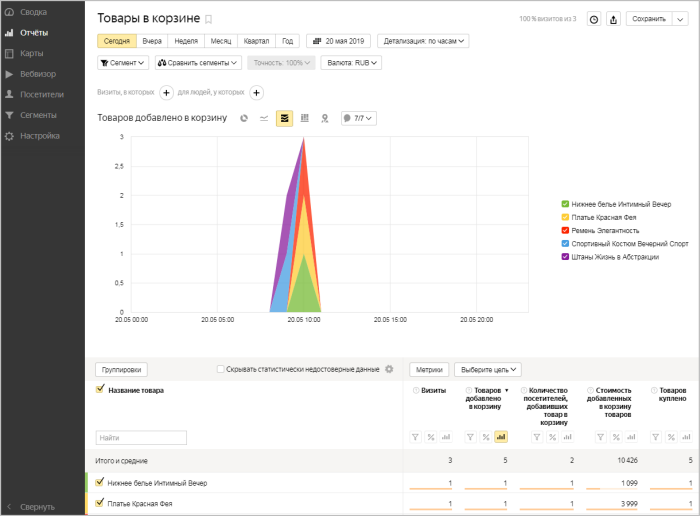
- **Заказанные товары**
  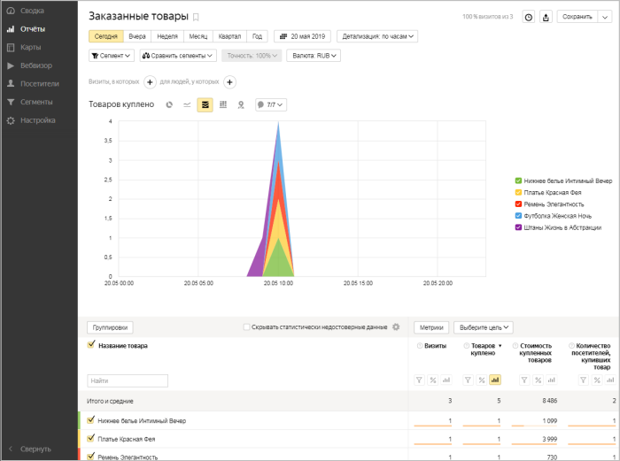

**Примечание**: Все отчеты (кроме отчета **Содержимое заказа**) поддерживают возможность

			настройки.

Ниже описаны инструменты, с помощью которых вы можете настроить вид отчета:

**1.** Виды диаграмм.

**2.** Сегментация.

**3.** Точность данных.

**4.** Период отчета.

**5.** Детализация данных по времени.

**6.** Модели атрибуции.

**7.** Отображение данных в таблице.

**8.** Группировки и метрики.

**9.** Примечания на графике.

**10.** Достоверность данных.

**11.** Выбор цели.

**12.** Уточнение числовых показателей.

**13.** Отображение данных на диаграмме.

**14.** Сортировка данных по показателю.

[Подробнее](https://yandex.ru/support/metrica/reports/report-general.html#set-report)...
