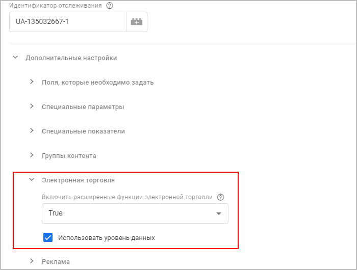
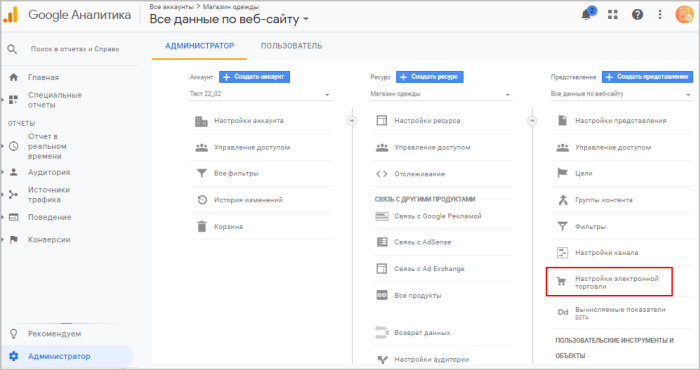
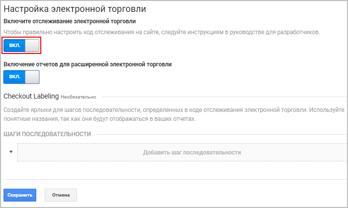
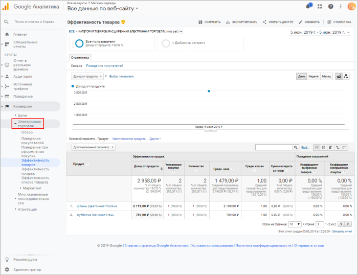

# Как подключить электронную торговлю Google

**Навигация**
- [← Оглавление курса](index.md)
- [← Предыдущий: 23090 — Уровень данных](lesson_23090.md)
- [Следующий: 4966 — Примеры кастомизации →](lesson_4966.md)

Официальная страница урока: https://dev.1c-bitrix.ru/learning/course/index.php?COURSE_ID=41&LESSON_ID=12307

|  | ### Как подключить электронную торговлю Google |
| --- | --- |

В

			предыдущем уроке

В этом уроке вы узнаете, как создать тег с триггерами:

**showDetail** - детальный просмотр товара;

**addToCart** - добавление товара в корзину;

**checkout** - переход на страницу оформления заказа;

**purchase** - завершение оформления заказа (заказ совершен).

**removeFromCart** - удаление товара из корзины.

[Подробнее](lesson_11833.md)...

		 мы настроили тег с триггерами для отслеживания покупательской активности (событий) в интернет-магазине. В этом уроке рассмотрим, как с помощью **Электронной торговли Google** получить детальные

			отчеты

                     В Google Analytics представлены перечисленные ниже стандартные отчеты по

электронной торговле. Для работы с дополнительными отчетами настройте отслеживание

расширенной электронной торговли.

Стандартные отчеты:

**Обзор.** Сводные данные – Доход, Коэффициент транзакций, Количество транзакций, Средняя стоимость

заказа и другие показатели.

**Эффективность товаров.**  Доход от продукта, Покупки, Количество, Средняя цена и
Среднее количество с разбивкой по Коду товара и Категории.

**Эффективность продаж.** Доход с разбивкой по Дате.

**Транзакции.**Доход, Налог, Доставка и Количество с разбивкой по Идентификатору транзакции.

**Время до покупки.** Число дней до транзакции и Сеансы до транзакции.

[Подробнее](https://support.google.com/analytics/answer/1037249?hl=ru)...

		 по товарам.

Для использования возможностей электронной торговли необходимо выполнить два действия:

1. Подключите к своему интернет-магазину
  			Google Tag Manager
  Еще один вид счетчика событий (т.е. клиентских "кликов" по определенным местам/кнопкам сайта) - **Google Аналитика**.
  Для отслеживания событий в Google Аналитике воспользуемся новым инструментом от Google - **Google Tag Manager**.
  Принцип подключения **Google Аналитики** и **Google Tag Manager** такой же, что и **Яндекс.Метрики**: необходимо зарегистрироваться на соответствующих ресурсах, получить коды отслеживания и вставить их в шаблон сайта.
  [Подробнее](lesson_11831.md)...
  		 и
  			создайте тег
  Рассмотрим пошагово, как с помощью тегов **Google Tag Manager** отследить события.
  Прежде всего, в настройках параметров компонентов **sale.order.ajax**, **sale.basket.basket** и **catalog** во вкладке **Настройки аналитики** отметьте опцию **Отправлять данные электронной торговли в Google и Яндекс** (возможность отслеживать метрики добавления/удаления/покупки товаров).
  [Подробнее](lesson_11833.md)...
  		 Universal Analytics.
   При настройке тега необходимо в **Дополнительных условиях** настроить
  			Электронную торговлю.
  
2. Включите отслеживание электронной торговли в **Google Аналитике** (Администратор &gt; Представление &gt; Настройки электронной торговли):
  
  **Примечание**: В **Настройках электронной торговли** можно при желании
  			включить
                       **Обязательно** нужно включить отслеживание электронной торговли.
  **При желании** можно включить отчеты для расширенной электронной торговли.
  
  		 дополнительно отчеты для
  			расширенной
  В отчетах **расширенной** электронной торговли можно просмотреть дополнительно следующие параметры:
  **-** Поведение потребителей при совершении покупки;
  **-** Экономическая эффективность;
  **-** Эффективная реклама;
  **-** Атрибуция товаров.
  [Подробнее](https://support.google.com/analytics/answer/6014841?hl=ru)...
  		 электронной торговли.

Готово! Теперь данные о товарах Вашего интернет-магазина будут поступать в Google Аналитику, и Вам станут доступны отчеты Google по электронной торговле (Отчеты &gt; Конверсии &gt; Электронная торговля):

