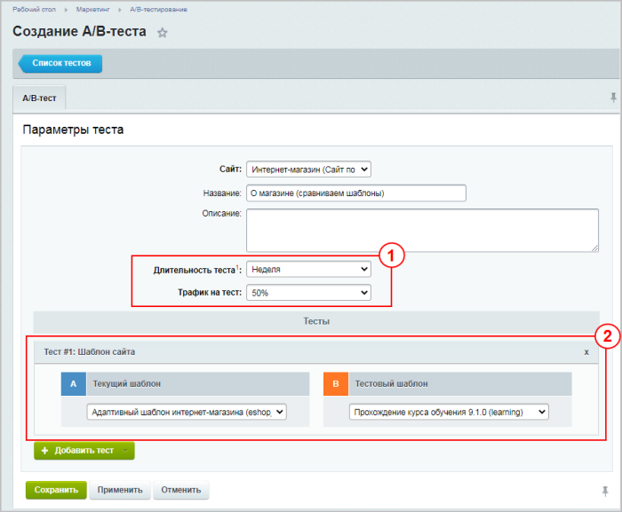

# Практические задания

**Навигация**
- [← Оглавление курса](index.md)
- [← Предыдущий: 20118 — Проверьте себя](lesson_20118.md)
- [Следующий: 2542 — Назначение и возможности модуля →](lesson_2542.md)

Официальная страница урока: https://dev.1c-bitrix.ru/learning/course/index.php?COURSE_ID=41&LESSON_ID=20186

После изучения главы рекомендуем выполнить несколько практических заданий.

### Практические задания

Практические задания состоят из вопроса, скриншота или видео с конечным результатом и объяснением, как это получить в спойлере. Не торопитесь подглядывать в спойлер. 

1. Создайте новый A/B-тест:
  ## Решение
  **Задание составлено по материалам урока:**
  - [Настройки и запуск тестирования](lesson_7201.md).
  **Результат:**
  
  1 Задаём **Длительность теста** (неделя), а **Трафик на тест** устанавливаем 50% (на новый и старый дизайны будет направлено по 25% от общего числа посетителей сайта);
  2 Так как цель теста - проверить дизайн, то указываем проверяемые шаблоны.

  - В тесте необходимо сравнить текущий шаблон ("Адаптивный шаблон интернет-магазина") этой страницы с новым шаблоном (например, с шаблоном "Прохождение курса обучения")
  - Длительность теста: неделя
  - На каждый дизайн должно попадать по 25% от общего количества посетителей сайта
2. Запустите созданный A/B-тест и перейдите на страницу **О магазине**. Посмотрите, как будет выглядеть эта страница для обеих групп пользователей, участвующих в тестировании.
  ## Решение
  **Задание составлено по материалам урока:**
  - [Настройки и запуск тестирования](lesson_7201.md).
  **Результат:**
  <!-- &lt;iframe title="Линейное задание 52" src="https://www.youtube.com/embed/HsXLv22-1aI?feature=oembed&rel=0" allow="autoplay; encrypted-media" allowfullscreen="" width="853" height="480" frameborder="0"&gt;&lt;/iframe&gt; -->

### Где выполнять задания?

Демонстрационную версию с пробным периодом в 30 дней вы можете установить на свой компьютер или на хостинг. Подробная информация о настройке каждого варианта представлена в уроке [Где практиковаться и выполнять задания](lesson_26638.md).

**Примечания:**

1. Настоятельно рекомендуем **НЕ** выполнять задания на работающем, «боевом» сайте.
2. Если вы всё же пытаетесь выполнять задания на работающем сайте, где вы не являетесь администратором, то не все задания можно выполнить.
