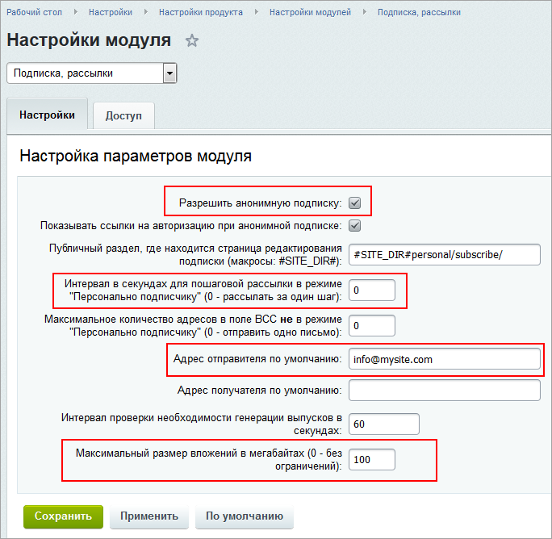
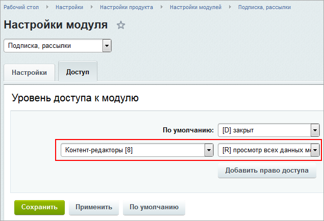
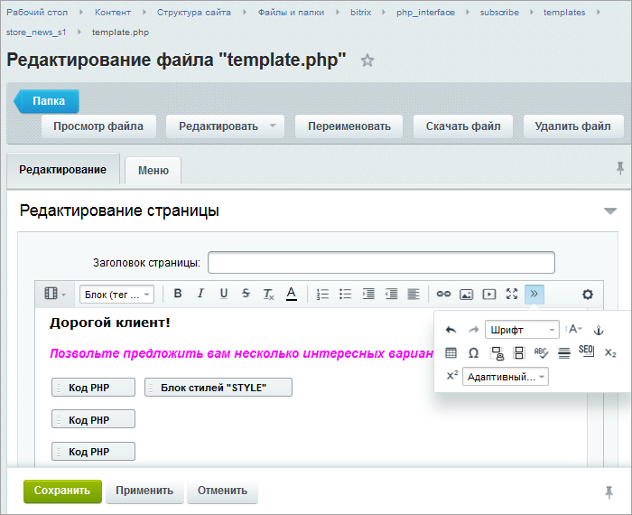

# Практические задания

**Навигация**
- [← Оглавление курса](index.md)
- [← Предыдущий: 20220 — Проверьте себя](lesson_20220.md)
- [Следующий: 2861 — Настройки модуля →](lesson_2861.md)

Официальная страница урока: https://dev.1c-bitrix.ru/learning/course/index.php?COURSE_ID=41&LESSON_ID=20244

После изучения главы рекомендуем выполнить несколько практических заданий.

### Практические задания

Практические задания состоят из вопроса, скриншота или видео с конечным результатом и объяснением, как это получить в спойлере. Не торопитесь подглядывать в спойлер. 

1. Выполните настройки модуля **Подписка и рассылки**:
  ## Решение
  **Задание составлено по материалу урока:**
  - [Настройки модуля Подписка и Рассылки](lesson_9111.md).
   **Результат:**
  На странице настройки модуля **Подписка и рассылки** (Настройки &gt; Настройки продукта &gt; Настройки модулей &gt; Подписка и рассылки):
  
  

  - Разрешите анонимную подписку;
  - Задайте отправку писем подписчикам за один шаг;
  - Задайте адрес отправителя по умолчанию info@mysite.com;
  - Ограничьте максимальный размер вложений в 100 Мб;
  - Назначьте права на доступ **Просмотр всех данных модуля** для **Контент-редакторов**.
2. Отредактируйте шаблон рассылки с использованием визуального редактора.
  ## Решение
  **Задание составлено по материалам урока:**
  - [Шаблон рассылки](lesson_4810.md).
   **Результат:**
  

### Где выполнять задания?

Демонстрационную версию с пробным периодом в 30 дней вы можете установить на свой компьютер или на хостинг. Подробная информация о настройке каждого варианта представлена в уроке [Где практиковаться и выполнять задания](lesson_26638.md).

**Примечания:**

1. Настоятельно рекомендуем **НЕ** выполнять задания на работающем, «боевом» сайте.
2. Если вы всё же пытаетесь выполнять задания на работающем сайте, где вы не являетесь администратором, то не все задания можно выполнить.
