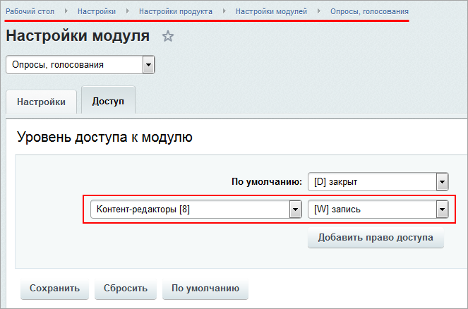

# Практические задания

**Навигация**
- [← Оглавление курса](index.md)
- [← Предыдущий: 20242 — Проверьте себя](lesson_20242.md)
- [Следующий: 20912 — Возможности модуля Адреса и местоположения →](lesson_20912.md)

Официальная страница урока: https://dev.1c-bitrix.ru/learning/course/index.php?COURSE_ID=41&LESSON_ID=20246

После изучения главы рекомендуем выполнить несколько практических заданий.

### Практические задания

Практические задания состоят из вопроса, скриншота или видео с конечным результатом и объяснением, как это получить в спойлере. Не торопитесь подглядывать в спойлер. 

|  | ### Практические задания |
| --- | --- |

1. Cоздайте новый тип **Календаря событий** и задайте права на его просмотр всем зарегистрированным пользователям.
  ## Решение
  **Задание составлено по материалу урока:**
  - [Календарь событий](lesson_5266.md).
   **Результат:**
  
  
2. Задайте права на запись **Опросов** Контент-менеджеру.
  ## Решение
  **Задание составлено по материалам урока:**
  - [Опросы, голосования](lesson_2859.md).
   **Результат:**
  
3. Задайте всем пользователям права на чтение страниц **Wiki** и настройте максимальный размер загружаемого изображения 800 на 800 пикселей.
  ## Решение
  **Задание составлено по материалам урока:**
  - [Wiki](lesson_4562.md).
   **Результат:**
  
  

### Где выполнять задания?

Демонстрационную версию с пробным периодом в 30 дней вы можете установить на свой компьютер или на хостинг. Подробная информация о настройке каждого варианта представлена в уроке [Где практиковаться и выполнять задания](lesson_26638.md).

**Примечания:**

1. Настоятельно рекомендуем **НЕ** выполнять задания на работающем, «боевом» сайте.
2. Если вы всё же пытаетесь выполнять задания на работающем сайте, где вы не являетесь администратором, то не все задания можно выполнить.
