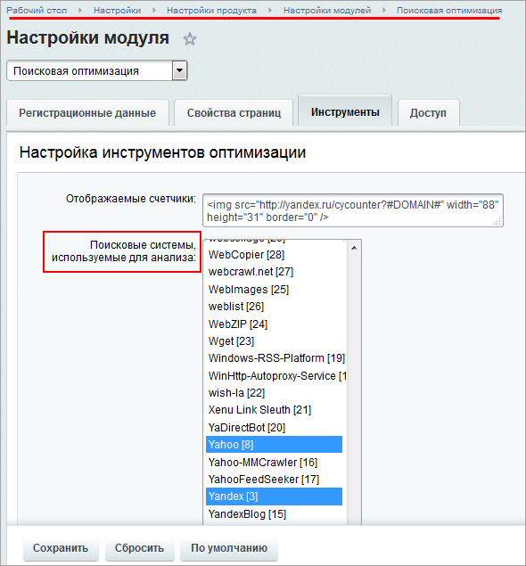
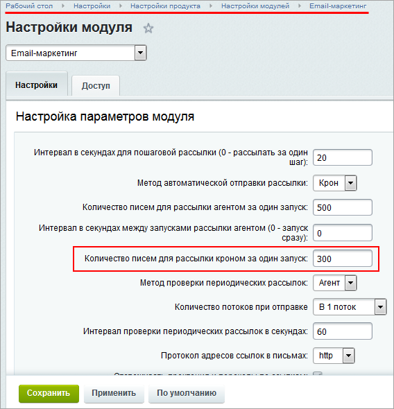
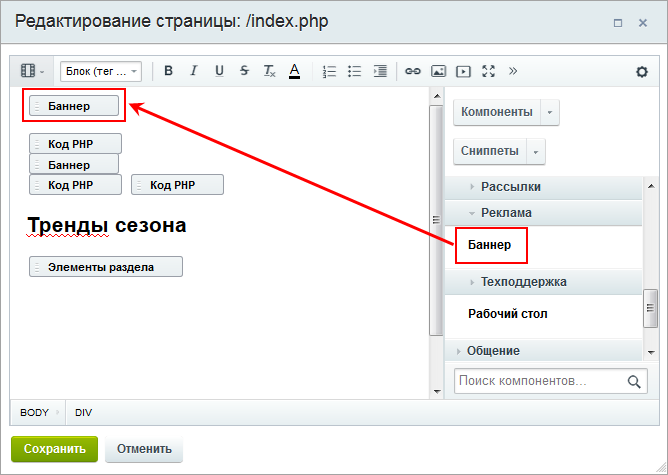

# Практические задания

**Навигация**
- [← Оглавление курса](index.md)
- [← Предыдущий: 20224 — Проверьте себя](lesson_20224.md)
- [Следующий: 6984 — Возможности Менеджера идей →](lesson_6984.md)

Официальная страница урока: https://dev.1c-bitrix.ru/learning/course/index.php?COURSE_ID=41&LESSON_ID=20248

После изучения главы рекомендуем выполнить несколько практических заданий.

### Практические задания

Практические задания состоят из вопроса, скриншота или видео с конечным результатом и объяснением, как это получить в спойлере. Не торопитесь подглядывать в спойлер. 

1. Выберите поисковые системы **Yahoo** и **Yandex** для анализа:
  ## Решение
  **Задание составлено по материалу урока:**
  - [Поисковая оптимизация](lesson_2095.md).
     **Результат:**
    
2. Задайте **Количество писем для рассылки кроном** за один запуск 300
  ## Решение
  **Задание составлено по материалам урока:**
  - [Настройки модуля](lesson_11321.md).
   **Результат:**
  
3. Задайте адрес для подписки - podpiska и для отписки - otpiska.
  ## Решение
  **Задание составлено по материалам:**
  - Урок [Настройки модуля](lesson_11321.md).
  - Пользовательская документация [E-mail маркетинг. Настройки модуля](https://dev.1c-bitrix.ru/user_help/marketing/sender/settings_email_marketing.php).
   **Результат:**
   
4. Разместите компонент **Баннер** на главной странице сайта.
  ## Решение
  **Задание составлено по материалу урока:**
  - Урок [Размещение компонента](lesson_2842.md).
   **Результат:**
  
  

### Где выполнять задания?

Демонстрационную версию с пробным периодом в 30 дней вы можете установить на свой компьютер или на хостинг. Подробная информация о настройке каждого варианта представлена в уроке [Где практиковаться и выполнять задания](lesson_26638.md).

**Примечания:**

1. Настоятельно рекомендуем **НЕ** выполнять задания на работающем, «боевом» сайте.
2. Если вы всё же пытаетесь выполнять задания на работающем сайте, где вы не являетесь администратором, то не все задания можно выполнить.
