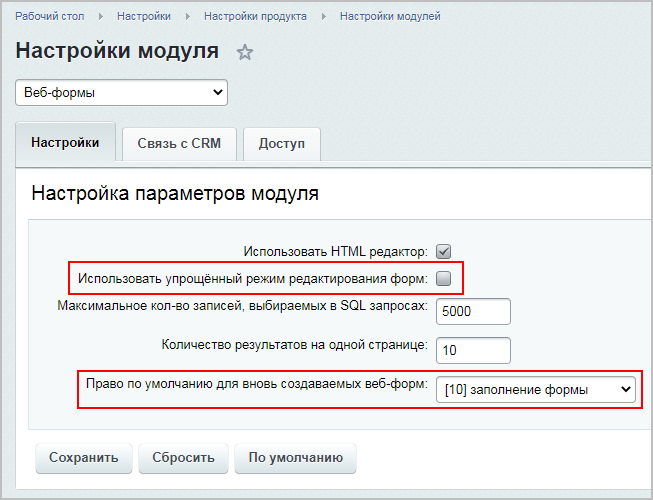
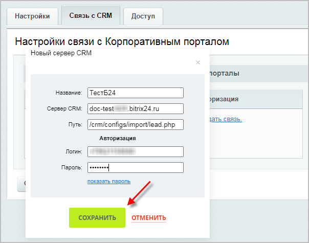

# Практические задания

**Навигация**
- [← Оглавление курса](index.md)
- [← Предыдущий: 20270 — Проверьте себя](lesson_20270.md)
- [Следующий: 6855 — Возможности Документооборота →](lesson_6855.md)

Официальная страница урока: https://dev.1c-bitrix.ru/learning/course/index.php?COURSE_ID=41&LESSON_ID=20314

После изучения главы рекомендуем выполнить несколько практических заданий.

### Практические задания

Практические задания состоят из вопроса, скриншота или видео с конечным результатом и объяснением, как это получить в спойлере. Не торопитесь подглядывать в спойлер. 

- Выполните следующие настройки модуля **Веб-формы**:
  ## Решение
  **Задание составлено по материалам урока:**
  - [Настройки модуля](lesson_2858.md).
  **Результат:**
  На странице настроек модуля (Настройки &gt; Настройки продукта &gt; Настройки модулей &gt; Веб-формы выполним настройки:
  - Вкладка **Настройки**:
    
  - Вкладка **Связь с CRM**:
    
    

  - Включите расширенный режим работы;
  - Установите право по умолчанию для вновь создаваемых веб-форм уровня **заполнение формы**;
  - Создайте новый портал *Битрикс24* и настройте передачу данных о заполнении веб-форм на этот портал;
- Добавьте новую веб-форму **Обратная связь** (feedback) согласно следующим требованиям:
  Для этой веб-формы создайте и настройте два статуса:
  ## Решение
  **Задание составлено по материалам уроков:**
  - [Настройка доступа к собственным результатам заполнения веб-формы](lesson_3846.md).
  - [Создание веб-формы, вопросов и полей](lesson_5308.md).
  **Результат:**
  <!-- &lt;iframe title="Линейное задание 61" src="https://www.youtube.com/embed/5RtqRe8-odc?feature=oembed&rel=0" allow="autoplay; encrypted-media" allowfullscreen="" width="853" height="480" frameborder="0"&gt;
  &lt;/iframe&gt; -->

  - Обязательно использование CAPTCHA;
  - Для неавторизованных пользователей доступ закрыт;
  - Зарегистрированные пользователи могут работать со своим результатом в соответствии с его статусом;
  - Контент-редакторы могут работать со всеми результатами в соответствии с их статусами.

  - **Сообщение отправлено** - статус должен присваиваться всем новым документам. Создатель результата может в данном статусе выполнять все действия с документом, а контент-редакторы могут только просматривать результат в данном статусе;
  - **Сообщение принято** - переводить документы в данный статус, просматривать и удалять их  могут только контент-менеджеры, но они не имеют право на редактирование результата.

### Где выполнять задания?

Демонстрационную версию с пробным периодом в 30 дней вы можете установить на свой компьютер или на хостинг. Подробная информация о настройке каждого варианта представлена в уроке [Где практиковаться и выполнять задания](lesson_26638.md).

**Примечания:**

1. Настоятельно рекомендуем **НЕ** выполнять задания на работающем, «боевом» сайте.
2. Если вы всё же пытаетесь выполнять задания на работающем сайте, где вы не являетесь администратором, то не все задания можно выполнить.
