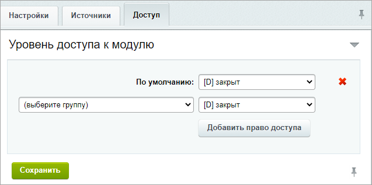

# Настройки модуля

**Навигация**
- [← Оглавление курса](index.md)
- [← Предыдущий: 20912 — Возможности модуля Адреса и местоположения](lesson_20912.md)
- [Следующий: 1708 — Общая информация →](lesson_1708.md)

Официальная страница урока: https://dev.1c-bitrix.ru/learning/course/index.php?COURSE_ID=41&LESSON_ID=20914

|  | ### Настраиваем модуль |
| --- | --- |

Настройки модуля задают возможности работы с адресами - использования карт, указателей, фотографий мест и др.

Управление настройками модуля выполняется на странице настройки модуля **Адреса и местоположения** (Настройки &gt; Настройки продукта &gt; Настройки модулей &gt; Адреса и местоположения).

На закладке Настройки можно выбрать национальный

			Формат адреса

                    

		 из списка. Список постоянно пополняется и расширяется новыми форматами. Здесь же задается уровень журналирования ошибок и обращений.

На закладке Источники укажите значения API ключей.

На закладке

			Доступ

                    

		 задается уровень прав на доступ к модулю различных групп пользователей.
