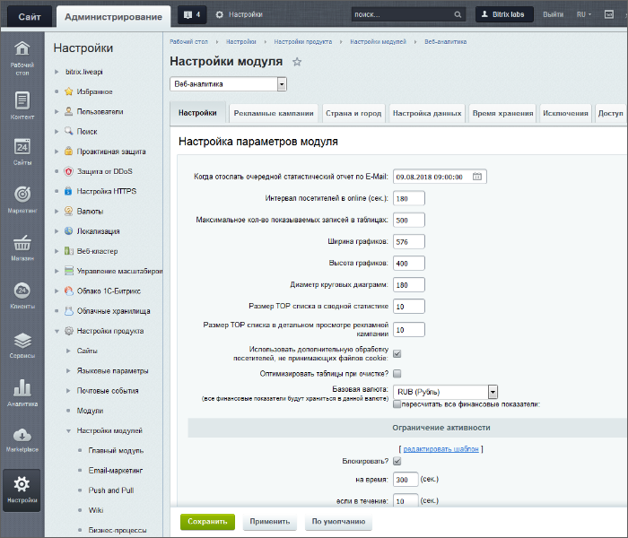
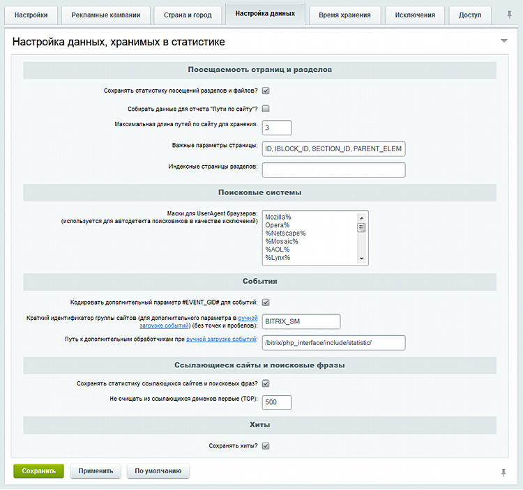
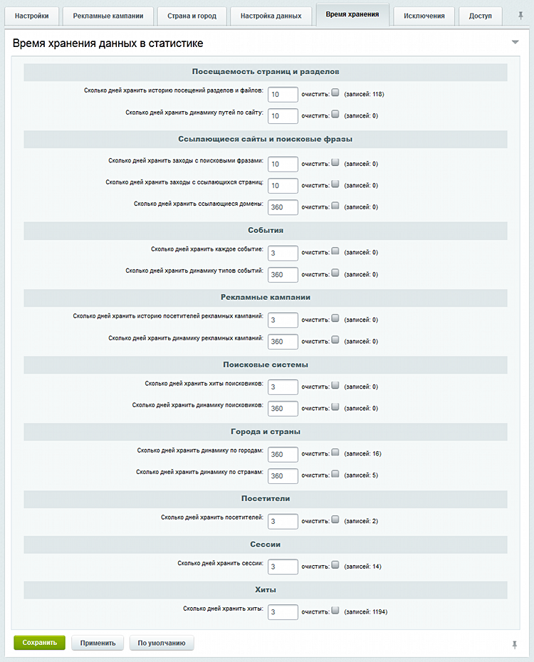
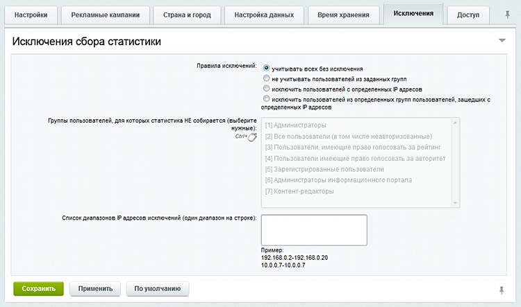
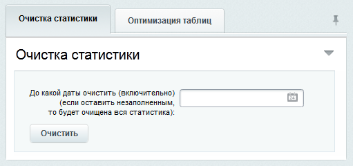

# Настройки модуля Веб-аналитика

**Навигация**
- [← Оглавление курса](index.md)
- [← Предыдущий: 4543 — Возможности веб-аналитики](lesson_4543.md)
- [Следующий: 11805 — Подключение счётчиков Яндекс.Метрики →](lesson_11805.md)

Официальная страница урока: https://dev.1c-bitrix.ru/learning/course/index.php?COURSE_ID=41&LESSON_ID=2101

Настройки модуля задают параметры обработки рекламных кампаний, определения страны и города по IP-адресу, параметры сбора статистики и управляют правами доступа к модулю.

### Настройки модуля

Параметры по умолчанию в форме настройки приемлемы для большинства пользователей. Изменять их рекомендуется только с пониманием возможного результата. Большинство значений полей ясно из их названия, мы дадим расшифровку только тех, которые могут вызвать затруднение. Более подробно о значениях полей в форме настроек модуля можно ознакомиться на странице

			Настройки модуля "Веб-аналитика"

                    Закладки

						[Описание компонента «Веб-аналитика. Настройки модуля» в пользовательской документации.](http://dev.1c-bitrix.ru/user_help/detail.php?ID=63396)

		 пользовательской документации.

В

			административном разделе

                    **Административный раздел** - раздел системы, недоступный для просмотра обычным посетителям сайта. В нём производятся настройки сайта и системы для работы.

[Подробнее...](https://dev.1c-bitrix.ru/learning/course/index.php?COURSE_ID=34&CHAPTER_ID=04459&LESSON_PATH=3905.4455.4459)

		 на странице **Настройки модуля** (Настройки &gt; Настройки продукта &gt; Настройки модулей &gt; Веб-аналитика) откроется форма настройки параметров модуля:

В закладке **Настройки** обратите внимание на поля:

- В поле **Когда отослать очередной статистический отчет по EMail** указывается время суток, когда производить автоматическую рассылку отчетов по статистике на
  			почтовый ящик администратора сайта
                       Адрес почтового ящика задается в настройках **Главного модуля**.
  		. Если поле пустое - отчет не будет отсылаться.
- Поле **Максимальное кол-во показываемых записей в таблицах** позволяет задать число записей, которые используются при составлении отчетов. Изменение текущего значения в большую сторону позволит получать более точную аналитику, но и потребует большего количества ресурсов, необходимых серверу для обработки запроса и тем больше времени надо для отработки статистических страниц.
- Если ваш сайт работает с базой *MySQL*, то можно включить функцию **Оптимизировать таблицы при очистке?**, которая автоматически оптимизирует таблицы MySQL при удалении устаревшей статистической информации (по полям **Сколько дней хранить...** закладки **Время хранения**). Это позволит снизить нагрузку на систему.

Cекция **Ограничение активности** позволяет ограничить доступ клиентов к сайту или блокировать доступ полностью в зависимости от установленных параметров, установить защиту от массовых скачиваний сайта специальными программами-грабберами (*Teleport Pro*, *Free Download Manager*, *HTTrack*).

На закладке

			Рекламные кампании

                    

		 изменения значений не рекомендуются, если вы не представляете себе последствий ваших действий.

На закладке

			Страна и город

                    

		 выполняется настройка параметров определения страны и города посетителя по IP адресу. С помощью колонки **Будет использован** выберите доступный и необходимый вам источник определения города и страны по IP-адресу. Либо установите и настройте дополнительные источники определения страны и города, используя соответствующие ссылки.

На закладке

			Настройка данных

                    

		 с целью снижения нагрузки на систему можно снять флажок с поля **Собирать данные для отчета "Пути по сайту"?**.

Параметры закладки

			Время хранения

                    

		 задают максимальное время хранения каждого события в днях. Каждый параметр имеет флаг **очистить**, который позволяет удалить статистику по данному параметру. Очистка информации происходит по нажатию на кнопку **Сохранить**.

**Примечание:** Большой период времени хранения приведет к увеличению размера базы данных статистики.

На закладке

			Исключения

                    

		 настраиваются правила кого считать в статистике посещений, кого нет. Можно задать ограничения по группам, IP адресам или по обоим параметрам вместе.

На закладке **Доступ** задаётся уровень прав на доступ к модулю различных групп пользователей.

### Служебные процедуры

Служебные процедуры предназначены для оптимизации работы сервера. Доступны:

- **Очистка БД** от устаревших данных. (Исключение составляют таблица поисковиков (здесь будут сброшены только счетчики) и таблицы привязки IP-адресов к странам.)
  
- **Оптимизация таблиц** модуля **Веб-аналитика** для уменьшения их размера и увеличения производительности.
  

### Документация по теме

- [Веб-аналитика. Настройки модуля](https://dev.1c-bitrix.ru/user_help/statistic/settings_va.php)
